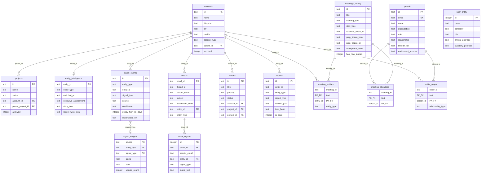
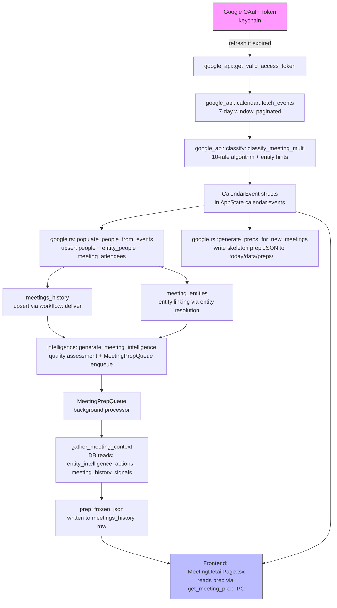
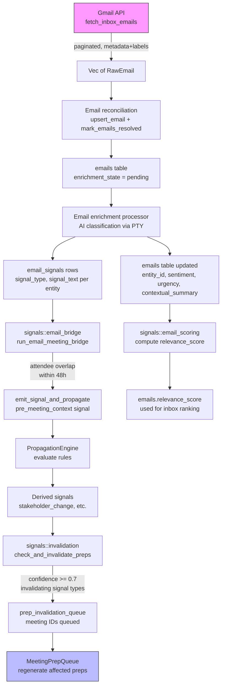
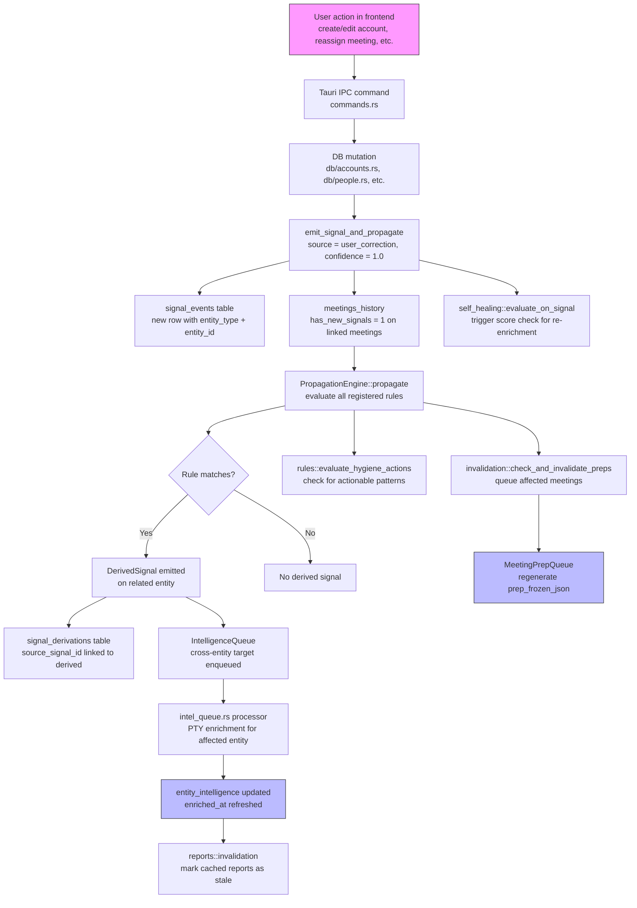
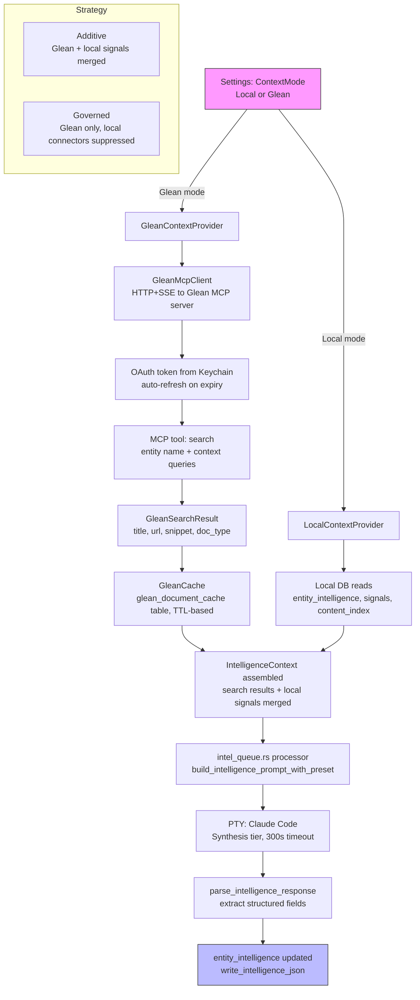
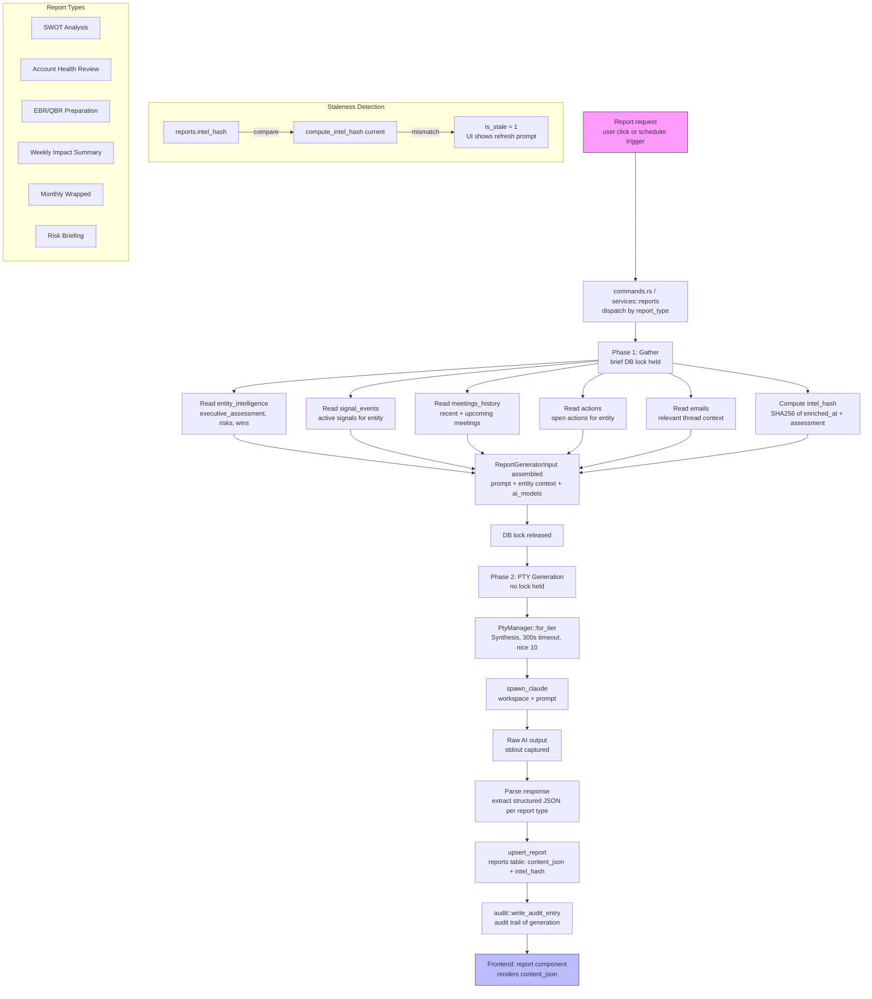

# DATA-FLOWS.md

End-to-end data flow documentation for DailyOS. Each section contains a Mermaid diagram, a prose explanation of the flow, the key files involved, and known issues or gaps.

Last updated: 2026-03-02 (schema version 53).

---

## 1. Entity-Relationship Diagram

The core ~15 tables that power DailyOS intelligence. Junction tables link meetings to entities and people. The signal bus provides a universal event log consumed by propagation, fusion, and prep invalidation.

### Key files

| File | Purpose |
|------|---------|
| `src-tauri/src/migrations/001_baseline.sql` | Core schema: accounts, projects, people, meetings, actions, entities |
| `src-tauri/src/migrations/018_signal_bus.sql` | signal_events, signal_weights tables |
| `src-tauri/src/migrations/034_emails.sql` | emails table for Gmail inbox tracking |
| `src-tauri/src/migrations/044_user_entity.sql` | user_entity single-row table |
| `src-tauri/src/migrations/050_reports.sql` | reports table for generated analyses |
| `src-tauri/src/db/mod.rs` | ActionDb struct and shared DB methods |

### Notes

- The `entities` table exists in the baseline schema but is largely vestigial; accounts, projects, and people are the real entity tables.
- `meeting_entities` is the critical junction linking meetings to accounts/projects. It drives entity resolution, prep generation, and signal propagation.
- `entity_intelligence` stores one row per entity with JSON columns for risks, wins, stakeholder insights, etc. It is the output of the intelligence enrichment pipeline.
- The schema is at version 53 with 42+ tables total; this diagram focuses on the ~15 most architecturally significant ones.

---

## 2. Google Calendar to Meeting Prep Flow

From OAuth token through calendar sync, meeting creation, entity linking, intelligence enrichment, prep generation, and finally frontend rendering.

### Detailed steps

1. **Token refresh** (`google_api/auth.rs`, `google_api/token_store.rs`): OAuth2 tokens are stored in the macOS Keychain. `get_valid_access_token()` checks expiry and refreshes via the Google token endpoint if needed.

2. **Calendar fetch** (`google_api/calendar.rs::fetch_events`): Fetches 7 days of events from the primary calendar. Handles pagination (250 per page), filters cancelled events, declined events, and resource rooms. Returns `Vec<GoogleCalendarEvent>` with attendee RSVPs and display names.

3. **Meeting classification** (`google_api/classify.rs`): A deterministic 10-rule algorithm classifies each event into a `MeetingType` (customer, internal, one_on_one, etc.) using user domains and entity hints built from the DB.

4. **People population** (`google.rs::populate_people_from_events`): For each attendee email, upserts into the `people` table and links via `meeting_attendees` and `entity_people`. Returns `SyncIntelResult` with lists of new and changed meeting IDs.

5. **Meeting persistence** (`workflow/deliver.rs`): Meetings are upserted into `meetings_history` keyed by `calendar_event_id`. Entity links go into `meeting_entities`.

6. **Intelligence lifecycle** (`intelligence.rs::generate_meeting_intelligence`): For new/changed meetings, runs quality assessment (mechanical, no AI) and enqueues into `MeetingPrepQueue` if the meeting has linked entities.

7. **Prep generation** (`meeting_prep_queue.rs`): Background processor drains the queue. Calls `gather_meeting_context()` which reads entity intelligence, open actions, recent meeting history, and active signals from DB. Assembles a `FullMeetingPrep` JSON and writes it to `prep_frozen_json` on the `meetings_history` row.

8. **Frontend render** (`src/pages/MeetingDetailPage.tsx`): Calls `get_meeting_prep` IPC command. The backend loads `prep_frozen_json` first (DB), falls back to disk files. Frontend renders the editorial meeting briefing.

### Key files

| File | Purpose |
|------|---------|
| `src-tauri/src/google_api/auth.rs` | OAuth2 consent flow and token refresh |
| `src-tauri/src/google_api/calendar.rs` | Calendar API fetch with pagination |
| `src-tauri/src/google_api/classify.rs` | Meeting type classification (10 rules) |
| `src-tauri/src/google.rs` | Calendar polling loop, people sync, prep triggers |
| `src-tauri/src/intelligence.rs` | Intelligence lifecycle: quality assessment, queue enqueue |
| `src-tauri/src/meeting_prep_queue.rs` | Background prep generation queue |
| `src-tauri/src/workflow/deliver.rs` | Meeting upsert, entity linking |
| `src/pages/MeetingDetailPage.tsx` | Frontend meeting detail rendering |

### Known issues

- **Stale skeleton preps**: Disk-based prep files (`_today/data/preps/*.json`) may contain empty skeletons that deserialize successfully into `FullMeetingPrep` with all content as `None`, masking richer data in `prep_frozen_json`. Load order (DB first, disk second) mitigates this.
- **No hot-reload for backend**: Calendar poll changes require full app restart. Vite hot-reloads the frontend only.

---

## 3. Gmail to Signal to Intelligence Flow

From Gmail API polling through email persistence, enrichment, signal emission, entity-level propagation, and prep invalidation.

### Detailed steps

1. **Gmail fetch** (`google_api/gmail.rs::fetch_inbox_emails`): Queries `in:inbox` with pagination (up to 5 pages). For each message stub, fetches metadata headers (From, Subject, Date, List-Unsubscribe, Precedence) and checks labelIds for UNREAD status.

2. **Inbox reconciliation** (`google.rs` + `db/emails.rs`): Raw emails are upserted into the `emails` table. A separate `fetch_inbox_message_ids` call identifies vanished messages (archived/deleted by user in Gmail) which are marked `resolved_at` in the DB.

3. **Email enrichment** (email processing pipeline): Emails with `enrichment_state = 'pending'` are picked up by the background enrichment processor. AI (via PTY/Claude Code) classifies each email: assigns entity linkage, extracts sentiment, urgency, and a contextual summary. Writes results back to the `emails` row and inserts `email_signals` rows.

4. **Email-meeting bridge** (`signals/email_bridge.rs::run_email_meeting_bridge`): For meetings in the next 48 hours, finds email_signals where the sender email overlaps with meeting attendee emails. Emits `pre_meeting_context` signals linking the email thread to the upcoming meeting.

5. **Signal propagation** (`signals/propagation.rs`): The `PropagationEngine` evaluates registered rules (person job change, champion sentiment, hierarchy propagation, etc.) and may derive new signals on related entities.

6. **Prep invalidation** (`signals/invalidation.rs`): If the signal confidence >= 0.7 and its type is in the invalidating set (stakeholder_change, champion_risk, pre_meeting_context, etc.), upcoming meetings (48h window) linked to the affected entity are queued for prep regeneration.

7. **Email scoring** (`signals/email_scoring.rs`): Computes a `relevance_score` for inbox ranking based on entity importance, thread position, and sender relationship.

### Key files

| File | Purpose |
|------|---------|
| `src-tauri/src/google_api/gmail.rs` | Gmail API: inbox fetch, message body, sent thread IDs, archive |
| `src-tauri/src/db/emails.rs` | Email CRUD: upsert, resolve, enrichment state |
| `src-tauri/src/signals/email_bridge.rs` | Email-to-meeting correlation bridge |
| `src-tauri/src/signals/email_scoring.rs` | Relevance score computation |
| `src-tauri/src/signals/email_context.rs` | Email context assembly for prompts |
| `src-tauri/src/signals/invalidation.rs` | Signal-driven prep invalidation |

### Known issues

- **Body fetch is opt-in**: `fetch_message_body` is only called when `emailBodyAccess` is enabled in settings. Without it, enrichment relies solely on subject + snippet.
- **Enrichment budget**: The email enrichment processor is budget-gated by attempts, not successes. A burst of spam can consume the budget before high-value emails are enriched.

---

## 4. User Action to Signal to Propagation Flow

When a user creates or edits an entity (account, project, person), the resulting signal ripples through the system: propagation rules fire, prep is invalidated, and re-enrichment is queued.

### Detailed steps

1. **User action**: User performs a mutation in the frontend (e.g., reassigns a meeting to a different account, edits a person's role, updates account health). The React component calls a Tauri IPC command.

2. **DB mutation + signal emission** (`commands.rs`): The command handler writes to the DB, then calls `emit_signal_and_propagate()` (or `emit_signal_propagate_and_evaluate()` when the IntelligenceQueue is available). User corrections use source `"user_correction"` at confidence 1.0 (Tier 1, highest reliability).

3. **Meeting flagging**: `emit_signal()` sets `has_new_signals = 1` on all future meetings linked to the affected entity. The scheduler picks these up every 30 minutes.

4. **Propagation rules** (`signals/rules.rs`): Nine registered rules evaluate the source signal:
   - `rule_person_job_change`: person title_change propagates stakeholder_change to linked accounts
   - `rule_champion_sentiment`: negative sentiment on champion propagates champion_risk to account
   - `rule_departure_renewal`: person departure near renewal propagates renewal_risk_escalation
   - `rule_hierarchy_up` / `rule_hierarchy_down`: signals flow through account parent/child hierarchy
   - `rule_person_network`: signals flow through person relationship graph
   - Plus others for overdue actions, renewal engagement, and profile discovery

5. **Cross-entity enrichment** (`intel_queue.rs`): When propagation creates derived signals on a different entity, that entity is enqueued in the IntelligenceQueue at `ProactiveHygiene` priority for re-enrichment.

6. **Self-healing** (`self_healing/scheduler.rs::evaluate_on_signal`): Checks whether the affected entity's trigger score exceeds the re-enrichment threshold, and enqueues if so.

7. **Prep invalidation**: If the signal type is in the invalidating set and confidence >= 0.7, upcoming meetings linked to the entity are queued for prep regeneration.

8. **Feedback loop** (`signals/feedback.rs`): User corrections train the Bayesian weight model. The corrected source gets its beta incremented (penalized), while the correct source gets alpha incremented (rewarded). After 5+ updates, Thompson Sampling begins to influence fusion weights.

### Key files

| File | Purpose |
|------|---------|
| `src-tauri/src/commands.rs` | Tauri IPC command handlers (user-facing mutations) |
| `src-tauri/src/signals/bus.rs` | Signal emission: `emit_signal`, `emit_signal_and_propagate`, `emit_signal_propagate_and_evaluate` |
| `src-tauri/src/signals/propagation.rs` | PropagationEngine with 9 registered rules |
| `src-tauri/src/signals/rules.rs` | Individual propagation rule implementations |
| `src-tauri/src/signals/feedback.rs` | Bayesian weight learning from user corrections |
| `src-tauri/src/signals/fusion.rs` | Weighted log-odds Bayesian signal fusion |
| `src-tauri/src/signals/decay.rs` | Time-based confidence decay |
| `src-tauri/src/self_healing/scheduler.rs` | Event-driven trigger evaluation for re-enrichment |
| `src-tauri/src/intel_queue.rs` | Background intelligence enrichment queue |

### Signal source tiers

| Tier | Sources | Base weight | Half-life |
|------|---------|-------------|-----------|
| 1 (highest) | user_correction, explicit | 1.0 | 365 days |
| 1b | transcript, notes | 0.9 | 60 days |
| 2 | attendee, email_thread, junction | 0.8 | 30 days |
| 2b | group_pattern | 0.75 | 60 days |
| 3 | glean, clay, gravatar | 0.6-0.7 | 60-90 days |
| 4 (lowest) | keyword, heuristic, embedding | 0.4 | 7 days |

### Known issues

- **`rule_meeting_frequency_drop` removed**: No code emits `meeting_frequency` signals, so this rule was deleted in the I377 audit.
- **Propagation does not propagate recursively**: Derived signals are emitted but do not trigger further propagation. This is intentional to prevent cascading chains but means a person departure on a child account will not automatically reach the parent account in a single step.

---

## 5. Glean Context Integration Flow

How Glean acts as an alternative context provider in enterprise mode, gathering entity context from the corporate knowledge graph instead of (or in addition to) local files.

### Detailed steps

1. **Mode selection** (`context_provider/mod.rs`): The `ContextMode` is stored in a `context_mode_config` DB table. Two modes: `Local` (default, all context from local DB + workspace files) and `Glean` (enterprise, context from Glean knowledge graph).

2. **Glean strategy**: Within Glean mode, two strategies control how Glean interacts with local connectors:
   - **Additive** (default): Glean is primary context source, but Gmail/Calendar/Linear signals are still active and merged.
   - **Governed**: Glean only. Local file-reading and connector queries are suppressed (except Calendar and transcript pollers which are always active).

3. **Glean MCP client** (`context_provider/glean.rs`): Uses HTTP+SSE transport to Glean's MCP server (`/mcp/default`). OAuth tokens are stored in macOS Keychain and auto-refreshed. Two MCP tools are used: `search` for finding entity-related documents and `read_document` for fetching full content.

4. **Caching** (`context_provider/cache.rs`): Glean search results are cached in the `glean_document_cache` table with TTL-based expiration to reduce API calls and improve latency.

5. **Context assembly**: Both providers implement the `ContextProvider` trait, returning an `IntelligenceContext` struct. This is the unified input to the intelligence enrichment prompt regardless of source.

6. **Enrichment**: The `intel_queue.rs` processor calls `build_intelligence_prompt_with_preset()` with the assembled context, spawns a Claude Code PTY at Synthesis tier (300s timeout), parses the structured response, and writes back to `entity_intelligence`.

### Key files

| File | Purpose |
|------|---------|
| `src-tauri/src/context_provider/mod.rs` | ContextProvider trait, ContextMode enum, persistence |
| `src-tauri/src/context_provider/glean.rs` | GleanContextProvider: MCP client, search, caching |
| `src-tauri/src/context_provider/local.rs` | LocalContextProvider: DB + file reads |
| `src-tauri/src/context_provider/cache.rs` | GleanCache: TTL-based document caching |
| `src-tauri/src/intel_queue.rs` | Intelligence enrichment queue (consumes ContextProvider output) |
| `src-tauri/src/intelligence.rs` | Prompt building, response parsing, JSON persistence |

### Known issues

- **No Glean write-back**: Glean is read-only. Intelligence generated by DailyOS does not flow back to the Glean knowledge graph. This is by design for the current architecture but limits bidirectional enrichment.
- **Token refresh race**: If multiple concurrent enrichment requests hit Glean simultaneously and the token expires, each may attempt a refresh. The keychain write is serialized but there is a brief window where requests may fail before the new token is stored.

---

## 6. Report Generation Flow

How reports (SWOT, Account Health, EBR/QBR, Weekly Impact, Monthly Wrapped, Risk Briefing) are generated using the two-phase pattern: gather under brief DB lock, then run PTY without holding the lock.

### Detailed steps

1. **Request origin**: Reports can be triggered by user action (clicking "Generate" in the frontend) or by the scheduler (Weekly Impact on Mondays, Monthly Wrapped on the 1st).

2. **Phase 1 -- Gather** (type-specific modules e.g. `reports/swot.rs`, `reports/account_health.rs`): Acquires a brief DB lock and reads all necessary context: entity intelligence, active signals, recent meeting history, open actions, and email threads. Computes an `intel_hash` (truncated SHA256 of enriched_at + executive_assessment) for staleness detection. Assembles a `ReportGeneratorInput` struct with the constructed prompt and all owned data.

3. **Phase 2 -- Generate** (`reports/generator.rs::run_report_generation`): The DB lock is released before this phase. Creates a `PtyManager` at Synthesis tier with 300-second timeout and nice priority 10 (lower CPU priority). Spawns Claude Code with the assembled prompt. Captures stdout.

4. **Storage** (`reports/mod.rs::upsert_report`): The parsed response is stored in the `reports` table as `content_json` with the `intel_hash` for later staleness comparison. Uses `ON CONFLICT ... DO UPDATE` for idempotent upserts.

5. **Staleness detection** (`reports/invalidation.rs`): When the frontend loads a report, the current `intel_hash` is recomputed and compared to the stored hash. If they differ (intelligence was re-enriched since report generation), `is_stale` is set to 1 and the UI shows a refresh prompt.

6. **Audit**: Every report generation writes an audit entry to the workspace for traceability.

### Key files

| File | Purpose |
|------|---------|
| `src-tauri/src/reports/mod.rs` | Report types, DB read/write, intel hash computation |
| `src-tauri/src/reports/generator.rs` | Two-phase PTY dispatch (shared across all report types) |
| `src-tauri/src/reports/swot.rs` | SWOT analysis: gather + prompt |
| `src-tauri/src/reports/account_health.rs` | Account Health Review: gather + prompt |
| `src-tauri/src/reports/ebr_qbr.rs` | EBR/QBR preparation: gather + prompt |
| `src-tauri/src/reports/weekly_impact.rs` | Weekly Impact Summary: cross-entity gather + prompt |
| `src-tauri/src/reports/monthly_wrapped.rs` | Monthly Wrapped: month-level gather + prompt |
| `src-tauri/src/reports/risk.rs` | Risk Briefing: gather + prompt |
| `src-tauri/src/reports/prompts.rs` | Prompt templates for all report types |
| `src-tauri/src/reports/invalidation.rs` | Staleness detection and invalidation |

### Known issues

- **No incremental updates**: Reports are fully regenerated on each request. There is no diff-based update mechanism.
- **PTY timeout at 300s**: Complex reports with many entities may occasionally timeout. The nice priority (10) prevents report generation from starving the UI but can slow generation on resource-constrained machines.
- **Intel hash granularity**: The hash only considers `enriched_at` + `executive_assessment`. Changes to other intelligence fields (risks, wins) that do not update `enriched_at` will not trigger staleness detection.

---

## Appendix: Scheduler Orchestration

The scheduler (`scheduler.rs`) is the heartbeat that ties these flows together. It runs a 60-second poll loop with the following responsibilities:

| Trigger | Action | Frequency |
|---------|--------|-----------|
| Day change (midnight or sleep/wake) | Emit `day-changed`, sweep MeetingPrepQueue | Daily |
| Monday day change | Generate Weekly Impact if needed | Weekly |
| 1st of month day change | Generate Monthly Wrapped if needed | Monthly |
| Sleep/wake detection (>5min time jump) | Re-run missed workflows within grace period | On wake |
| Calendar poll interval | `poll_calendar` -> sync meetings -> trigger intelligence | Adaptive (activity-based) |
| Pre-meeting readiness (30min before meeting) | Enqueue intelligence refresh for upcoming meetings | Per meeting |
| Proposed action archive | Auto-archive stale proposed actions | Periodic |

The scheduler respects dev mode isolation: when the dev sandbox is active (`is_dev_db_mode()`), all background processing is paused to prevent interference with development data.
