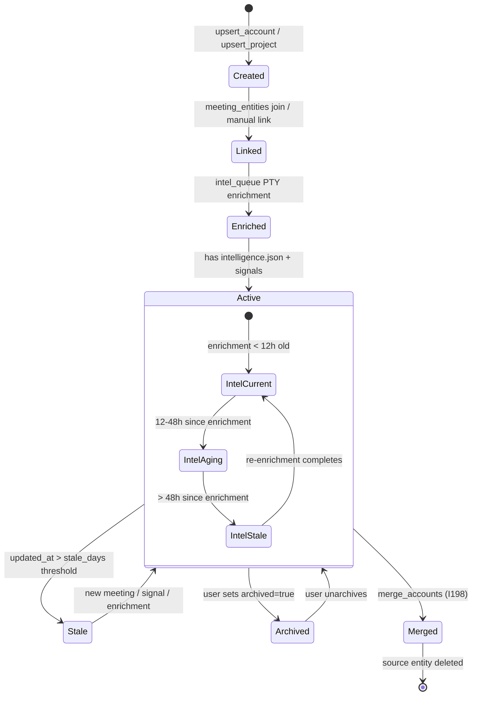
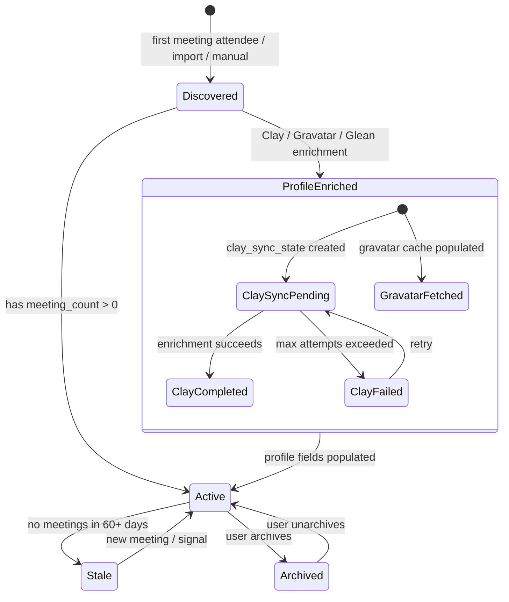
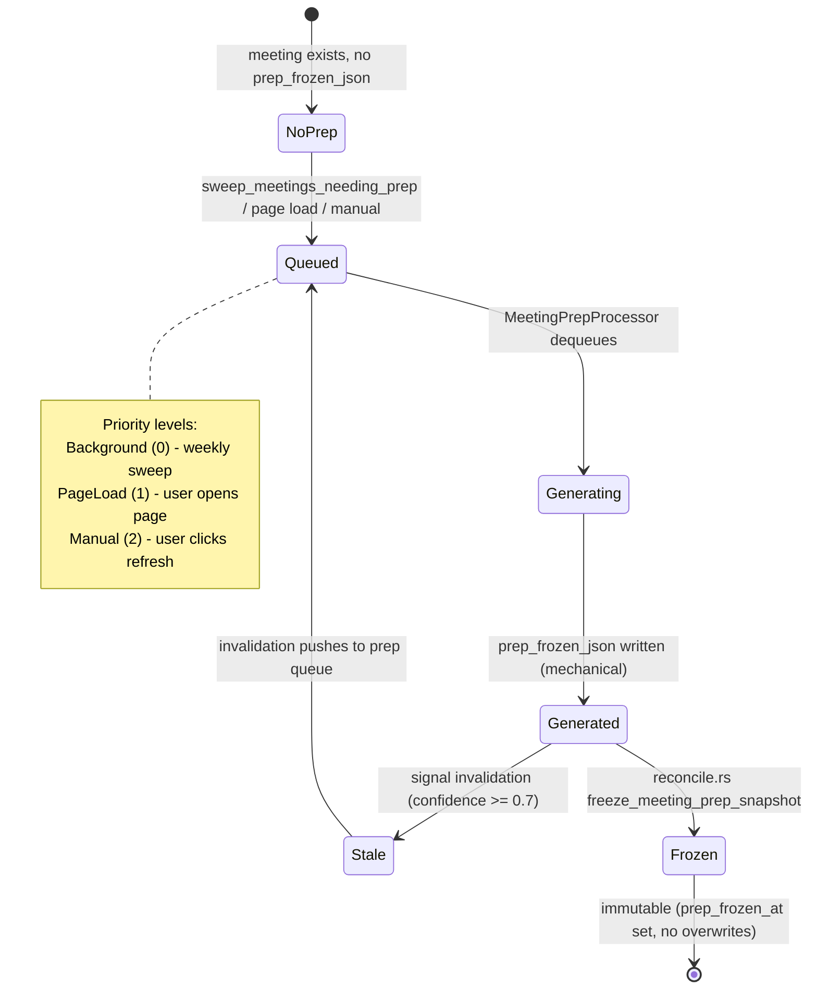
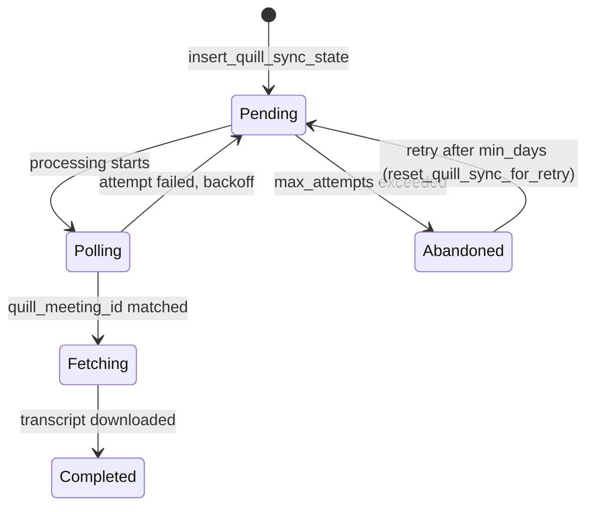
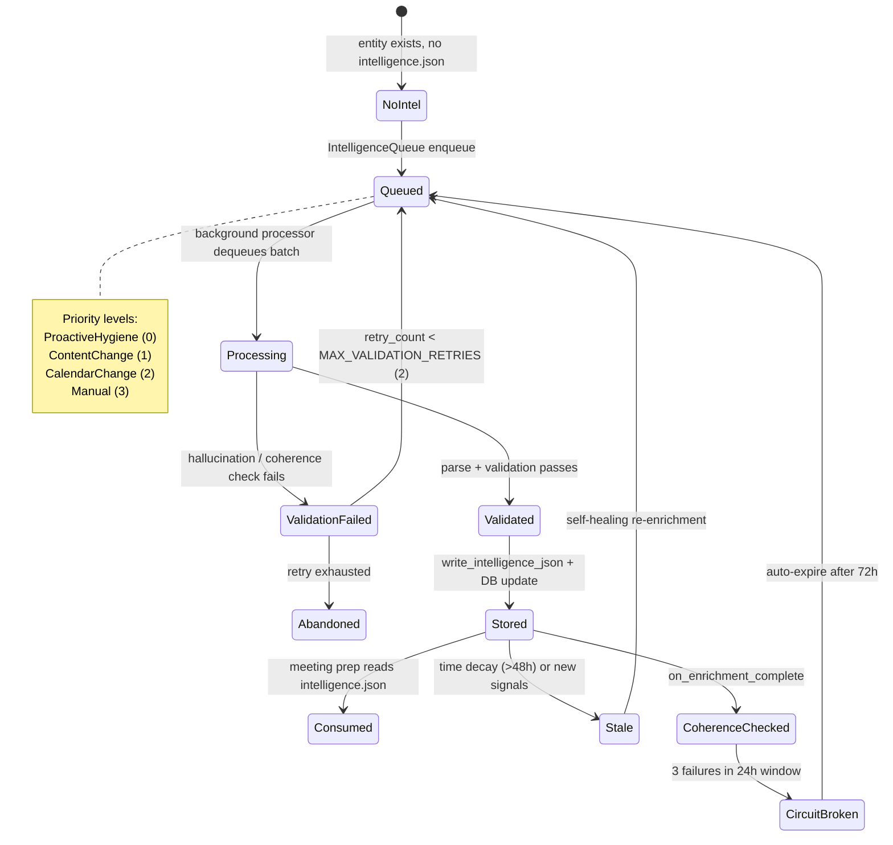
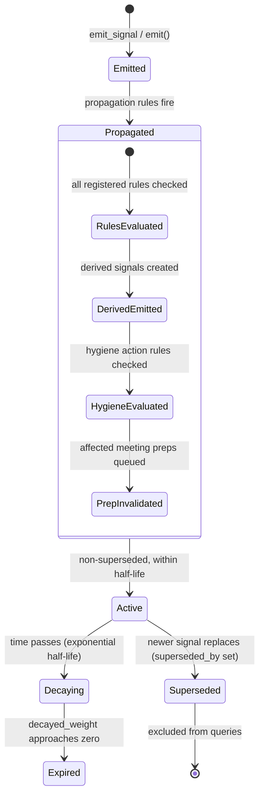
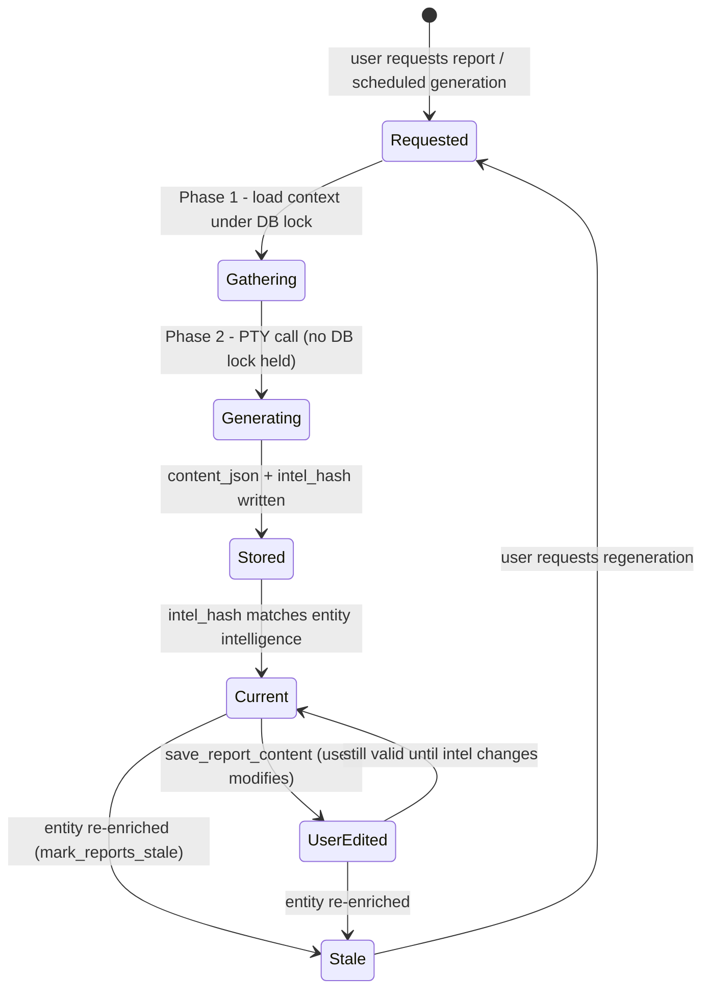
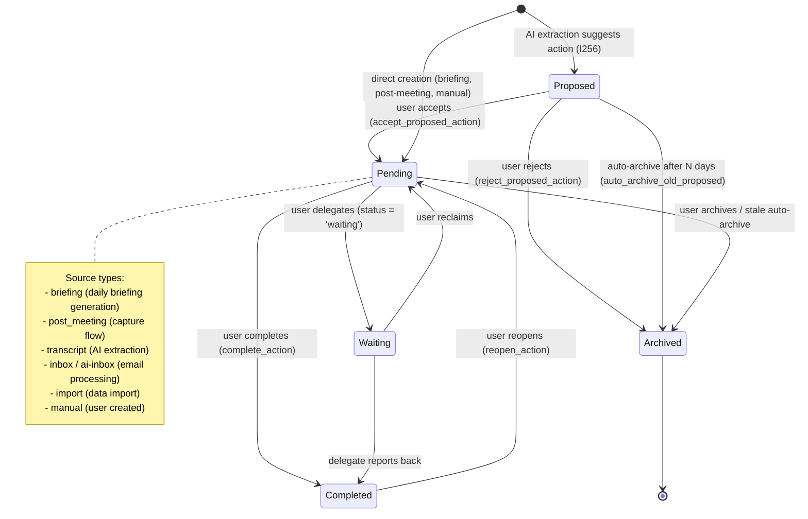
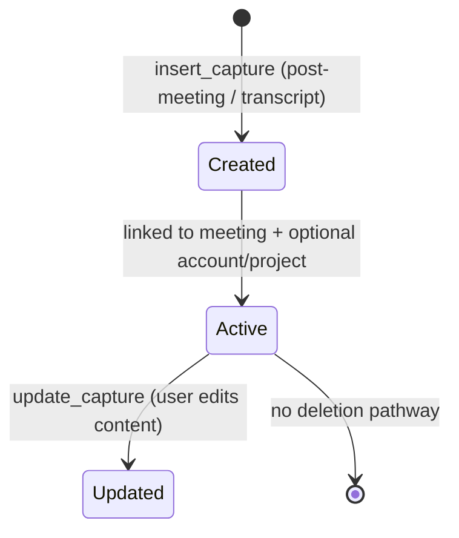

# Entity Lifecycle and State Machine Documentation

> Last updated: 2026-03-02 | Covers: v0.16.0

This document maps the lifecycle of every major domain object in DailyOS, from creation to deletion or archival. Each section includes the state machine, implementing code, transition triggers, and known gaps.

---

## Table of Contents

1. [Entity (Account/Project) Lifecycle](#1-entity-accountproject-lifecycle)
2. [Person Lifecycle](#2-person-lifecycle)
3. [Meeting Lifecycle](#3-meeting-lifecycle)
4. [Intelligence Lifecycle](#4-intelligence-lifecycle)
5. [Signal Lifecycle](#5-signal-lifecycle)
6. [Report Lifecycle](#6-report-lifecycle)
7. [Action/Capture Lifecycle](#7-actioncapture-lifecycle)

---

## 1. Entity (Account/Project) Lifecycle

Entities are the core domain objects that DailyOS tracks: accounts (customer organizations) and projects. Both share a common `entities` table (ADR-0045) that serves as a unified resolution surface, while `accounts` and `projects` tables hold type-specific fields.

### State Diagram



### Transitions

| Transition | Trigger | Key Files |
|---|---|---|
| **Created** | `upsert_account()` or `upsert_project()` called from workspace sync, manual creation, or import | `src-tauri/src/db/accounts.rs:upsert_account`, `src-tauri/src/db/projects.rs` |
| **Entity mirror** | `ensure_entity_for_account()` called automatically on upsert. Keeps `entities` table in sync. | `src-tauri/src/db/entities.rs:ensure_entity_for_account` |
| **Linked** | `meeting_entities` join table populated by auto-link scoring (keyword match, embedding similarity) or manual linking via `link_entity_to_meeting` command | `src-tauri/src/commands.rs`, `src-tauri/src/prepare/entity_resolution.rs` |
| **Enriched** | `IntelligenceQueue` processes entity via PTY call, writes `intelligence.json` to tracker path | `src-tauri/src/intel_queue.rs:run_intelligence_processor` |
| **Stale** | `get_stale_accounts(stale_days)` query detects accounts not touched within threshold | `src-tauri/src/db/actions.rs:get_stale_accounts` |
| **Archived** | User sets `archived=true` via command. Archived entities excluded from resolution, enrichment, and dashboards. | `src-tauri/src/db/accounts.rs:archive_account` |
| **Merged** | `merge_accounts()` transfers actions, meetings, people, events, children from source to target, then deletes source | `src-tauri/src/db/accounts.rs` (MergeResult) |

### Entity Auto-Link Scoring

Meeting-to-entity linking uses a multi-factor scoring approach:

1. **Keyword matching** -- Entity keywords (auto-extracted, stored in `keywords` JSON column) matched against meeting title/description. Source weight: 0.4.
2. **Embedding similarity** -- When the embedding model is loaded, cosine similarity between entity content embeddings and meeting context. Source weight: 0.4.
3. **Attendee organization matching** -- Meeting attendee email domains matched to entity-linked people organizations.
4. **Manual override** -- User links/unlinks entities. Source weight: 1.0 (user_correction).

### Known Gaps

- **No formal "Linking" state column.** Entity linking is a relationship in `meeting_entities`, not a state on the entity itself. An entity that has been created but never linked to a meeting is indistinguishable from a newly created entity.
- **No archival cascade.** Archiving an account does not cascade to child projects, linked people, or pending actions. These must be cleaned up separately.
- **Keyword extraction is one-shot.** Keywords are extracted once (`keywords_extracted_at`) and not refreshed as entity context evolves.

---

## 2. Person Lifecycle

People are discovered from multiple sources, enriched via third-party services, and tracked for relationship intelligence.

### State Diagram



### Source Priority

Enrichment data follows a strict priority hierarchy. Higher-priority sources never get overwritten by lower ones.

| Priority | Source | Weight | Half-life | Examples |
|---|---|---|---|---|
| 4 (highest) | User | 1.0 | 365 days | Manual edits to name, role, notes |
| 3 | Clay | 0.6 | 90 days | LinkedIn URL, title history, company data |
| 2 | Glean/Gravatar | 0.7/0.6 | 60/90 days | Org chart, profile photos, bios |
| 1 (lowest) | AI | 0.4 | 7 days | Inferred role from email signatures |

Implemented in `src-tauri/src/db/people.rs:update_person_profile()` which tracks provenance in the `enrichment_sources` JSON column.

### Transitions

| Transition | Trigger | Key Files |
|---|---|---|
| **Discovered** | `upsert_person()` from meeting attendee processing, manual add, or import. Also mirrors to `entities` table via `ensure_entity_for_person()`. | `src-tauri/src/db/people.rs:upsert_person` |
| **Clay Enrichment** | `enrichment.rs` background processor queries `clay_sync_state` for pending rows, calls Clay via Smithery Connect API | `src-tauri/src/enrichment.rs:process_clay_queue` |
| **Gravatar Enrichment** | `enrichment.rs` queries `gravatar_cache` for stale emails, fetches profile + avatar | `src-tauri/src/enrichment.rs:process_gravatar_queue` |
| **Profile Update** | `update_person_profile(person_id, fields, source)` -- single write function for ALL enrichment sources. Handles source priority checks. | `src-tauri/src/db/people.rs:update_person_profile` |
| **Signal Emission** | Profile discovery emits `profile_discovered` signal via `emit_signal_and_propagate()`, triggers downstream propagation to linked accounts | `src-tauri/src/enrichment.rs` (Gravatar path), `src-tauri/src/signals/bus.rs` |
| **Relationship Mapping** | `entity_people` join table links people to accounts/projects. `person_relationships` tracks inter-person relationships. | `src-tauri/src/db/person_relationships.rs` |
| **Archived** | User sets `archived=true`. Archived people excluded from enrichment queue, attendee resolution, and dashboard views. | `src-tauri/src/db/people.rs` |

### Enrichment Flow

```
upsert_person() (from meeting sync)
    |
    v
clay_sync_state row created (pending)
    |
    v
enrichment.rs background processor
    |--- Clay via Smithery ---> update_person_profile(source="clay")
    |                               |
    |                               v
    |                           emit_signal("profile_discovered", source="clay")
    |                               |
    |                               v
    |                           propagation rules fire:
    |                               rule_person_profile_discovered -> account stakeholders_updated
    |                               rule_person_network -> co-attendee relationship signals
    |
    |--- Gravatar -----------> update_person_profile(source="gravatar")
                                    |
                                    v
                                emit_signal_and_propagate("profile_discovered", source="gravatar")
```

### Known Gaps

- **No Glean enrichment path yet.** Glean mode disables Clay/Gravatar but no Glean-specific person enrichment pipeline exists (planned for v1.1.0, I505).
- **Enrichment staleness uses a flat 30-day window.** There is no per-source TTL -- a person enriched by Gravatar 29 days ago is not re-enriched even if Clay data is available.
- **Relationship type is coarse.** `relationship` column is only "internal" | "external" | "unknown". The richer relationship graph (I504, I506) is planned for v1.1.0.

---

## 3. Meeting Lifecycle

Meetings flow from Google Calendar sync through preparation, execution, and post-meeting processing.

### State Diagram

```mermaid
stateDiagram-v2
    [*] --> Synced: calendar polling / ensure_meeting_in_history
    Synced --> EntityLinked: auto-link or manual link
    EntityLinked --> PrepQueued: MeetingPrepQueue enqueue
    PrepQueued --> PrepGenerated: mechanical prep built
    PrepGenerated --> PrepFrozen: reconcile.rs freezes snapshot
    PrepGenerated --> Active: meeting start_time is today
    Active --> Completed: meeting end_time has passed
    Completed --> TranscriptProcessed: transcript matched + processed
    TranscriptProcessed --> Archived: intelligence_state = archived

    state Synced {
        [*] --> New: first seen (MeetingSyncOutcome::New)
        New --> Changed: title/time/attendees changed (MeetingSyncOutcome::Changed)
        Changed --> Unchanged: no further changes (MeetingSyncOutcome::Unchanged)
    }

    state PrepGenerated {
        [*] --> MechanicalPrep: gather_meeting_context (no AI)
        MechanicalPrep --> AIEnriched: full briefing refresh (PTY)
    }
```

### Meeting Prep State Machine

The meeting prep subsystem has its own internal state progression:



### Transitions

| Transition | Trigger | Key Files |
|---|---|---|
| **Synced** | Calendar polling calls `ensure_meeting_in_history()`. Returns New/Changed/Unchanged outcome. | `src-tauri/src/db/meetings.rs:ensure_meeting_in_history` |
| **Entity Linked** | `meeting_entities` populated by entity resolution during daily preparation or manual linking | `src-tauri/src/prepare/entity_resolution.rs` |
| **Prep Queued** | `sweep_meetings_needing_prep()` on app boot enqueues all future meetings with entities but no prep. Also triggered by page load or manual refresh. | `src-tauri/src/meeting_prep_queue.rs:sweep_meetings_needing_prep` |
| **Prep Generated** | `generate_mechanical_prep()` builds prep from entity intelligence, account dashboards, open actions, meeting history -- no AI call | `src-tauri/src/meeting_prep_queue.rs:generate_mechanical_prep` |
| **Prep Frozen** | `freeze_meeting_prep_snapshot()` writes immutable snapshot. Gates on `prep_frozen_at IS NULL` -- once set, never overwritten. | `src-tauri/src/db/meetings.rs:freeze_meeting_prep_snapshot` |
| **Intelligence State Updated** | `update_intelligence_state()` tracks progression: null -> enriching -> enriched -> refreshing -> enriched | `src-tauri/src/db/meetings.rs:update_intelligence_state` |
| **New Signals Flag** | `mark_meeting_new_signals()` set when signals arrive for linked entities. Cleared when user views meeting. | `src-tauri/src/db/meetings.rs:mark_meeting_new_signals` / `clear_meeting_new_signals` |
| **Transcript Processed** | Quill sync or manual attachment writes `transcript_path` and `transcript_processed_at` | `src-tauri/src/db/meetings.rs:update_meeting_transcript_metadata` |
| **Prep Reviewed** | User views meeting detail, `mark_prep_reviewed()` records timestamp | `src-tauri/src/db/meetings.rs:mark_prep_reviewed` |

### Prep Invalidation Triggers

Signals with confidence >= 0.7 and specific signal types invalidate existing prep for upcoming meetings (48h window):

- `stakeholder_change`, `champion_risk`, `renewal_risk_escalation`
- `engagement_warning`, `project_health_warning`
- `title_change`, `company_change`
- `pre_meeting_context`, `stakeholders_updated`
- `team_member_added`, `team_member_removed`
- `transcript_outcomes`

Implemented in `src-tauri/src/signals/invalidation.rs:check_and_invalidate_preps`.

### Quill Transcript Sync State Machine



Exponential backoff: 5, 10, 20, 40, 80 minutes between attempts.

### Known Gaps

- **No explicit "Cancelled" state.** If a Google Calendar event is deleted, the meeting row persists in `meetings_history` with no deletion marker.
- **Prep invalidation clears `prep_frozen_json` but not `prep_frozen_at`.** The `freeze_meeting_prep_snapshot` function gates on `prep_frozen_at IS NULL`, so once a meeting has been AI-frozen, signal-driven invalidation cannot replace it (by design -- immutability after freeze).
- **No time-based prep expiry.** Mechanical prep generated a week before a meeting is not automatically refreshed as the meeting approaches.

---

## 4. Intelligence Lifecycle

Intelligence enrichment follows ADR-0086: entity intelligence is the producer, meeting prep is the consumer.

### State Diagram



### Pipeline

```
Entity created/updated
    |
    v
IntelligenceQueue.enqueue(priority)
    |--- dedup by entity_id (higher priority wins)
    |--- debounce: 30s for ContentChange/ProactiveHygiene
    |
    v
run_intelligence_processor (background loop, 5s poll)
    |--- batch up to 3 entities per PTY call
    |--- TTL check: skip if enriched within 2h
    |
    v
build_intelligence_prompt_with_preset(entity, preset, sources)
    |
    v
PtyManager.spawn_claude(workspace, prompt)  [ModelTier::Synthesis, 300s timeout]
    |
    v
parse_intelligence_response(output)
    |--- validation: hallucination detection, coherence scoring
    |--- retry on failure (up to 2 retries)
    |
    v
write_intelligence_json(tracker_path)
    |
    v
DB updates:
    |--- entity_intelligence row (enriched_at, executive_assessment, etc.)
    |--- entity_quality row (trigger score, coherence metrics)
    |--- mark_reports_stale(entity_id) -- invalidate cached reports
    |
    v
on_enrichment_complete:
    |--- coherence check (embedding similarity between old/new intel)
    |--- circuit breaker management if coherence fails
    |--- emit "entity_coherence_flagged" signal if needed
```

### Quality Assessment

`assess_intelligence_quality()` computes quality level from DB alone (no AI):

| Level | Criteria |
|---|---|
| **Sparse** | No linked entities AND no attendee history |
| **Developing** | Has entity context OR attendee history |
| **Ready** | Has entity context + attendee history + 3+ signals (but stale/aging) |
| **Fresh** | Ready criteria + staleness = Current (enriched < 12h ago) |

Staleness thresholds: Current (<12h), Aging (12-48h), Stale (>48h).

Implemented in `src-tauri/src/intelligence/lifecycle.rs:assess_intelligence_quality`.

### Key Files

| File | Purpose |
|---|---|
| `src-tauri/src/intel_queue.rs` | Priority queue, dedup, debounce, batch processing, PTY calls |
| `src-tauri/src/intelligence/lifecycle.rs` | Quality assessment, meeting intelligence orchestration |
| `src-tauri/src/intelligence/prompts.rs` | Prompt construction with preset-driven customization |
| `src-tauri/src/intelligence/validation.rs` | Hallucination detection, coherence scoring |
| `src-tauri/src/intelligence/io.rs` | Read/write intelligence.json files |
| `src-tauri/src/self_healing/scheduler.rs` | Circuit breaker, coherence retry management |
| `src-tauri/src/self_healing/detector.rs` | Coherence check (embedding similarity) |
| `src-tauri/src/self_healing/remediation.rs` | Enrichment trigger scoring, prioritization |
| `src-tauri/src/self_healing/quality.rs` | entity_quality table management |

### Known Gaps

- **Batch enrichment shares one PTY call for up to 3 entities.** A hallucination in one entity's output can corrupt the parse for the entire batch.
- **No per-entity enrichment budget.** The hygiene budget (`HygieneBudget`) is global -- a few expensive entities can exhaust the daily budget for all others.
- **Coherence check requires the embedding model to be loaded.** If the model fails to initialize, coherence checking is silently skipped.

---

## 5. Signal Lifecycle

Signals are typed, weighted, time-decaying events emitted from every data source into the universal signal bus (ADR-0080).

### State Diagram



### Source Tier Weights

| Tier | Sources | Base Weight | Default Half-life |
|---|---|---|---|
| **Tier 1** (highest) | `user_correction`, `explicit` | 1.0 | 365 days |
| **Tier 2** | `transcript`, `notes` | 0.9 | 60 days |
| **Tier 3** | `attendee`, `attendee_vote`, `email_thread`, `junction` | 0.8 | 30 days |
| **Tier 3b** | `group_pattern` | 0.75 | 60 days |
| **Tier 4** | `proactive` | 0.7 | 3 days |
| **Tier 4b** | `glean`, `glean_search`, `glean_org` | 0.7 | 60 days |
| **Tier 5** | `clay`, `gravatar` | 0.6 | 90 days |
| **Tier 6** (lowest) | `keyword`, `keyword_fuzzy`, `heuristic`, `embedding` | 0.4 | 7 days |

### Emission Variants

Three levels of signal emission with increasing side effects:

1. **`emit_signal()`** -- Insert signal, flag linked meetings. No propagation.
2. **`emit_signal_and_propagate()`** -- Emit + run all propagation rules + prep invalidation.
3. **`emit_signal_propagate_and_evaluate()`** -- Emit + propagate + evaluate self-healing re-enrichment trigger.

### Propagation Rules

Registered in `src-tauri/src/signals/propagation.rs:default_engine`:

| Rule | Input Signal | Derived Signal | Target |
|---|---|---|---|
| `rule_person_job_change` | Person `title_change` | `stakeholder_change` on linked accounts | Accounts linked via `entity_people` |
| `rule_overdue_actions` | Any signal on entity with overdue actions | `engagement_warning` | Same entity |
| `rule_champion_sentiment` | Person `champion_risk` | `champion_risk` on linked accounts | Accounts |
| `rule_departure_renewal` | Person departure + account near renewal | `renewal_risk_escalation` | Account |
| `rule_renewal_engagement_compound` | Account renewal + low engagement | Compound risk signal | Account |
| `rule_person_network` | Person signal | Relationship signal | Co-attendee people |
| `rule_hierarchy_up` | Child entity signal | Aggregated signal | Parent entity |
| `rule_hierarchy_down` | Parent entity signal | Cascaded signal | Child entities |
| `rule_person_profile_discovered` | Person `profile_discovered` | `stakeholders_updated` | Linked accounts |

### Decay Formula

```
decayed_weight = base_weight * 2^(-age_days / half_life_days)
```

Implemented in `src-tauri/src/signals/decay.rs:decayed_weight`. Pure math, no DB access.

### Learned Reliability (Thompson Sampling)

The `signal_weights` table stores Beta distribution parameters (alpha, beta) per source/entity_type/signal_type combination. When `update_count >= 5`, Thompson Sampling explores/exploits learned reliability. Below 5 updates, returns uninformative prior (0.5).

Implemented in `src-tauri/src/signals/bus.rs:get_learned_reliability` and `src-tauri/src/signals/sampling.rs`.

### Key Files

| File | Purpose |
|---|---|
| `src-tauri/src/signals/bus.rs` | Signal CRUD, emission functions, source weights |
| `src-tauri/src/signals/propagation.rs` | PropagationEngine, rule registry, derived signal emission |
| `src-tauri/src/signals/rules.rs` | All propagation rule implementations |
| `src-tauri/src/signals/decay.rs` | Exponential half-life decay math |
| `src-tauri/src/signals/feedback.rs` | Bayesian weight learning from user corrections |
| `src-tauri/src/signals/invalidation.rs` | Signal-driven meeting prep invalidation |
| `src-tauri/src/signals/fusion.rs` | Weighted log-odds Bayesian combination |
| `src-tauri/src/signals/sampling.rs` | Thompson Sampling for reliability exploration |
| `src-tauri/src/signals/scoring.rs` | Signal scoring and ranking |

### Known Gaps

- **No explicit signal expiry/GC.** Signals decay in weight but are never physically deleted from `signal_events`. Over time the table grows unbounded.
- **Supersession is manual.** The system does not automatically detect when a new signal should supersede an old one of the same type -- callers must explicitly call `supersede_signal()`.
- **Propagation is synchronous.** All rules fire within the same DB transaction as the original emission. A slow rule blocks all other rules and the caller.

---

## 6. Report Lifecycle

Reports are AI-generated analytical documents (SWOT, Account Health, EBR/QBR, Weekly Impact, Monthly Wrapped, Risk Briefing) stored in the `reports` table.

### State Diagram



### Intel Hash Freshness

Each report stores an `intel_hash` computed from the entity's intelligence state at generation time:

```
hash = SHA256(entity_id : entity_type : enriched_at | executive_assessment)[0:16]
```

When entity intelligence is refreshed, `mark_reports_stale()` sets `is_stale=1` on all reports for that entity. The frontend can compare `intel_hash` to detect if regeneration would produce different results.

### Report Types

| Type | Scope | Key File |
|---|---|---|
| `swot` | Single account | `src-tauri/src/reports/swot.rs` |
| `account_health` | Single account | `src-tauri/src/reports/account_health.rs` |
| `ebr_qbr` | Single account | `src-tauri/src/reports/ebr_qbr.rs` |
| `weekly_impact` | User-wide | `src-tauri/src/reports/weekly_impact.rs` |
| `monthly_wrapped` | User-wide | `src-tauri/src/reports/monthly_wrapped.rs` |
| `risk_briefing` | User-wide | `src-tauri/src/reports/risk.rs` |

### Two-Phase Generation Pattern

All report types follow the same pattern implemented in `src-tauri/src/reports/generator.rs`:

1. **Phase 1 (Gather):** Brief DB lock to collect entity intelligence, signals, meeting history, actions. Produces `ReportGeneratorInput` with an owned prompt string.
2. **Phase 2 (Generate):** Release DB lock. Run `PtyManager::spawn_claude()` at `ModelTier::Synthesis` with 300s timeout and nice priority 10. Write audit trail.
3. **Phase 3 (Store):** `upsert_report()` writes `content_json` + `intel_hash` + sets `is_stale=0`.

### Key Files

| File | Purpose |
|---|---|
| `src-tauri/src/reports/mod.rs` | ReportType enum, DB CRUD, intel hash computation |
| `src-tauri/src/reports/generator.rs` | Two-phase PTY dispatch (shared infrastructure) |
| `src-tauri/src/reports/invalidation.rs` | `mark_reports_stale()` called after entity re-enrichment |
| `src-tauri/src/reports/prompts.rs` | Prompt templates for each report type |

### Known Gaps

- **No automatic regeneration.** Stale reports are flagged but never automatically regenerated -- the user must explicitly request a refresh.
- **No differential generation.** Every regeneration runs the full prompt with all context, even if only a small piece of intelligence changed.
- **User edits are overwritten on regeneration.** `upsert_report()` replaces `content_json` entirely. There is no merge between user edits and AI output.

---

## 7. Action/Capture Lifecycle

Actions are tasks extracted from meetings, emails, and daily briefings. Captures are post-meeting outcomes (wins, risks, decisions).

### Action State Diagram



### Action Dedup Guards

`upsert_action_if_not_completed()` implements two-layer deduplication:

1. **Title-based guard:** If ANY action with the same title + account already exists (any status), skip insert. Catches cross-source duplicates.
2. **ID-based guard:** If an action with the same ID is already completed, skip. Prevents daily briefing syncs from resurrecting completed actions.

### Capture State Diagram



Captures are simpler than actions -- they have no status progression. They are immutable records of outcomes tied to meetings.

### Transitions

| Transition | Trigger | Key Files |
|---|---|---|
| **Proposed** | AI enrichment suggests action during briefing or email processing | `src-tauri/src/db/actions.rs:upsert_action` with status="proposed" |
| **Accepted** | User clicks "Accept" on proposed action | `src-tauri/src/db/actions.rs:accept_proposed_action` |
| **Rejected** | User clicks "Reject" on proposed action. Records `rejection_source` for correction learning. | `src-tauri/src/db/actions.rs:reject_proposed_action_with_source` |
| **Completed** | User marks action done | `src-tauri/src/db/actions.rs:complete_action` |
| **Reopened** | User reopens completed action | `src-tauri/src/db/actions.rs:reopen_action` |
| **Waiting** | User sets `status = 'waiting'` with `waiting_on` field | Direct `upsert_action` call |
| **Archived** | User archives, or `archive_stale_actions(days)` auto-archives old pending actions | `src-tauri/src/db/actions.rs:archive_action` / `archive_stale_actions` |
| **Decision Flagged** | AI enrichment marks action as needing a decision (`needs_decision=1`) | `src-tauri/src/db/actions.rs:flag_action_as_decision` |
| **Capture Created** | Post-meeting flow or transcript processing extracts wins/risks/decisions | `src-tauri/src/db/signals.rs:insert_capture_with_project` |

### Entity Connections

Actions connect to the domain model through multiple paths:

- `account_id` -- links to the account entity
- `project_id` -- links to the project entity (I52)
- `person_id` -- links to a specific person (I351)
- `source_type` + `source_id` -- traces back to the originating meeting, email, or briefing
- `source_label` -- human-readable label for the source (used for workspace file updates)

Captures connect via:

- `meeting_id` -- the originating meeting
- `account_id` -- the linked account
- `project_id` -- the linked project

### Known Gaps

- **No capture deletion.** Captures have no delete or archive pathway. Over time they accumulate indefinitely.
- **No action-to-capture link.** An action extracted from a meeting and a capture from the same meeting are not explicitly linked.
- **Stale delegation detection is query-based, not event-driven.** `get_stale_delegations(stale_days)` is a point-in-time query, not a background job that proactively alerts.
- **Proposed action auto-archive uses a single global threshold.** There is no per-source or per-entity variation in how long proposed actions survive before being auto-archived.

---

## Cross-Cutting: Signal Flow Between Lifecycles

The following diagram shows how signal emission connects the lifecycles together:

```
Person enriched (Clay/Gravatar)
    |
    emit_signal("profile_discovered")
    |
    propagation rules fire:
    |--- rule_person_profile_discovered -> account "stakeholders_updated"
    |--- rule_person_network -> co-attendee relationship signals
    |
    |--- account signal -> mark_meeting_new_signals for linked meetings
    |--- account signal -> check_and_invalidate_preps (48h window)
    |--- account signal -> evaluate_on_signal -> self-healing queue
    |--- account signal -> mark_reports_stale
    |
    v
Meeting prep regenerated (MeetingPrepQueue)
Report marked stale
Entity re-enriched if trigger score > 0.7
```

This cascade is the core intelligence loop: data arrives at a person, propagates to accounts, invalidates cached meeting prep and reports, and triggers fresh enrichment -- all driven by the signal bus.

---

## v1.4.0 Substrate Lifecycles

The lifecycles above describe DailyOS as of 2026-03-02. v1.4.0 Abilities Runtime adds the following state machines. These do not yet exist in code; they describe the shape substrate implementation will produce.

### Claim lifecycle

Every claim in `intelligence_claims` passes through this state machine.

```
                       ┌─────────────┐
                       │  proposed   │  Created by propose_claim.
                       └──────┬──────┘  Visible only in Analysis Inbox.
                              │
              ┌───────────────┼───────────────┐
              │               │               │
       user accepts     gate passes      user rejects
       (Inbox)          (commit gate)    (Inbox)
              │               │               │
              ▼               ▼               ▼
                       ┌─────────────┐    ┌───────────┐
                       │  committed  │    │ withdrawn │
                       └──────┬──────┘    └───────────┘
                              │
              ┌───────────────┼────────────────┐
              │               │                │
       same actor          different         user removes
       re-asserts          actor asserts      value (UI)
       (different text)    (conflict)
              │               │                │
              ▼               ▼                ▼
       ┌─────────────┐   contradiction     ┌─────────────┐
       │ superseded  │   row written;      │ tombstoned  │
       │ (history)   │   BOTH stay         │ (authoritative
       └─────────────┘   committed         │  negative)  │
                         until resolution  └─────────────┘
```

Transitions are append-only (new row per supersede/tombstone with `previous_claim_id` pointer; `claim_sequence` monotonic per field_path). Trust annotation (`trust_score`, `trust_version`) mutates in place on the committed row — trust is deterministic + recomputable, so history is not load-bearing for it.

**State read semantics:**

- Default: `claim_state IN ('committed', 'tombstoned') AND superseded_at IS NULL`. Tombstones are authoritative negative assertions, included.
- Analysis Inbox: `claim_state = 'proposed'`.
- History: drop all filters.

Governing: [ADR-0113](../decisions/0113-human-and-agent-analysis-as-first-class-claim-sources.md) §2, R1.1, R1.2.

### Agent trust ledger lifecycle

Per `(agent_name, agent_version, claim_type)` trio. Beta distribution tracks reliability.

```
  New agent version registers (first claim)
    |
    v
  INSERT agent_trust_ledger row {α: warmed, β: warmed,
    posterior_score: Beta(α, β).mean(), last_updated}
    |
    v
  Version-bump warming: α_new = prior.α × 0.5, β_new = prior.β × 0.5
  (halves prior evidence; start not cold)
    |
    v
  Steady state — updates on claim outcomes:
    +-- User/human accepts claim → α += 1
    +-- Independent corroboration → α += 0.5
    +-- User/human rejects → β += 1
    +-- Independent contradiction → β += 0.5
    |
    v
  Recompute posterior_score after each update.
    |
    +-- posterior_score < floor (default 0.45) → QUARANTINE:
    |     subsequent claims auto-route to Analysis Inbox.
    |
    +-- Shadow sampling (R1.4): 10% of below-threshold claims surfaced
    |   to Inbox anyway → prevents ratchet.
    |
    +-- Updates keep flowing → score recovers → exit quarantine.
    |
    v
  Agent version deprecated → rows remain for audit; no new updates.
```

Governing: [ADR-0113 §6, R1.4](../decisions/0113-human-and-agent-analysis-as-first-class-claim-sources.md).

### Publish draft lifecycle

Every `publish_drafts` row.

```
          User (or ability) creates draft
                     │
                     ▼
              ┌─────────────┐
              │    Open     │   Reviewable, editable, revocable. TTL 24h.
              └──────┬──────┘
                     │
      ┌──────────────┼──────────────┐
      │              │              │
  user edits     user confirms   user withdraws
  (bumps         (issues token)  (cancel)
   draft_version)      │              │
      │               ▼              ▼
      │        ┌─────────────┐  ┌─────────────┐
      │        │  Committed  │  │  Withdrawn  │
      │        └──────┬──────┘  │ (frozen;    │
      │               │         │  payload    │
      │        (draft lifecycle │  null-masked)│
      │         ends here;      └─────────────┘
      │         outbox worker
      │         takes over)
      │
      └── TTL expires before commit → Expired
          (payload null-masked after 7 days per R1.8)
```

Governing: [ADR-0117 §1, R1.8](../decisions/0117-publish-boundary-pencil-and-pen.md).

### Publish outbox lifecycle

Every `publish_outbox` row (Pen phase). Independent of draft lifecycle.

```
            commit_publish writes row
                     │
                     ▼
              ┌─────────────┐
              │   Pending   │   Worker picks up in FIFO order within chain.
              └──────┬──────┘
                     │
              DestinationClient::deliver(payload, idem_key)
                     │
    ┌──────────┬─────┼─────┬──────────┬──────────┐
    │          │     │     │          │          │
 success   transient perm  timeout  worker crash
    │      (5xx etc)  (4xx)  (retry)   (restart)
    │          │      │      │        (stays
    ▼          ▼      ▼      ▼         Pending,
┌───────────┐┌──────────────┐┌───────────────┐ resumed
│ Delivered ││FailedRetryable││FailedPermanent│ on boot)
│ + dest_ref││ (backoff 5x) ││               │
└─────┬─────┘└──────┬───────┘└───────────────┘
      │             │
  (optional)   After 5 retries
  retract      → FailedPermanent
      │
      ▼
┌───────────┐
│ Retracted │  or RetractionFailed
└───────────┘  (per RetractionSupport)
```

Idempotency: `idem_key = hash(ability_name, draft_id, draft_version, payload_hash)`. Retries don't duplicate.

Governing: [ADR-0117 §3, R1.2, R1.4, R1.5](../decisions/0117-publish-boundary-pencil-and-pen.md).

### Invalidation job lifecycle

Every `invalidation_jobs` row. Durable queue per ADR-0115.

```
                Signal emit triggers enqueue
                (same transaction as event log — R1.4)
                             │
                             ▼
                      ┌─────────────┐
                      │   Pending   │   FIFO within chain_id.
                      └──────┬──────┘
                             │
                       Worker picks up
                             │
                             ▼
                      ┌─────────────┐
                      │   Running   │   Recomputing affected_output_ids.
                      └──────┬──────┘
                             │
        ┌─────────┬──────────┴─────────┬────────────────┐
        │         │                    │                │
     success  transient            cycle detected   depth cap
     (outputs failure              (ancestry         exceeded
      recom-  (remains              intersect)      (default 16)
      puted)  Pending,
             retry backoff)
        │         │                    │                │
        ▼         ▼                    ▼                ▼
 ┌──────────┐ (up to 5x →       ┌──────────────────┐ ┌────────────────┐
 │Completed │  FailedPermanent  │ CycleDetected    │ │DeadLettered    │
 │          │  or DeadLettered) │ (affected        │ │(retry          │
 │          │                   │  marked stale)   │ │ exhausted,     │
 │          │                   │                  │ │ marked stale)  │
 └──────────┘                   └──────────────────┘ └────────────────┘
```

**Outputs never silently dropped.** Cycle / depth / dead-letter all mark affected outputs with `last_known_good_as_of`. Surfaces render staleness explicitly.

Governing: [ADR-0115 §5, R1.4, R1.6](../decisions/0115-signal-granularity-audit.md).

### Actor taxonomy (reference)

Not a lifecycle per se — the enumeration every claim's `actor` column serializes.

| Variant | String | Example |
|---|---|---|
| User direct action | `user` | — |
| User tombstone | `user_removal` | — |
| Human analyst | `human:<role>:<id>` | `human:cs:james@a8c.com` |
| Agent (AI ability) | `agent:<name>:<version>` | `agent:detect_champion:2.1` |
| System (deterministic) | `system:<component>` | `system:scheduler` |
| External source | `external:<source>` | `external:salesforce` |

Actor and `DataSource` are orthogonal. An agent claim has `actor = 'agent:...'` AND `source_ref` pointing to the `DataSource`(s) the agent consumed.

Governing: [ADR-0113 §1, R1.5](../decisions/0113-human-and-agent-analysis-as-first-class-claim-sources.md).
