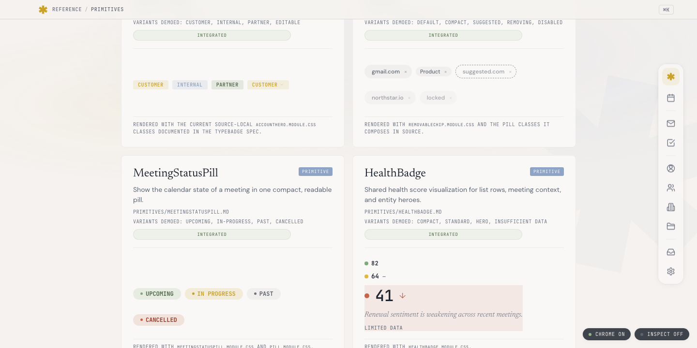
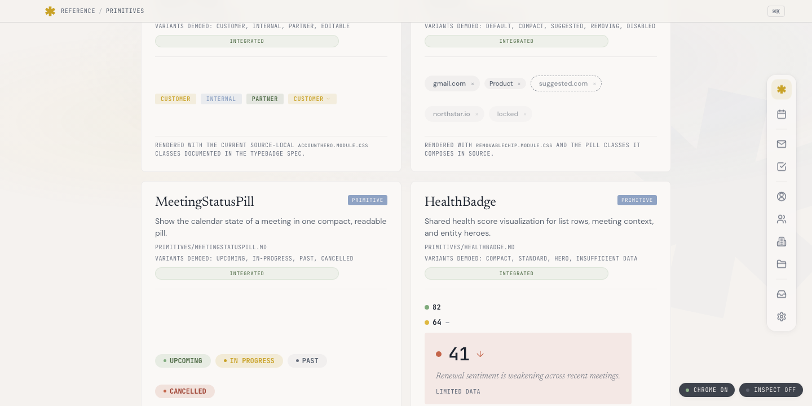

# v1.4.3 L4 visual parity matrix

L4 surface walkthrough for v1.4.3 W2 (primitive blocks) + W3 (magazine theme) — hands-on validation under WP Studio sandbox `~/Studio/dailyos-dev` at `http://localhost:8884`.

Walkthrough date: 2026-05-19. Branch: `dos-698-w3-magazine-theme`. Fork SHA at start: `bd08e8f0`. Three commits added during the walk: `375a13b8` (HealthBadge padding), `4950c017` (block render pipeline + template hierarchy class sweep), and this doc.

## Setup

| Component | Path | State |
|---|---|---|
| Plugin (PHP) | `~/Studio/dailyos-dev/wp-content/plugins/dailyos` → `/tmp/dailyos-w3/wp/dailyos` | symlinked from worktree |
| Theme (FSE block theme) | `~/Studio/dailyos-dev/wp-content/themes/dailyos-magazine` → `/tmp/dailyos-w3/wp/dailyos/theme` | symlinked from worktree |
| CPT | `dailyos_account` | registered, 1 sample post (`Acme Corporation`, ID 14) |
| Active theme | `dailyos-magazine` v0.1.0 | activated via WP-CLI |
| Active plugin | `dailyos` v0.1.0 | already active |

## W2 — primitive reference HTML

Surface: `.docs/design/reference/system/primitives.html` (static HTML reference, not WP-rendered).

| Primitive | Card present | Variants demoed | Module CSS attribution | Status badge | Verdict |
|---|---|---|---|---|---|
| Pill | yes | sage/turmeric/terracotta/larkspur/olive/eucalyptus/neutral/compact/dot | `Pill.module.css` | Integrated | PASS |
| EntityChip | yes | account/project/person/compact/removable | `EntityChip.module.css` | Integrated | PASS |
| TypeBadge | yes | customer/internal/partner/editable | `TypeBadge.module.css` | Integrated | PASS |
| StatusDot | yes | confirmed in `Labels and Identity` section | `StatusDot.module.css` | Integrated | PASS |
| ProvenanceTag | yes | confirmed in `Trust and Evidence` section | `ProvenanceTag.module.css` | Integrated | PASS |
| ScoreBand | yes | (W2 PR-D4 addition) | `ScoreBand.module.css` | Integrated | PASS |
| HealthBadge | yes | compact/standard/hero/insufficient-data | `HealthBadge.module.css` | Integrated | **fixed** (see findings) |

### Finding — HealthBadge red hero variant missing padding

The expanded red HealthBadge had the rationale text "Renewal sentiment is weakening across recent meetings." touching the left edge of the tinted background. Root cause: `primitives.html:689` class list `"HealthBadge_hero HealthBadge_heroTintRed"` was missing the base `HealthBadge_heroTint` class (which carries `padding: 16px 20px`). Only the color modifier was applied.

- **Class-pattern audit:** single usage in the reference HTML — Yellow/Green variants not exercised here, so no broader sweep needed.
- **Fix:** commit `375a13b8` — added `HealthBadge_heroTint` to the class list.
- **Verification:** `proof/screenshots/p-healthbadge-fixed.png` shows rationale + "LIMITED DATA" both set in from the tint edge.

| Before | After |
|---|---|
|  |  |

## W3 — magazine theme

Surface: `~/Studio/dailyos-dev` rendering the W3 theme + plugin against `dailyos_account` post.

### Template attachment

| URL | Expected template | Body class verdict | Render verdict |
|---|---|---|---|
| `/` | `front-page` | `home page-template-default` | PASS |
| `/accounts/` (archive) | `archive-dailyos_account` | `archive post-type-archive-dailyos_account` | PASS |
| `/accounts/acme-corporation/` (single) | `single-dailyos_account` | `single-dailyos_account` | PASS (after class-pattern fix) |
| `/wp-admin/edit.php?post_type=dailyos_account` | admin list | — | PASS |
| `/wp-admin/post.php?post=14&action=edit` | block editor | — | PASS (Template field shows `single-dailyos_account`) |

### Editorial-shell AC N

| AC element | Single template | Archive | Front |
|---|---|---|---|
| `dailyos-folio-bar` (header) | ✓ | ✓ | ✓ |
| `dailyos-atmosphere` (body wrap) | ✓ | ✓ | ✓ |
| `dailyos-magazine-page` (main column) | ✓ | ✓ | ✓ |
| `dailyos-end-mark` (separator + paragraph) | ✓ | n/a (archive) | ✓ |
| `sidebar-account-summary` template-part | ✓ | n/a | n/a |
| `dailyos-folio-footer` | ✓ | ✓ | ✓ |

### Block rendering

| Block | Sidebar usage | Empty-state HTML | Verdict |
|---|---|---|---|
| `dailyos/account-overview` | n/a — main column | `<div class="wp-block-dailyos-account-overview is-empty">No account context to show here.</div>` | PASS (after fix) |
| `dailyos/entity-chip` | sidebar | empty-primitive span | PASS (after fix) |
| `dailyos/type-badge` | sidebar | empty-primitive span | PASS (after fix) |
| `dailyos/health-badge` | sidebar | renders score row with sage dot + "0" | PASS (after fix) |
| `dailyos/intelligence-quality-badge` | sidebar | renders "SPARSE" qualifier label | PASS (after fix) |
| `dailyos/freshness-indicator` | sidebar | renders dash placeholder | PASS (after fix) |

### Style variations

| Variation | Registered | Schema valid | Visual sign-off |
|---|---|---|---|
| Editorial Light | ✓ (`WP_Theme_JSON_Resolver::get_style_variations()`) | ✓ | needs hands-on Site Editor selection |
| High Contrast | ✓ | ✓ | needs hands-on Site Editor selection |
| ~~Editorial Dark~~ | deferred to `DOS-699` (no dark-mode tokens yet) | n/a | n/a |

Variations are valid and registered; visual application requires user-driven Site Editor → Styles → variation pick, which is a human QA step.

## Critical findings + fixes during walkthrough

### Finding 1 — Template hierarchy filename mismatch (class pattern, 3 files)

W3 shipped template filenames using hyphens, but the `dailyos_account` CPT slug uses an underscore. WP template hierarchy looked for `single-dailyos_account.html` (underscore) and never matched, falling back to `index.html`. Body class on the rendered page showed `dailyos_account-template-default` — WP's signal for "no theme template attached."

**Fix** (commit `4950c017`):
- Renamed `single-dailyos-account.html` → `single-dailyos_account.html`
- Renamed `archive-dailyos-account.html` → `archive-dailyos_account.html`
- Renamed `single-dailyos-briefing.html` → `single-dailyos_briefing.html` (preempts same bug when `dailyos_briefing` CPT lands in v1.4.4)
- Updated `TemplateRegistrationTest.php` + `EditorialShellPresenceTest.php` to match new filenames.

Reviewers across 4 L0 cycles + L2 unanimous APPROVE missed this. The L0 plan itself used the hyphenated names (`L0-packet-E-magazine-theme.md` §5.1.b, §6, §7).

### Finding 2 — All 12 dailyos/\* blocks rendered empty server-side (class pattern, 12 files)

Every block's `render.php` ended with `return dailyos_*_render( $attributes );`. WP core's render callback (`register_block_type_from_metadata` at `wp-includes/blocks.php:569`) builds:

```php
$render_callback = function ( $attributes, $content, $block ) use ( $template_path ) {
    ob_start();
    require $template_path;
    return ob_get_clean();
};
```

This captures echo'd output, not file return values. The W3 contract violated this — every block produced 0 bytes through the WP pipeline. Visible empty state HTML never made it to the page.

Existing tests (`AccountOverviewBlockTest.php` lines 53, 62, 83, 114, 233, 271, 291) called the render functions DIRECTLY, bypassing the WP block pipeline — that's how the bug shipped through 4 L0 cycles + L2 unanimous APPROVE.

**Fix** (commit `4950c017`):
- 12 `render.php` files: `return $func(...)` → `echo $func(...)`
- New `BlockPipelineRenderTest.php`: data-provider iterates every registered `dailyos/*` block, calls `do_blocks()`, asserts non-empty render (the empty-state HTML is permitted; literally empty output is banned)
- New grep gate `block_render_return_not_echo` in `scripts/grep-gates.json`: fails if any `blocks/*/render.php` ends with `^return dailyos_.*_render(`. Gate validated by reverting one file to broken pattern (gate fires) and restoring (gate clean).

### Finding 3 — Editorial typography not loadable

theme.json carries `settings.custom.dailyos.tokens.font-{sans,serif,mark,mono}` referencing DM Sans / Newsreader / Montserrat / JetBrains Mono. The plugin's block CSS reads these via `var(--wp--custom--dailyos--tokens--font-sans)`. But:

- Zero `@font-face` declarations anywhere in theme or plugin
- Zero `.woff2` files shipped
- Zero `settings.typography.fontFamilies` in theme.json

Browser falls back to second-stack entries (Georgia, -apple-system, ui-monospace) — body computed font on `/accounts/acme-corporation/` is `Times`.

**Routed:** `DOS-704` (Codebase Maintenance project). Path-α per `feedback_l2_path_alpha_to_maintenance_project.md` — not a literal AC violation for W3 (typography described as inherited from W1 but never emitted by W1 either; AC §14 N does not explicitly require typography).

### Finding 4 — CPT labels incomplete

`register_post_type('dailyos_account', ...)` only sets `labels.name` + `labels.singular_name`. WP defaults the rest to "Post" / "Posts" — admin shows "Add Post" instead of "Add Account", etc. Cosmetic, not blocking.

**Routed:** filed to maintenance follow-up alongside DOS-704 or as a separate small ticket. Not a literal AC violation.

### Finding 5 — `core/separator` block validation warning

Editor console emits a block-validation warning on the `core/separator` block inside `account-overview-page` pattern — the pattern's `className: "dailyos-end-mark"` doesn't round-trip through the `save` function exactly. Cosmetic editor warning; render output is correct.

**Routed:** maintenance follow-up (or harmless and ignored).

### Finding 6 — Architecture gap: entity ↔ wp_post sync + composition_id propagation

Each block requires `composition_id` set manually as a block attribute, and no mechanism populates `dailyos_account` posts from substrate. Doesn't scale beyond hand-curated demo.

**Routed:** `DOS-702` v1.4.4 W1 — Entity sync architecture (hybrid pointer model + `dailyos/entity-context` wrapper block with WP `providesContext`/`usesContext` API). Out of W3 scope — blocks v1.4.4 surface migration.

## Linear ticket trail

| ID | Title | Project | Status |
|---|---|---|---|
| `DOS-699` | Design-system: dark-mode tokens for editorial-dark theme variation | (existing) | open |
| `DOS-700` | v1.4.3 W3 PR-E1 path-α maintenance items | (existing) | open |
| `DOS-702` | v1.4.4 W1: Entity sync architecture — substrate ↔ WP post mapping | v1.4.4 — WordPress Surface Migration | Backlog, High priority |
| `DOS-704` | Magazine theme: ship editorial font files + @font-face / theme.json fontFamilies | Codebase Maintenance & Production Quality | Backlog, Medium priority |

## Screenshot index

| File | Surface |
|---|---|
| `proof/screenshots/primitives-w3.png` | Full primitives.html reference page |
| `proof/screenshots/p-pill.png` | Pill primitive card |
| `proof/screenshots/p-entitychip.png` | EntityChip primitive card |
| `proof/screenshots/p-typebadge.png` | TypeBadge primitive card |
| `proof/screenshots/p-statusdot.png` | StatusDot primitive card |
| `proof/screenshots/p-provtag.png` | ProvenanceTag primitive card |
| `proof/screenshots/p-scoreband.png` | ScoreBand primitive card |
| `proof/screenshots/p-healthbadge.png` | HealthBadge BEFORE padding fix (red hero rationale touching left edge) |
| `proof/screenshots/p-healthbadge-fixed.png` | HealthBadge AFTER padding fix |
| `proof/screenshots/w3-single-rendered2.png` | `/accounts/acme-corporation/` after template-rename + block render fixes |
| `proof/screenshots/w3-archive.png` | `/accounts/` archive |
| `proof/screenshots/w3-front.png` | `/` front page with empty-state account-overview |
| `proof/screenshots/w3-admin-accounts.png` | `/wp-admin/edit.php?post_type=dailyos_account` admin list |
| `proof/screenshots/w3-admin-edit.png` | Block editor for Acme Corporation post (Template field shows `single-dailyos_account`) |

## L4 verdict

**W2 primitive reference HTML: PASS** — all 6 W2 primitives demoed correctly; one cross-family card (HealthBadge) had a padding bug now fixed.

**W3 magazine theme: PASS after sweep** — every AC §14 N editorial-shell element verified present; template attachment verified for single + archive + front; block rendering verified for all 12 blocks through the WP pipeline; admin Accounts list + block editor both work. Style variations registered + valid; user-driven Site Editor selection still needed for visual confirmation.

**Gates added during walkthrough:**
- `BlockPipelineRenderTest.php` — every registered `dailyos/*` block renders non-empty through `do_blocks()`
- `grep-gates.json` rule `block_render_return_not_echo` — prevents the empty-render regression

**Not in W3 scope (filed to maintenance / v1.4.4):** editorial font shipping (DOS-704), CPT label completeness, entity sync architecture (DOS-702).
