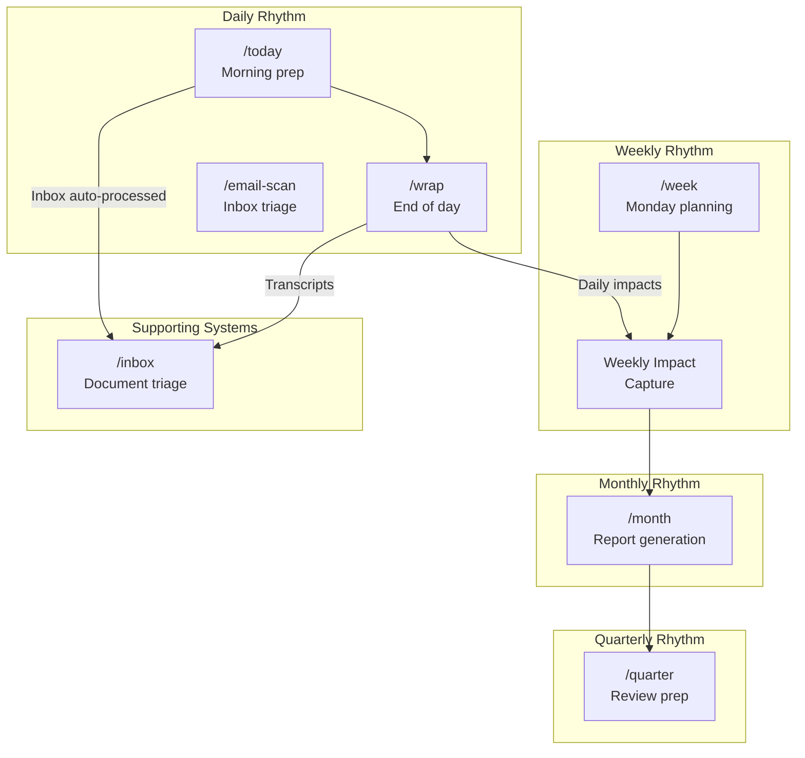
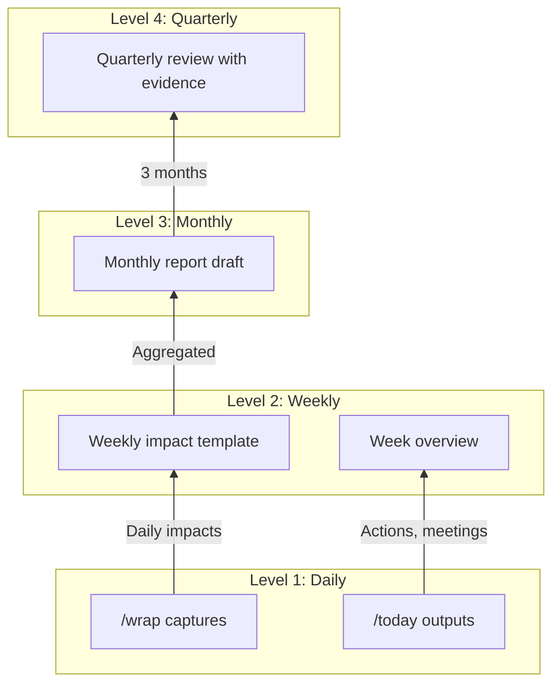
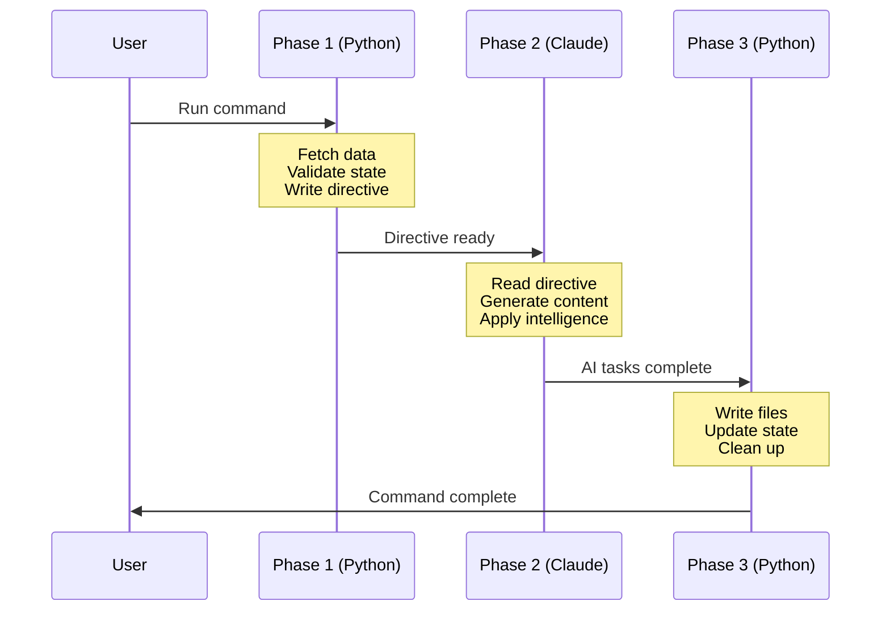

# How It Works

Technical documentation for the Daily Operating System.

## Quick Reference

| Command | When | What it Does | Documentation |
|---------|------|--------------|---------------|
| `/today` | Every morning | Prep meetings, surface actions, triage email | [Daily Workflow](daily-workflow.md) |
| `/wrap` | End of day | Reconcile actions, capture impacts, archive | [Daily Workflow](daily-workflow.md) |
| `/email-scan` | Inbox zero blocks | Triage email, draft responses, archive noise | [Daily Workflow](daily-workflow.md) |
| `/week` | Monday morning | Week overview, hygiene alerts, impact template | [Weekly Workflow](weekly-workflow.md) |
| `/month` | First Monday | Aggregate weekly impacts, generate report | [Monthly/Quarterly](monthly-quarterly-workflow.md) |
| `/quarter` | Last week of Q | Pre-populate review with evidence | [Monthly/Quarterly](monthly-quarterly-workflow.md) |

---

## System Architecture Overview



---

## Command Cascade

The commands form a cascade where outputs flow upward:



---

## Documentation Map

### Core Systems

| Document | Purpose | Key Sections |
|----------|---------|--------------|
| [Daily Workflow](daily-workflow.md) | /today, /wrap, /email-scan workflows | Three-phase execution, meeting prep, action reconciliation |
| [Weekly Workflow](weekly-workflow.md) | /week command and impact capture | Monday planning, hygiene alerts, time blocking |
| [Monthly/Quarterly](monthly-quarterly-workflow.md) | /month and /quarter workflows | Report aggregation, evidence mapping |
| [Inbox Processing](inbox.md) | Three-phase document workflow | Preparation, enrichment, delivery |

### Architecture

| Document | Purpose |
|----------|---------|
| [Skill-Agent-Tool Layers](skill-agent-tool-layers.md) | How skills, agents, and Python tools relate |
| [Three-Phase Pattern](three-phase-pattern.md) | The prepare → enrich → deliver architecture |

### Reference

| Document | Purpose |
|----------|---------|
| [Tools Reference](tools-reference.md) | Quick reference for all Python tools |

---

## Three-Phase Pattern

All major commands follow this pattern:



**Why three phases?**

1. **Reliability**: Python handles flaky APIs with retries and timeouts
2. **Speed**: Deterministic ops complete quickly, AI focuses on judgment
3. **Debuggability**: Directive files show exactly what data was gathered
4. **Resilience**: Commands can resume from Phase 2 if Claude interrupts

---

## Getting Started

### New User Checklist

1. **Set up Google API**: Configure `.config/google/` credentials
2. **Run `/week`**: Start with Monday overview for full context
3. **Run `/today`**: Daily morning routine
4. **Run `/wrap`**: End each day to maintain data quality
5. **Process inbox**: Documents flow through system

### Recommended Daily Flow

```
Morning:
1. Run /today
2. Review 00-overview.md
3. Work through prep files
4. Address high-priority emails

Throughout day:
5. Attend meetings
6. Capture notes in _inbox/ or directly

End of day:
7. Run /wrap
8. Answer prompts for task status, impacts
9. System archives and prepares for tomorrow
```

---

## Troubleshooting

| Symptom | Likely Cause | Resolution |
|---------|--------------|------------|
| No calendar events | Google API issue | Check credentials, run API test |
| Empty directive | Script error | Check prepare script output |
| Stale task data | Missed /wrap | Run /wrap to reconcile |
| Inbox stuck | Enrichment incomplete | Complete Phase 2 manually |

### Common Debug Commands

```bash
# Check Google API
python3 .config/google/google_api.py calendar list 1

# View directive
cat _today/.today-directive.json | jq .

# Check inbox state
cat _inbox/.processing-state.json
```

---

## Related Documentation

- [Getting Started](/docs/getting-started.md) - Setup and installation
- [CLI Reference](/docs/cli-reference.md) - All available commands

---

*Documentation version: 1.0*
