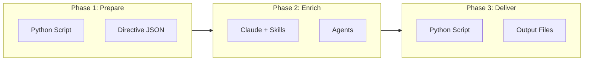
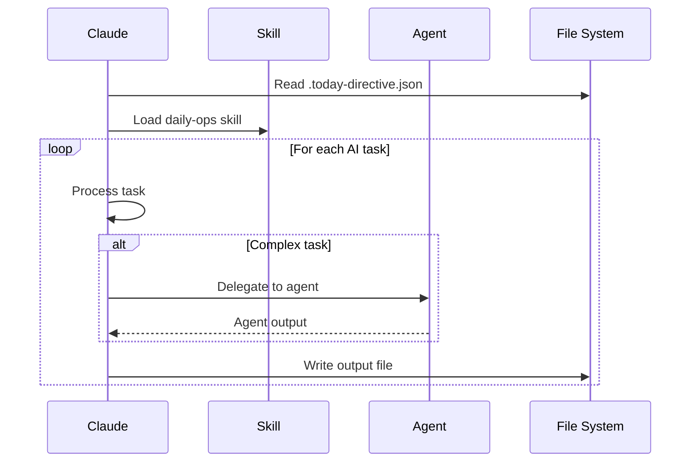

# Three-Phase Pattern

The core architectural pattern that powers all major commands in the Daily Operating System.

## Overview

Every major command follows a consistent three-phase pattern:



| Phase | Executor | Purpose | Output |
|-------|----------|---------|--------|
| **Phase 1** | Python | Gather data, validate state | Directive JSON |
| **Phase 2** | Claude | AI enrichment, synthesis | Generated content |
| **Phase 3** | Python | Write files, update state | Final outputs |

---

## Why Three Phases?

### 1. Reliability

Python handles flaky external APIs with:
- Retries with exponential backoff
- Timeouts to prevent hanging
- Graceful degradation when APIs fail

```python
# Example from prepare_today.py
try:
    events = fetch_calendar_events(days=1)
except APIError:
    print("Warning: Calendar unavailable, using cached data")
    events = load_cached_events()
```

### 2. Speed

- **Deterministic operations** (API calls, file reads) complete quickly in Python
- **AI focuses on judgment** (summarization, synthesis, recommendations)
- Parallel API calls during Phase 1 reduce total time

### 3. Debuggability

Directive files show exactly what data was gathered:

```bash
# See what Phase 1 gathered
cat _today/.today-directive.json | jq .

# Output shows calendar, tasks, emails, etc.
{
  "command": "today",
  "generated_at": "2026-02-03T08:30:00",
  "calendar": {...},
  "tasks": {...},
  "emails": {...}
}
```

### 4. Resilience

Commands can resume from Phase 2 if Claude interrupts:
- Directive file persists
- Phase 2 can re-read directive
- No need to re-fetch APIs

---

## Phase 1: Preparation

**Executor**: Python script (`prepare_*.py`)

### Responsibilities

1. **Fetch external data**
   - Google Calendar events
   - Gmail inbox
   - Google Sheets data

2. **Aggregate local data**
   - Master task list
   - Recent meeting summaries
   - Project status

3. **Validate state**
   - Check required files exist
   - Verify no stale data
   - Detect previous incomplete runs

4. **Generate directive**
   - JSON file with all data
   - List of AI tasks to perform
   - Context for Phase 2

### Example: prepare_today.py

```python
def main():
    # Gather data
    calendar = fetch_calendar(days=1)
    tasks = load_master_task_list()
    emails = fetch_unread_emails()

    # Classify meetings
    meetings = classify_meetings(calendar.events)

    # Generate directive
    directive = {
        "command": "today",
        "generated_at": datetime.now().isoformat(),
        "calendar": calendar,
        "tasks": tasks,
        "meetings": meetings,
        "emails": emails,
        "ai_tasks": generate_ai_tasks(meetings, tasks)
    }

    write_json("_today/.today-directive.json", directive)
```

### Output: Directive File

```json
{
  "command": "today",
  "generated_at": "2026-02-03T08:30:00",
  "calendar": {
    "events": [...]
  },
  "meetings": {
    "external": [...],
    "internal": [...]
  },
  "ai_tasks": [
    {
      "type": "meeting_prep",
      "meeting": "Project Sync",
      "priority": "high"
    },
    {
      "type": "email_summary",
      "count": 5,
      "priority": "medium"
    }
  ]
}
```

---

## Phase 2: Enrichment

**Executor**: Claude with Skills and Agents

### Responsibilities

1. **Read directive**
   - Parse JSON from Phase 1
   - Understand tasks to perform

2. **Generate content**
   - Meeting prep documents
   - Email summaries
   - Action item analyses

3. **Apply intelligence**
   - Prioritization
   - Pattern recognition
   - Recommendations

4. **Write AI outputs**
   - Generated markdown files
   - Updates to existing files

### Workflow



### Example Output

For a meeting prep task, Claude generates:

```markdown
# Project Sync Prep
**Monday, Feb 3 | 10:00 AM**

## Context
Last meeting focused on Q1 roadmap...

## Attendees
| Name | Role | Notes |
|------|------|-------|
| Jane Smith | PM | Project lead |

## Suggested Talking Points
1. Follow up on timeline discussion
2. Review blockers identified last week

## Open Action Items
- [ ] Send updated spec - Due: Feb 5
```

---

## Phase 3: Delivery

**Executor**: Python script (`deliver_*.py`)

### Responsibilities

1. **Verify enrichment**
   - Check AI outputs exist
   - Validate no TODO placeholders remain

2. **Write final files**
   - Aggregate into overview documents
   - Update indexes

3. **Update state**
   - Mark processing complete
   - Update tracking files

4. **Clean up**
   - Archive old files
   - Remove temporary data

### Example: deliver_today.py

```python
def main():
    # Load directive
    directive = read_json("_today/.today-directive.json")

    # Verify AI outputs
    verify_enrichments_complete()

    # Write overview
    write_overview(directive)

    # Update week overview with prep status
    update_week_overview()

    # Optional: Create calendar blocks
    if user_approved_blocks():
        create_calendar_events(suggested_blocks)

    # Clean directive
    if not keep_directive:
        remove("_today/.today-directive.json")
```

### Final Output Structure

```
_today/
├── 00-overview.md           # Daily dashboard
├── 01-0930-external-prep.md # Meeting prep files
├── 02-1100-internal-prep.md
├── 80-actions-due.md        # Action items
├── 81-suggested-focus.md    # Focus priorities
└── 83-email-summary.md      # Email triage
```

---

## Command-Specific Implementations

### /today

```
prepare_today.py → Claude → deliver_today.py
```

| Phase | What Happens |
|-------|--------------|
| 1 | Fetch calendar, tasks, emails |
| 2 | Generate meeting preps, email summaries |
| 3 | Write overview, update week status |

### /wrap

```
prepare_wrap.py → Claude → deliver_wrap.py
```

| Phase | What Happens |
|-------|--------------|
| 1 | Check completed meetings, transcript status |
| 2 | Capture impacts, prompt for task updates |
| 3 | Update task list, archive files |

### /week

```
prepare_week.py → Claude → deliver_week.py
```

| Phase | What Happens |
|-------|--------------|
| 1 | Fetch week's calendar, aggregate tasks |
| 2 | Generate overview, hygiene alerts |
| 3 | Create impact template, calendar blocks |

### /inbox

```
prepare_inbox.py → Claude → deliver_inbox.py
```

| Phase | What Happens |
|-------|--------------|
| 1 | Validate files, detect context |
| 2 | Summarize, extract actions, apply tags |
| 3 | Move to PARA locations, update indexes |

---

## Error Handling

### Phase 1 Failures

- **API unavailable**: Continue with cached/local data
- **Missing files**: Create with defaults
- **Validation errors**: Report and stop

### Phase 2 Failures

- **Claude interruption**: Directive persists, resume manually
- **Agent errors**: Fallback to direct processing
- **Incomplete outputs**: Mark for retry

### Phase 3 Failures

- **Write errors**: Report file path, suggest manual fix
- **State corruption**: Rollback to directive state
- **Archive failures**: Skip and warn

---

## Best Practices

### For Tool Development

1. **Keep Phase 1 deterministic**
   - Same inputs → same directive
   - No AI logic in prepare scripts

2. **Make directives complete**
   - Include all context Claude needs
   - Avoid additional API calls in Phase 2

3. **Design for resumption**
   - Phase 2 should work from directive alone
   - Support `--skip-prepare` flags

### For Skill Development

1. **Read directive first**
   - Check what Phase 1 gathered
   - Don't duplicate data fetching

2. **Mark progress**
   - Update state after each major step
   - Allow partial completion

3. **Write incrementally**
   - Don't buffer all output
   - Write files as generated

---

## Related Documentation

- [Skill-Agent-Tool Layers](skill-agent-tool-layers.md) - Full architecture
- [Tools Reference](tools-reference.md) - All Python tools
- [Daily Workflow](daily-workflow.md) - /today, /wrap in detail

---

*Three-phase pattern version: 1.0*
