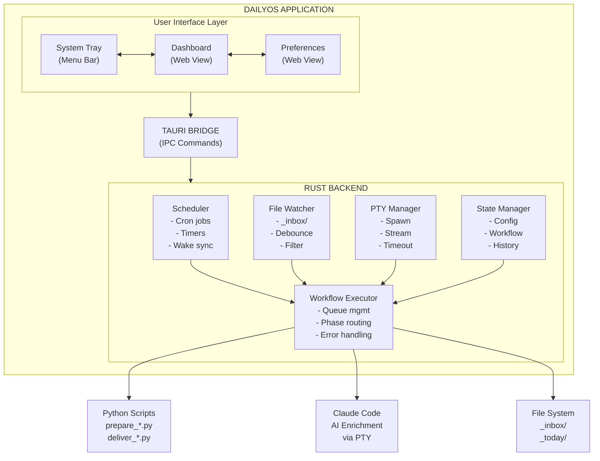
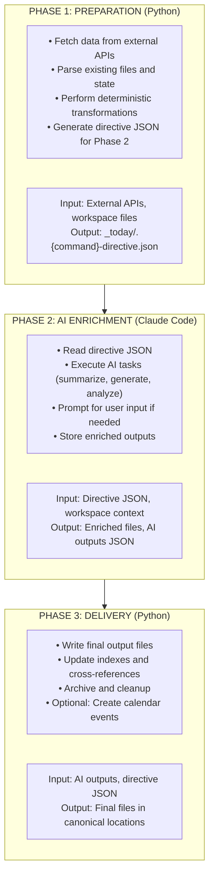
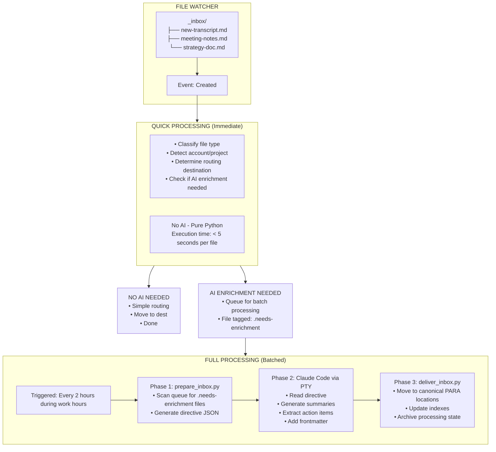
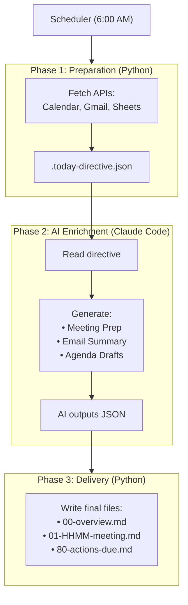
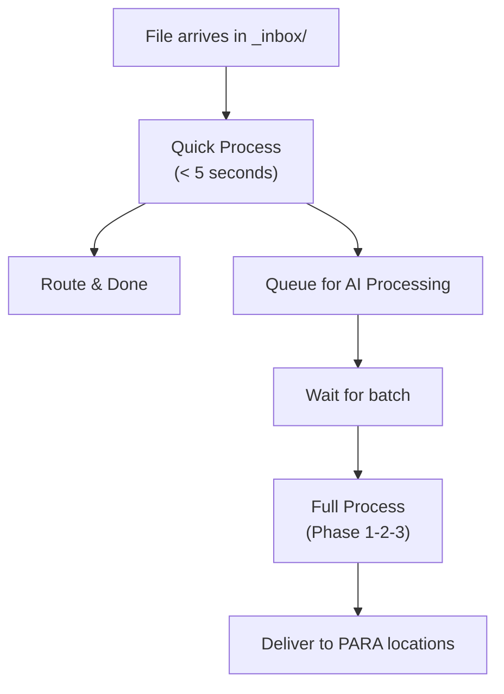
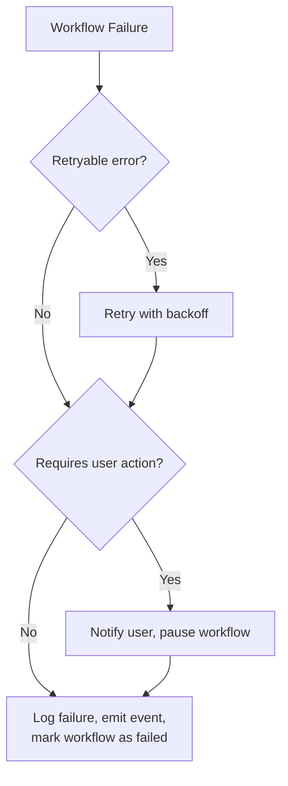

# DailyOS Technical Architecture

## Overview

DailyOS is a native desktop application built with Tauri that orchestrates AI-native productivity workflows. This document details the system architecture, data flow patterns, and key technical decisions.

> **Note:** "Daybreak" is the internal codename for the native app rewrite (this branch). The product is DailyOS.

---

## Foundational Constraints

### Claude Code as Execution Engine

**Decision:** Use Claude Code CLI, not Anthropic API.

| Aspect | Implication |
|--------|-------------|
| **Token budget** | Bounded by user's Claude subscription, not per-request API billing |
| **Authentication** | User authenticates Claude Code once via CLI; DailyOS inherits |
| **Distribution** | Requires Claude Code installed (acceptable trade-off for cost control) |
| **Invocation** | Spawn as subprocess, not HTTP calls |
| **User visibility** | CLI hidden from users; DailyOS orchestrates silently |

**Why this matters:** API billing creates unlimited token liability. Subscription model caps costs and shifts authentication burden to the user's existing Claude account.

**Ecosystem compatibility:**
- Claude Desktop app can access same workspace files
- Claude Code in IDE can work in same workspace
- DailyOS orchestrates in background

No conflicts—all three coexist on the same file system.

**Onboarding requirements:**
1. Verify Claude Code installation (`which claude`)
2. Verify authentication (test invocation)
3. Guide user to install/authenticate if missing

**Error handling:**
- `ClaudeCodeNotFound` → prompt user to install
- `ClaudeCodeNotAuthenticated` → prompt user to run `claude` and log in
- Subscription limit errors → graceful degradation, notify user

### Determinism Boundary (Not Rigid Phases)

**Decision:** Separate deterministic from non-deterministic work, but don't enforce a universal phase structure.

The original three-phase pattern (Prepare → Enrich → Deliver) was designed for CLI batch workflows. For an event-driven native app, this is too rigid.

**Principle preserved:** Deterministic operations (file I/O, API calls, parsing) are separate from non-deterministic operations (AI). This enables:
- Testability for deterministic code
- Checkpointing before expensive AI calls
- Graceful degradation if AI unavailable

**What's flexible:** Each workflow defines its own steps. Not every workflow needs three phases. Quick inbox processing skips AI entirely. Interactive flows may interleave.

**Checkpointing:** Infrastructure concern, not forced structure. Workflows declare which steps are checkpointable. System handles crash recovery automatically.

---

## System Architecture



---

## Workflow Patterns

### The Three-Phase Pattern (Background Workflows)

Background workflows like `/today` and `/wrap` typically follow a three-phase pattern. This is not a universal requirement—it's one workflow shape.



### Hybrid JSON + Markdown Architecture (DEC4)

**JSON for machines, markdown for humans.** Phase 3 generates both:
- `_today/data/*.json` — Structured data for dashboard rendering (schema-validated)
- `_today/*.md` — Human-readable files for direct consumption

**Why Phase 3 generates JSON (not Claude):**
1. **Determinism boundary** — JSON generation is deterministic, testable
2. **Schema validation** — Python validates against JSON Schema before writing
3. **Error recovery** — If Claude outputs malformed markdown, Python handles gracefully
4. **Extensibility** — Adding fields doesn't require changing Claude's prompts

Archives remain markdown-only (DEC5). JSON is generated at runtime for active `_today/` only.

See `DATA-MODEL.md` for entity definitions and file structure. See `templates/schemas/` for JSON schemas.

### Phase Implementation Details

> **Note:** The examples below show Python scripts from the original DailyOS CLI. These may be ported to Rust or called as subprocesses—implementation TBD based on complexity of each script.

**Phase 1 (Preparation)**:
```bash
python3 _tools/prepare_today.py
# Output: _today/.today-directive.json
```

- No AI, deterministic
- Fast execution (< 30 seconds typically)
- Same input produces same output
- DailyOS spawns as subprocess, captures exit code

**Phase 2 (Enrichment)**:
```bash
claude --workspace /path/to/workspace --command "Read _today/.today-directive.json and execute AI tasks"
```

- Claude Code via PTY subprocess
- Variable execution time (1-5 minutes)
- May require user interaction (prompts)
- DailyOS streams output, monitors for completion

**Phase 3 (Delivery)**:
```bash
python3 _tools/deliver_today.py --ai-outputs outputs.json
# Output: Files in _today/, _inbox/, Accounts/, etc.
```

- Pure Python, no AI
- Fast execution (< 30 seconds)
- Writes final files to canonical locations
- DailyOS verifies output files exist

---

## Core Components

### 1. Scheduler

Manages time-based workflow execution.

```rust
struct Scheduler {
    jobs: Vec<ScheduledJob>,
    timezone: Tz,
}

struct ScheduledJob {
    id: String,
    workflow: Workflow,
    cron: CronSchedule,    // e.g., "0 8 * * 1-5" for 8am weekdays
    enabled: bool,
    last_run: Option<DateTime>,
    next_run: DateTime,
}

enum Workflow {
    Today,
    Week,
    InboxFull,
    Archive,
}
```

**Features**:
- Cron-style scheduling
- Timezone-aware (user's local time)
- Sleep/wake synchronization
- Missed job detection and handling

**Wake Synchronization**:
```rust
fn on_system_wake(&mut self) {
    let now = Utc::now();
    for job in &mut self.jobs {
        if job.next_run < now && job.enabled {
            // Missed window - queue for immediate execution
            self.queue_immediate(job.workflow.clone());
        }
    }
    self.recalculate_next_runs();
}
```

### 2. File Watcher

Monitors `_inbox/` for new files.

```rust
struct FileWatcher {
    watched_path: PathBuf,
    debounce_ms: u64,
    pending_events: HashMap<PathBuf, Instant>,
}

impl FileWatcher {
    fn start(&self) -> Receiver<FileEvent> {
        // Uses notify crate
        // Debounces rapid events
        // Filters to .md files only
    }
}

enum FileEvent {
    Created(PathBuf),
    Modified(PathBuf),
    Deleted(PathBuf),
}
```

**Debouncing Strategy**:
```
File arrives → Start 500ms timer
  ├── Another event → Reset timer
  └── Timer expires → Emit debounced event
```

**Filter Rules**:
- Include: `*.md` files
- Exclude: Hidden files (`.*`)
- Exclude: Temp files (`*.tmp`, `*.swp`)
- Exclude: Processing state (`.processing-state.json`)

### 3. PTY Manager

Spawns and manages Claude Code processes.

```rust
struct PtyManager {
    active_sessions: HashMap<String, PtySession>,
    timeout: Duration,
}

struct PtySession {
    id: String,
    pty: Pty,
    workflow: Workflow,
    started_at: Instant,
    output_buffer: String,
}

impl PtyManager {
    fn spawn_claude(&self, workspace: &Path, command: &str) -> Result<PtySession> {
        // Create pseudo-terminal
        // Spawn: claude --workspace {workspace} --print "{command}"
        // Return session handle
    }

    fn stream_output(&self, session: &PtySession) -> impl Stream<Item = String> {
        // Stream stdout/stderr
        // Parse for progress indicators
        // Detect completion or error
    }
}
```

**PTY Benefits**:
- Proper terminal emulation for Claude Code
- Handles ANSI escape codes
- Supports interactive prompts (if needed)
- Captures full output for logging

**Timeout Handling**:
```rust
async fn execute_with_timeout(&self, session: PtySession) -> Result<Output> {
    tokio::select! {
        result = self.wait_for_completion(&session) => result,
        _ = tokio::time::sleep(self.timeout) => {
            session.kill();
            Err(ExecutionError::Timeout)
        }
    }
}
```

### 4. State Manager

Persists application and workflow state.

```rust
struct StateManager {
    config_path: PathBuf,        // ~/.daybreak/config.json
    history_path: PathBuf,       // ~/.daybreak/history.json
    state: AppState,
}

struct AppState {
    config: Config,
    workflows: WorkflowState,
    history: Vec<ExecutionRecord>,
}

struct Config {
    workspace_path: PathBuf,
    schedules: HashMap<Workflow, CronSchedule>,
    notifications_enabled: bool,
    google_token_path: Option<PathBuf>,
}

struct WorkflowState {
    today: WorkflowStatus,
    archive: WorkflowStatus,
    inbox: InboxStatus,
    week: WorkflowStatus,
}

enum WorkflowStatus {
    Idle,
    Running { started: DateTime, phase: Phase },
    Completed { finished: DateTime },
    Failed { error: String, can_retry: bool },
}
```

---

## Active Inbox Architecture

The inbox system uses a two-tier processing model.



### Quick Processing Logic

```rust
fn quick_process(file: &Path) -> ProcessingResult {
    let content = read_file(file)?;
    let filename = file.file_name().unwrap();

    // 1. Classify
    let file_type = classify_file(filename, &content);

    // 2. Detect context
    let context = detect_context(filename, &content);

    // 3. Determine routing
    let destination = determine_destination(&file_type, &context);

    // 4. Check if AI needed
    let needs_ai = match file_type {
        FileType::Transcript => true,  // Always enrich transcripts
        FileType::MeetingNotes => true,
        FileType::Strategy => true,
        FileType::General => content.len() > 1000,  // Enrich long docs
    };

    if needs_ai {
        tag_for_enrichment(file);
        ProcessingResult::Queued
    } else {
        move_to_destination(file, &destination);
        ProcessingResult::Complete
    }
}
```

---

## Tauri Application Structure

```
daybreak/
├── src-tauri/                    # Rust backend
│   ├── src/
│   │   ├── main.rs              # Entry point
│   │   ├── lib.rs               # Library root, Tauri setup
│   │   ├── commands.rs          # Tauri IPC commands
│   │   ├── scheduler.rs         # Cron-like scheduling ✅
│   │   ├── executor.rs          # Workflow orchestration ✅
│   │   ├── pty.rs               # PTY/Claude Code management ✅
│   │   ├── state.rs             # Config & status persistence ✅
│   │   ├── notification.rs      # Native notifications ✅
│   │   ├── error.rs             # Error types ✅
│   │   ├── types.rs             # Shared type definitions ✅
│   │   ├── watcher.rs           # File watcher (Phase 2)
│   │   └── workflow/
│   │       ├── mod.rs           # ✅
│   │       ├── today.rs         # ✅
│   │       ├── archive.rs       # ✅
│   │       ├── inbox.rs         # (Phase 2)
│   │       └── week.rs          # (Phase 3)
│   ├── Cargo.toml
│   └── tauri.conf.json
│
├── src/                          # Web frontend (React + TypeScript)
│   ├── App.tsx
│   ├── router.tsx               # TanStack Router
│   ├── components/
│   │   ├── dashboard/           # Dashboard views
│   │   ├── layout/              # AppSidebar, CommandMenu
│   │   └── ui/                  # shadcn/ui components
│   ├── hooks/
│   │   ├── useDashboardData.ts  # ✅
│   │   ├── useWorkflow.ts       # ✅
│   │   └── use-mobile.ts
│   └── lib/
│
├── package.json
└── vite.config.ts
```

✅ = Implemented | (Phase N) = Planned for that phase

### Tauri Commands (IPC)

```rust
// src-tauri/src/commands.rs

#[tauri::command]
async fn run_workflow(workflow: Workflow) -> Result<ExecutionId, String> {
    // Queue workflow for immediate execution
}

#[tauri::command]
async fn get_workflow_status(workflow: Workflow) -> Result<WorkflowStatus, String> {
    // Return current status
}

#[tauri::command]
async fn get_dashboard_data() -> Result<DashboardResult, String> {
    // Load _today/data/*.json and return structured data (DEC4)
}

#[tauri::command]
async fn get_inbox_status() -> Result<InboxStatus, String> {
    // Return pending, processing, completed counts
}

#[tauri::command]
async fn update_schedule(workflow: Workflow, cron: String) -> Result<(), String> {
    // Update schedule configuration
}

#[tauri::command]
async fn get_execution_history(limit: usize) -> Result<Vec<ExecutionRecord>, String> {
    // Return recent execution history
}
```

---

## Data Flow Diagrams

### `/today` Execution Flow



### `/inbox` Processing Flow



---

## Error Handling Strategy

### Retry Logic

```rust
struct RetryPolicy {
    max_attempts: u32,
    backoff: BackoffStrategy,
}

enum BackoffStrategy {
    Fixed(Duration),
    Exponential { base: Duration, max: Duration },
}

async fn execute_with_retry<T, F>(
    operation: F,
    policy: &RetryPolicy,
) -> Result<T, ExecutionError>
where
    F: Fn() -> Future<Output = Result<T, ExecutionError>>,
{
    let mut attempts = 0;
    loop {
        match operation().await {
            Ok(result) => return Ok(result),
            Err(e) if e.is_retryable() && attempts < policy.max_attempts => {
                attempts += 1;
                let delay = policy.backoff.delay_for(attempts);
                tokio::time::sleep(delay).await;
            }
            Err(e) => return Err(e),
        }
    }
}
```

### Error Classification

```rust
enum ExecutionError {
    // Retryable
    NetworkError(String),
    Timeout,
    ApiRateLimit,

    // Non-retryable
    ConfigurationError(String),
    WorkspaceNotFound,
    InvalidCredentials,

    // Requires user action
    GoogleAuthExpired,
    ClaudeCodeNotFound,
    ClaudeCodeNotAuthenticated,
    ClaudeSubscriptionLimit,
}

impl ExecutionError {
    fn is_retryable(&self) -> bool {
        matches!(self,
            Self::NetworkError(_) |
            Self::Timeout |
            Self::ApiRateLimit
        )
    }

    fn requires_user_action(&self) -> bool {
        matches!(self,
            Self::GoogleAuthExpired |
            Self::ClaudeCodeNotFound |
            Self::ClaudeCodeNotAuthenticated |
            Self::ClaudeSubscriptionLimit
        )
    }
}
```

### Failure Recovery



---

## Configuration Schema

### `~/.daybreak/config.json`

```json
{
  "version": 1,
  "workspace": {
    "path": "/Users/user/Documents/workspace",
    "validated": true
  },
  "schedules": {
    "today": {
      "enabled": true,
      "cron": "0 6 * * 1-5",
      "timezone": "America/New_York"
    },
    "week": {
      "enabled": true,
      "cron": "0 8 * * 1",
      "timezone": "America/New_York"
    },
    "inbox_full": {
      "enabled": true,
      "cron": "0 9,11,13,15,17 * * 1-5",
      "timezone": "America/New_York"
    }
  },
  "notifications": {
    "enabled": true,
    "sound": true,
    "show_on_completion": true,
    "show_on_failure": true
  },
  "integrations": {
    "google_token_path": ".config/google/token.json"
  },
  "advanced": {
    "claude_timeout_seconds": 300,
    "phase1_timeout_seconds": 60,
    "phase3_timeout_seconds": 60,
    "inbox_debounce_ms": 500,
    "inbox_batch_interval_hours": 2
  }
}
```

---

## Security Considerations

### File System Access

- DailyOS only accesses configured workspace directory
- No network access except through DailyOS scripts
- Credentials remain in workspace `.config/` directory

### Claude Code Authentication

- DailyOS does not store Claude credentials
- User authenticates via Claude Code CLI directly
- Authentication state managed by Claude Code, not DailyOS
- DailyOS verifies auth status but never handles tokens

### PTY Isolation

- Claude Code runs in isolated PTY
- Environment sanitized before spawn
- No shell injection vectors

### Configuration Protection

- Config file has user-only permissions (600)
- Sensitive paths validated before use
- No secrets stored in DailyOS config (Google token stays in workspace)

---

## Performance Targets

| Metric | Target | Notes |
|--------|--------|-------|
| App startup | < 2 seconds | Cold start to system tray |
| Dashboard load | < 500ms | Parse and render `_today/` files |
| Quick inbox processing | < 5 seconds | Per file classification |
| Phase 1 execution | < 60 seconds | Python script timeout |
| Phase 2 execution | < 5 minutes | Claude Code timeout |
| Phase 3 execution | < 60 seconds | Python script timeout |
| Memory usage | < 100 MB | Idle state |
| CPU usage | < 1% | Idle state |

---

## Future Considerations

### SQLite for System State (Phase 2+)

**Current approach:** Markdown files for user content, JSON files for app state.

**When to add SQLite:** As the app grows beyond MVP, a hybrid approach is recommended:

| Layer | Storage | Purpose |
|-------|---------|---------|
| User content | Markdown files | Source of truth, human-readable, portable |
| System state | SQLite | Execution history, processing queue, indexes |

**Why hybrid:**
- Markdown stays user-owned and editable (principle preserved)
- SQLite handles efficient queries, transaction safety, and state management
- This is how Bear, Obsidian, and similar apps work

**Use cases for SQLite:**

```
~/.daybreak/daybreak.db
├── execution_history    -- Replaces execution_history.json
├── processing_queue     -- File watcher queue state
├── action_index         -- Cross-day action tracking
├── meeting_index        -- Historical meeting lookup
└── search_fts           -- Full-text search over workspace
```

**Migration path:**
1. Phase 2 (File Watcher): Add SQLite for processing queue
2. Later: Migrate execution history from JSON
3. Later: Add indexes for cross-referencing queries

**Decision:** Defer to Phase 2. JSON is sufficient for MVP.

### Multi-Workspace Support

- Track multiple workspace paths
- Switch context via menu
- Separate schedules per workspace

### Background Sync

- Sync workspace to cloud storage
- Conflict resolution for concurrent edits
- Offline queue for scheduled runs

### Plugin Architecture

- Custom workflow definitions
- Third-party integrations
- User-defined triggers

---

*Document Version: 1.1*
*Last Updated: 2026-02-05*
