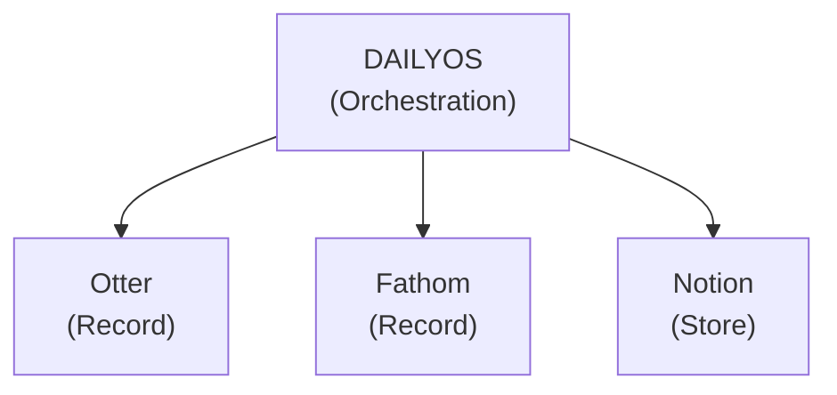

# Jobs To Be Done: DailyOS

> Formal JTBD framework distilled from [PHILOSOPHY.md](PHILOSOPHY.md) and [VISION.md](VISION.md).
>
> For implementation details, see [ARCHITECTURE.md](ARCHITECTURE.md) and [PRD.md](PRD.md).

---

## The User

**Knowledge workers whose only AI experience is ChatGPT or Copilot.**

They know how to ask a question and get output. That's the extent of their AI literacy. They don't know how to build systems, write sophisticated prompts, or structure workflows. They're definitely not running terminal commands.

**Their day looks like this:**
- Move from app to app (Salesforce → Glean → Gong → Slack → Docs)
- Collect information from each silo manually
- Synthesize in their head
- Walk into meetings half-prepared
- Action items fall through cracks
- Repeat

**Role doesn't matter.** Customer success, sales, product, marketing, engineering, consulting—the specific work varies, but the problem is universal. Everyone is:
- Hopping between 10-12 apps daily
- Manually gathering context that should be gathered for them
- Struggling to keep up with transcripts, emails, Slack, and docs
- Feeling guilty about systems they set up and abandoned

**The shift DailyOS represents:**

> A human EA costs $60-150k per year. You have to be senior enough to justify that spend. So the cognitive burden reduction that transforms how leaders work has been locked away from everyone else.
>
> AI changes the equation.
>
> **DailyOS is an EA for everyone.**

The account manager deserves an EA. The project lead deserves an EA. The IC deserves an EA. Everyone doing knowledge work deserves something handling the cognitive overhead so they can focus on what they're actually good at.

---

## The Struggling Moment

> "Every productivity tool promised to change my life. Every one became a maintenance burden or got abandoned."

**The Guilt Loop:**
```
Good intentions
    ↓
Set up system
    ↓
Friction to use it
    ↓
Take path of least resistance (skip it)
    ↓
System gets out of sync
    ↓
Guilt about wasted effort
    ↓
New tool, new hope...
    ↓
[repeat]
```

**Trigger situations:**
- Walking into meetings unprepared
- Actions falling through cracks
- "I know it's somewhere" but can't find it
- Transcripts piling up unprocessed
- Spending time on productivity instead of work

---

## The Job Statement

**When** I sit down to work each day,
**I want** my day to already be prepared for me,
**So I can** focus on decisions and actions instead of gathering and organizing.

**The tagline:** "Open the app. Your day is ready."

---

## The Three Core Jobs

### Job 1: Prepare My Day

> "When I start my workday, I want everything I need already gathered and synthesized, so I can walk into my first meeting prepared."

**Outcome:** Morning briefing ready before I open the app—calendar context, meeting prep, actions surfaced, emails triaged.

**Trigger:** Automatic (morning)

---

### Job 2: Capture & Route My Inputs

> "When I get content from anywhere—transcripts, Slack, email, the web—I want it processed and filed automatically, so I don't have a growing pile of 'stuff to organize.'"

**Outcome:** Files processed, actions extracted, routed to the right place—without me running commands.

**Trigger:** Continuous (when files appear)

This is the **most critical job** because local-first means content needs an entry point. Without automatic processing, local-first becomes local-chaos.

---

### Job 3: Close My Day

> "When I finish working, I want my accomplishments captured and loose ends identified, so tomorrow starts clean."

**Outcome:** Accomplishments logged, incomplete actions carried forward, impact captured—without manual data entry.

**Trigger:** Automatic (end of day)

---

## Functional Outcomes

| Job | What Success Looks Like |
|-----|------------------------|
| **Prepare** | Morning briefing ready, meetings prepped, actions visible |
| **Capture** | Files processed automatically, routed correctly, actions extracted |
| **Close** | Day wrapped up, accomplishments logged, tomorrow seeded |

**Measurable goals:**
- Meeting prep time: 30 min → 5 min
- Action drop rate: Reduced 80%
- Inbox processing: Automatic (0 manual runs)
- System maintenance time: Zero

---

## Emotional Outcomes

| Feeling | What They Say |
|---------|---------------|
| **Supported** | "I feel like I have an assistant who actually knows what's going on" |
| **Prepared** | "I walk into every meeting knowing the context" |
| **Unburdened** | "I don't have to maintain this thing" |
| **In control** | "My data is on my machine, not some cloud service" |
| **Guilt-free** | "Missing a day doesn't break anything" |
| **Current** | "My transcripts don't pile up anymore" |

---

## What They're Firing

| Alternative | Why It Fails |
|-------------|--------------|
| **Todoist/Asana/Monday** | Maintenance burden, guilt when abandoned |
| **Notion/Obsidian** | Blank canvas requiring constant care |
| **ChatGPT/Copilot** | Reactive—you have to ask, no persistent context |
| **Calendar apps** | Show schedule but no context or prep |
| **Enterprise tools** | Data siloed, requires hopping between apps |
| **Manual transcript processing** | Time-consuming, backlog grows |
| **DailyOS CLI** | Requires terminal, manual invocation |

---

## The Silo Problem (Competitive Positioning)

Every productivity tool creates another inbox to manage. Each one knows only itself:

```
Otter records → Otter knows → You manage Otter
Fathom records → Fathom knows → You manage Fathom
Notion stores → Notion knows → You manage Notion
Gmail holds → Gmail knows → You manage Gmail
Calendar shows → Calendar knows → You manage Calendar
```

**The user becomes the integration layer.** They're the one who:
- Remembers "that discussion was in the Fathom transcript"
- Manually pulls context before meetings
- Copies action items from transcript to task manager
- Mentally correlates across systems

**DailyOS's position:** We're not another silo. We're the **orchestration layer above all of them**.



**What DailyOS does differently:**

| Tool | What It Does | What It Knows | Integration |
|------|--------------|---------------|-------------|
| Otter/Fathom | Records meetings | That meeting | None—ends there |
| Notion/Obsidian | Stores notes | Those notes | Manual linking |
| Gmail | Holds email | Those threads | Manual checking |
| **DailyOS** | Orchestrates all | **Everything** | **Automatic** |

**The value proposition:**

> "Drop your transcript in `_inbox/`. I'll summarize it, extract actions to your master list, route it to the right account folder, and surface it in tomorrow's prep when you meet with that customer again."

**Competitive differentiation:**

- **vs. Otter/Fathom**: They record. We act on recordings. They're input; we're output.
- **vs. Notion AI**: Answers questions about your notes. We proactively prepare your day.
- **vs. Microsoft Copilot**: Tied to Microsoft ecosystem. We're local-first, tool-agnostic.
- **vs. ChatGPT**: No persistent context. You ask every time. We remember and anticipate.

**The single funnel:**

DailyOS is the **one place** where outputs from all your tools converge and become actionable context. You don't manage Otter AND Fathom AND Notion—you manage `_inbox/`, and DailyOS handles the rest.

---

## Hiring Criteria

What makes someone "hire" DailyOS:

1. **Zero friction** — Runs automatically, no commands to remember
2. **Zero maintenance** — Updates itself, no configuration required
3. **Zero guilt** — Works even when they forget about it
4. **Active processing** — Inbox doesn't pile up
5. **Full ownership** — Local files, no cloud dependency
6. **Polished consumption** — Nice UI, not terminal output

---

## Jobs NOT Being Done

DailyOS is **not** hired to:

- **Record meetings** — That's Otter, Fathom, Fireflies. DailyOS consumes their output.
- **Replace calendar apps** — Reads from them, doesn't manage them
- **Replace task managers** — Surfaces tasks, doesn't provide task management UI
- **Replace note-taking apps** — Consumes notes, doesn't create them
- **Be a chat interface** — Produces; user consumes
- **Be the AI** — That's Claude. DailyOS orchestrates.
- **Work offline** — Requires Claude for AI features
- **Manage teams** — Single-user only
- **Sync across devices** — Local-first means one machine

**The key distinction:** We're not competing with your tools. We're the layer that makes them useful together.

---

## Key Scenarios

### Scenario 1: Monday Morning
Sarah opens her laptop at 8:45am. Notification: "Your day is ready—4 meetings, 2 overdue actions." She reviews her overview, checks the prep for her 9am call. Ready.

### Scenario 2: Transcript Processing
After her call, Sarah drags the transcript into her inbox folder. Five minutes later: "Processed: Acme call summary ready." Summary filed, actions extracted. She didn't run a command.

### Scenario 3: End of Day
5:15pm. Prompt: "Ready to wrap up?" She confirms, answers 3 quick questions. Accomplishments logged, carryover identified. Done.

### Scenario 4: Skipped a Week
Sarah returns from vacation. No red badges. No shame. No backlog. Just: "Welcome back. Here's today."

---

## Success Metrics

| Metric | What It Measures |
|--------|-----------------|
| Users open daily | Value delivered (not obligation) |
| Inbox always empty | Active processing working |
| Users feel prepared | Core job delivered |
| Word of mouth | "You need to try this" |

**Failure indicators:**
- Becomes another maintenance burden
- Guilt loop reappears
- Inbox piles up
- Technical knowledge required

---

## Relationship to Other Docs

| Document | What It Covers |
|----------|---------------|
| [PHILOSOPHY.md](PHILOSOPHY.md) | The "why"—manifesto, beliefs |
| [VISION.md](VISION.md) | The "what"—product definition, user experience |
| [PRINCIPLES.md](PRINCIPLES.md) | Design principles, decision framework |
| [PRD.md](PRD.md) | Features, requirements, scope |
| [ARCHITECTURE.md](ARCHITECTURE.md) | Technical implementation |
| [SKILLS.md](SKILLS.md) | Commands and skills catalog |
| **This doc (JTBD.md)** | Jobs, outcomes, hiring criteria |

---

*Use this document to evaluate features: "Does this help the user do one of the three core jobs?"*
