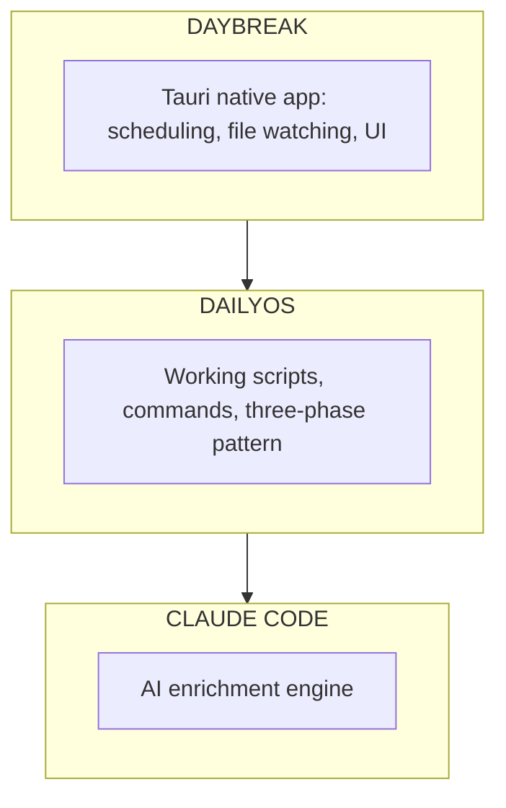

# Daybreak Product Requirements Document (PRD)

## Version 1.1

---

## Executive Summary

Daybreak is a native desktop application that wraps the DailyOS productivity framework, transforming it from a CLI-invoked system into an automated personal chief of staff. Daybreak schedules, executes, and orchestrates DailyOS workflows without requiring manual intervention, while preserving the ability to invoke Claude Code for interactive or on-demand tasks.

**Core Value Proposition**: AI produces, users consume. Daybreak inverts the traditional productivity tool paradigm by having AI gather context, process information, and surface insights automatically - rather than requiring users to remember to run commands.

**Design Philosophy**: The dashboard IS the interface. Files become the backing store, not the primary experience. Users open the app and their day is ready—rendered as UI components, not markdown files to read.

---

## Problem Statement

DailyOS provides powerful workflows (`/today`, `/wrap`, `/inbox`, `/week`, `/month`, `/quarter`, `/editorial`) but requires users to:

1. **Remember** to invoke commands at the right time
2. **Wait** for Python scripts and Claude Code to execute
3. **Manually trigger** document processing when files arrive
4. **Context switch** between terminal and other work
5. **Read markdown files** instead of a polished interface

This creates friction that prevents consistent adoption of the "chief of staff" workflow.

---

## Solution: Daybreak

Daybreak is a native Tauri desktop application that:

1. **Renders your day as a dashboard** - Not files to read, but a polished UI to scan
2. **Automates background execution** - Morning briefing runs before you wake up
3. **Watches for inbox activity** - Processes documents as they arrive in `_inbox/`
4. **Prompts at natural moments** - Post-meeting capture, not end-of-day batch
5. **Provides system tray presence** - Always available, never intrusive

---

## Existing Foundation (What's Already Built)

Daybreak wraps **DailyOS**, a proven productivity framework with working infrastructure:

### Already Implemented in DailyOS

| Component | Status | What It Does |
|-----------|--------|--------------|
| **Python Scripts** | ✅ Working | `prepare_today.py`, `deliver_today.py`, `prepare_week.py`, etc. |
| **Three-Phase Pattern** | ✅ Proven | Prepare (Python) → Enrich (Claude) → Deliver (Python) |
| **Web Dashboard** | ✅ Active | Express server (`server.js`) rendering `_today/` files |
| **Command Templates** | ✅ Complete | `/today`, `/wrap`, `/inbox`, `/week`, `/month`, `/quarter`, `/editorial` |
| **PARA File Routing** | ✅ Working | Inbox → Accounts/Projects/Areas/Resources |
| **Google API Integration** | ✅ Working | Calendar, Gmail, Sheets, Drive |
| **Role Templates** | ✅ Complete | 8 roles with customized folder structures |

### What Daybreak Adds

| Capability | DailyOS Today | With Daybreak |
|------------|---------------|---------------|
| **Invocation** | Manual (`/today` in terminal) | Automatic (scheduled) |
| **Inbox Processing** | Manual (`/inbox` command) | File watcher + automatic |
| **UI** | Web dashboard (must navigate) | Native app + system tray |
| **Notifications** | None | Native OS notifications |
| **Prompts** | Terminal-based | Native dialogs |
| **Always Running** | No (must start) | Yes (launch at login) |

### Architecture Implication

Daybreak is a **native shell** around proven infrastructure, not a greenfield build:



The Python scripts, directive JSON schemas, and phase orchestration are **already defined and working**. Daybreak's job is to:
1. Schedule their execution
2. Watch for triggers (file changes, time)
3. Render their output in a native UI
4. Provide notifications and prompts

This significantly de-risks the project—we're not inventing the workflow, just automating its invocation.

---

## Feature Classification

### Tier 1: Fully Automated (Background)

These run without user intervention or awareness.

| Feature | Trigger | What Happens |
|---------|---------|--------------|
| Morning Briefing | Scheduled (morning) | Fetches calendar, generates prep, populates dashboard |
| Inbox Processing | File watcher + batched | Classifies, enriches, routes documents |
| Nightly Archive | Scheduled (midnight) | Archives day's files, cleans up |

### Tier 2: Contextual Prompts (Event-Driven)

These appear at natural moments, not scheduled times.

| Feature | Trigger | What Happens |
|---------|---------|--------------|
| Post-Meeting Capture | Meeting ends | Optional quick outcome/action capture |
| Review Needed | Processing edge case | "This file needs your input" prompt |

### Tier 3: Interactive Experiences (User-Initiated)

These require user engagement but Daybreak facilitates.

| Feature | Trigger | What Happens |
|---------|---------|--------------|
| Weekly Planning | Monday + user opens app | Interactive priority-setting, visual week view |
| Manual Processing | User request | Run inbox/briefing on demand |

### Tier 4: On-Demand Only (Claude Code)

These are NOT automated by Daybreak. Users invoke them through Claude Code when needed.

| Workflow | When to Use | Why Not Automated |
|----------|-------------|-------------------|
| `/month` | End of month | Requires curation of highlights |
| `/quarter` | Pre-quarterly review | Requires reflection, goal-setting |
| `/editorial` | When writing important docs | Interactive review process |

---

## Feature Specifications

### F1: Morning Briefing

**User Story**: As a knowledge worker, I want my morning briefing ready when I start work so I can immediately see my day's context in a polished dashboard.

**How It Works**:
1. **Background execution** at scheduled time (default 7:00 AM)
2. **Three-phase pattern**: Prepare (Python) → Enrich (Claude) → Deliver (Python)
3. **Files written** to `_today/` as backing store
4. **Dashboard populated** from those files when user opens app
5. **Notification**: "Your day is ready" when complete

**Dashboard Rendering** (not file reading):

| Backing File | Dashboard Component |
|--------------|---------------------|
| `00-overview.md` | Home screen summary |
| `XX-HHMM-*-prep.md` | Meeting cards with expandable prep |
| `80-actions-due.md` | Action list panel |
| `83-email-summary.md` | Email triage section |
| `90-agenda-needed/` | "Needs attention" badge on meetings |

**Acceptance Criteria**:
- [ ] Briefing runs at configured time without user intervention
- [ ] Dashboard shows complete day context when opened
- [ ] Meeting cards display prep inline (expandable)
- [ ] Action items appear in dedicated panel with due dates
- [ ] System tray notification indicates completion
- [ ] Clicking notification opens dashboard

**Error Handling**:
- Google API unavailable: Run in manual mode, show degraded state indicator
- Claude Code timeout: Retry once, then show "Briefing incomplete" state
- Workspace not configured: Show onboarding flow

---

### F2: Post-Meeting Capture (Replaces /wrap)

**User Story**: As a knowledge worker, I want to capture meeting outcomes when they're fresh, not at end-of-day when I've forgotten details.

**Design Rationale**: The original `/wrap` command attempted batch capture at 5:30 PM. This is unnatural—users don't remember 4 meetings worth of outcomes. Instead, prompt immediately after each meeting.

**How It Works**:
1. **Calendar awareness**: Daybreak knows when meetings end
2. **Smart prompting**: 5 minutes after meeting end time, optional prompt appears
3. **Quick capture**: 2-3 taps, not text entry
4. **Dismissible**: "Skip" is always an option with no guilt

**Post-Meeting Prompt UI**:

```
┌─────────────────────────────────────────┐
│  Acme Corp Monthly just ended           │
│                                         │
│  Any quick outcomes to capture?         │
│                                         │
│  ┌─────────┐ ┌─────────┐ ┌─────────┐   │
│  │ 🎯 Win  │ │ ⚠️ Risk │ │ ✅ Action│   │
│  └─────────┘ └─────────┘ └─────────┘   │
│                                         │
│  [ Skip this time ]                     │
└─────────────────────────────────────────┘
```

**Capture Options**:
- **Win**: Quick win for impact tracking (one-liner)
- **Risk**: Flag concern for follow-up
- **Action**: Create action item with owner/due
- **Skip**: No capture needed

**What Gets Archived**:
- Captured outcomes append to daily impact log
- Actions go to master task list
- Risks flag the account for attention

**Acceptance Criteria**:
- [ ] Prompt appears 5 minutes after meeting end (configurable)
- [ ] Only prompts for customer/external meetings (not internal/personal)
- [ ] Capture completes in under 10 seconds
- [ ] "Skip" is prominent and guilt-free
- [ ] Captured data persists to appropriate files
- [ ] Prompt doesn't appear if user is in another meeting

**Disabling**: Users can disable post-meeting prompts entirely in preferences.

---

### F3: Background Automation

**User Story**: As a knowledge worker, I want housekeeping to happen automatically so I never think about archiving or cleanup.

**Automated Tasks** (no user interaction):

| Task | When | What Happens |
|------|------|--------------|
| Archive | Midnight | Move today's files to `_today/archive/YYYY-MM-DD/` |
| Week rollup | Monday 6 AM | Archive `week-*` files to `archive/WNN/` |
| Stale cleanup | Weekly | Flag files in `_inbox/` older than 7 days |

**Acceptance Criteria**:
- [ ] Archive runs automatically at configured time
- [ ] No user prompt or confirmation needed
- [ ] Process is silent (no notification unless error)
- [ ] Files remain accessible in archive structure

---

### F4: Processing Queue (Active Inbox)

**User Story**: As a knowledge worker, I want documents processed automatically when they appear so I don't have to remember to run inbox processing.

**How It Works**:

**Quick Processing** (Immediate, on file arrival):
- File watcher detects new file in `_inbox/`
- Classify file type (transcript, notes, strategy doc, etc.)
- Determine routing destination
- If simple: route immediately
- If needs AI: queue for full processing

**Full Processing** (Batched, every 2 hours):
- AI enrichment (summaries, action extraction)
- Frontmatter generation
- Final routing to PARA locations

**Processing Queue Panel** (Dashboard Component):

```
┌─────────────────────────────────────────┐
│  Processing Queue                    3  │
├─────────────────────────────────────────┤
│  ✅ acme-transcript.md      → Accounts  │
│  ⏳ strategy-doc.md         Enriching   │
│  ⚠️ unknown-file.md         Review      │
└─────────────────────────────────────────┘
```

**Three States**:
| State | Icon | Meaning | User Action |
|-------|------|---------|-------------|
| Ready | ✅ | Processed, routed | None (info only) |
| Pending | ⏳ | Waiting/processing | None (patience) |
| Review | ⚠️ | Needs human input | Click to resolve |

**Review Scenarios**:
- Unknown account (can't route)
- Ambiguous file type
- Duplicate detected
- Processing error

**Acceptance Criteria**:
- [ ] File watcher detects new files within 30 seconds
- [ ] Quick processing completes within 1 minute
- [ ] Full processing batches run on schedule
- [ ] Queue panel shows real-time status
- [ ] Review items have clear resolution flow
- [ ] Completed items clear from queue after 24 hours

---

### F5: Weekly Planning

**User Story**: As a knowledge worker, I want my week planned on Monday with my input, presented as a visual experience rather than terminal prompts.

**How It Works**:
1. **Sunday night/Monday early**: Background prepares data (calendar, actions, hygiene)
2. **User opens app Monday**: "Ready to plan your week?" prompt
3. **Interactive flow**: Visual priority-setting, week overview, focus blocks
4. **Output**: Week view populated, impact template created

**Weekly Planning Flow**:

```
Step 1: Priorities (Visual Cards)
┌─────────────────────────────────────────┐
│  What are your priorities this week?    │
│                                         │
│  ┌───────────┐ ┌───────────┐           │
│  │ 🤝 Customer│ │ 🎯 Project │           │
│  │  meetings │ │   work    │           │
│  │     ✓     │ │           │           │
│  └───────────┘ └───────────┘           │
│  ┌───────────┐ ┌───────────┐           │
│  │ 📋 Admin  │ │ 🧘 Light  │           │
│  │  catch-up │ │   week    │           │
│  └───────────┘ └───────────┘           │
│                                         │
│  [ Continue → ]                         │
└─────────────────────────────────────────┘

Step 2: Week Overview (Visual Calendar)
┌─────────────────────────────────────────┐
│  Your Week at a Glance                  │
│                                         │
│  Mon  Tue  Wed  Thu  Fri                │
│  ┌──┐ ┌──┐ ┌──┐ ┌──┐ ┌──┐              │
│  │2 │ │3 │ │1 │ │2 │ │0 │  meetings    │
│  └──┘ └──┘ └──┘ └──┘ └──┘              │
│                                         │
│  ⚠️ 3 overdue actions                   │
│  📅 2 meetings need agendas             │
│                                         │
│  [ See Details → ]                      │
└─────────────────────────────────────────┘

Step 3: Focus Blocks (Toggle)
┌─────────────────────────────────────────┐
│  Want me to create focus blocks?        │
│                                         │
│  Based on your priorities, I suggest:   │
│                                         │
│  ☑ Mon 9:30-10:30  Customer prep        │
│  ☑ Tue 2:00-3:00   Admin catch-up       │
│  ☐ Wed 9:00-10:00  Project deep work    │
│                                         │
│  [ Create Selected ] [ Skip ]           │
└─────────────────────────────────────────┘
```

**Timeout Behavior**: If user doesn't engage by noon Monday, run with sensible defaults. No guilt, no nagging.

**Acceptance Criteria**:
- [ ] Data prepared in background before user arrives
- [ ] Prompt appears when user opens app on Monday
- [ ] Priority selection uses visual cards, not text input
- [ ] Week overview shows calendar + alerts visually
- [ ] Focus block creation is opt-in with clear toggles
- [ ] Entire flow completes in under 2 minutes
- [ ] Skipping any step is easy and guilt-free

---

### F6: System Tray Presence

**User Story**: As a user, I want Daybreak always available but not intrusive so I can access it when needed.

**Acceptance Criteria**:
- [ ] App runs in system tray (menubar on macOS)
- [ ] Left-click opens dashboard window
- [ ] Right-click shows quick actions menu
- [ ] Notifications appear for completed workflows
- [ ] Badge shows count requiring attention

**Quick Actions Menu**:
- Open Dashboard
- Run Briefing Now
- Process Inbox Now
- Preferences
- Quit

**Badge Logic**:
| Condition | Badge |
|-----------|-------|
| Items needing review | Count (red) |
| Briefing ready, not viewed | Dot (blue) |
| Error state | Exclamation (yellow) |
| All clear | None |

---

### F7: Dashboard

**User Story**: As a user, I want to see my daily context at a glance in a polished interface, not by reading markdown files.

**Dashboard Layout**:

```
┌─────────────────────────────────────────────────────────────┐
│  Daybreak                              Wed, Feb 4     [⚙️]  │
├─────────────────────────────────────────────────────────────┤
│                                                             │
│  Today's Schedule                                           │
│  ┌─────────────────────────────────────────────────────┐   │
│  │ 9:00 AM   Daily Prep              Personal          │   │
│  ├─────────────────────────────────────────────────────┤   │
│  │ 11:00 AM  Acme Corp Monthly       Customer    ▼     │   │
│  │   ┌─────────────────────────────────────────────┐   │   │
│  │   │ Prep: ARR $450K | Tier 2 | Renewal: 4 mo   │   │   │
│  │   │ ⚠️ Open risk: Performance concerns         │   │   │
│  │   │ ✅ Recent win: Launched Phase 2            │   │   │
│  │   │ 📋 2 actions to discuss                    │   │   │
│  │   └─────────────────────────────────────────────┘   │   │
│  ├─────────────────────────────────────────────────────┤   │
│  │ 2:00 PM   Team Sync               Internal          │   │
│  └─────────────────────────────────────────────────────┘   │
│                                                             │
│  ┌──────────────────────┐  ┌──────────────────────────┐    │
│  │ Actions           12 │  │ Processing Queue      3  │    │
│  ├──────────────────────┤  ├──────────────────────────┤    │
│  │ 🔴 3 overdue         │  │ ✅ transcript.md         │    │
│  │ 🟡 4 due today       │  │ ⏳ strategy.md           │    │
│  │ 🟢 5 this week       │  │ ⚠️ unknown.md  [Review]  │    │
│  └──────────────────────┘  └──────────────────────────┘    │
│                                                             │
└─────────────────────────────────────────────────────────────┘
```

**Component Specifications**:

#### Meeting Card Component

| Element | Behavior |
|---------|----------|
| Time + Title | Always visible |
| Type badge | Customer (blue), Internal (gray), Personal (green) |
| Expand arrow | Reveals inline prep summary |
| Prep content | Key metrics, risks, wins, actions (from prep file) |
| "Needs agenda" badge | Shows if agenda not sent |
| Click action | Opens full prep in editor |

#### Action List Panel

| Element | Behavior |
|---------|----------|
| Count badge | Total actionable items |
| Overdue section | Red, sorted by days overdue |
| Due today section | Yellow, sorted by priority |
| This week section | Green, collapsed by default |
| Checkbox | Marks complete (updates master list) |
| Click action | Shows full action context |

#### Processing Queue Panel

| Element | Behavior |
|---------|----------|
| Count badge | Items requiring attention |
| Status icon | ✅ Ready, ⏳ Pending, ⚠️ Review |
| File name | Truncated with tooltip |
| Destination | Where it will/did route |
| Review button | Opens resolution flow |

**Acceptance Criteria**:
- [ ] Dashboard loads in under 1 second
- [ ] Real-time updates when backing files change
- [ ] Meeting cards expand/collapse smoothly
- [ ] Actions can be checked off directly
- [ ] Processing queue shows live status
- [ ] Click-through to files opens in default editor
- [ ] Responsive to window resize

---

## Technical Requirements

### TR1: Tauri Application

- **Framework**: Tauri v2 with Rust backend, web frontend
- **Platform**: macOS primary (Windows/Linux future)
- **Packaging**: DMG installer with auto-update support

### TR2: Claude Code Integration

- **Execution**: PTY subprocess spawning Claude Code
- **Context**: Pass workspace path, command, and any required inputs
- **Timeout**: Configurable per-command (default 5 minutes)
- **Output**: Capture and parse for status/errors

### TR3: File Watching

- **Library**: Rust `notify` crate
- **Scope**: Watch `_inbox/` directory and `_today/` for changes
- **Debounce**: 500ms to handle rapid file operations
- **Filter**: `.md` files, ignore hidden files

### TR4: Scheduler

- **Implementation**: Rust-based scheduler (cron-like)
- **Precision**: 1-minute resolution
- **Persistence**: Schedules survive app restart
- **Timezone**: User's local timezone
- **Wake handling**: Re-sync on system wake events

### TR5: Configuration

- **Location**: `~/.daybreak/config.json`
- **Workspace**: Discovers from `~/.dailyos/config.json` or prompt
- **Schedules**: User-configurable times
- **Integrations**: Google API token path

### TR6: Calendar Awareness

- **Source**: Google Calendar API (when configured)
- **Polling**: Every 5 minutes during work hours
- **Meeting detection**: Track start/end times for prompt timing
- **Fallback**: If no calendar, disable post-meeting prompts

---

## Success Criteria

### Launch Criteria (v1.0)

1. **Reliability**: 95%+ successful automated runs over 2-week test period
2. **Performance**: Briefing completes within 3 minutes
3. **Adoption**: User opens Daybreak daily for 1 week without CLI fallback
4. **Stability**: No crashes requiring force-quit over 1 week

### User Experience Goals

1. **Zero-intervention days**: User can go entire day without terminal commands
2. **Confidence**: User trusts automation is running (clear status indicators)
3. **Escape hatch**: Manual run options always available
4. **No guilt**: Skipping prompts has no negative consequences

---

## Out of Scope for v1.0

1. **Mobile companion app** - Future consideration
2. **Multi-workspace support** - Single workspace per instance
3. **Custom workflow creation** - Only DailyOS standard workflows
4. **Collaboration features** - Single-user only
5. **Cloud sync** - All data remains local
6. **Role-specific packages** - CSM/TAM features deferred to skill packages

---

## Dependencies

### Software Dependencies

| Dependency | Version | Purpose |
|------------|---------|---------|
| Tauri | 2.x | Desktop app framework |
| Claude Code | Latest | AI enrichment engine |
| Python 3 | 3.9+ | DailyOS scripts |
| Node.js | 18+ | Dashboard UI (React) |

### External API Dependencies (Google Workspace)

Google API configuration is **optional but recommended**. Without it, Daybreak still functions but with reduced capability.

| API | What It Enables | Without It |
|-----|-----------------|------------|
| **Google Calendar** | Fetch meetings, trigger post-meeting prompts | No meeting cards, no prompts |
| **Google Gmail** | Scan inbox for high-priority emails | No email triage |
| **Google Sheets** | Pull account data (tier, health) | Manual account context |
| **Google Drive** | Access shared docs for meeting context | No doc context in prep |

**Graceful Degradation:**
- If Google API unavailable: Briefing runs in "manual mode"
- User notified via status indicator (not intrusive popup)
- Core features (inbox processing, file routing) unaffected
- Calendar-dependent features (meeting cards, post-meeting prompts) disabled

**Configuration:**
- Requires OAuth setup via `dailyos google-setup` or Daybreak onboarding
- Tokens stored in workspace: `.config/google/token.json`
- Daybreak does not store credentials—workspace owns them

**Scopes Required:**
- `calendar.readonly` — Read calendar events
- `gmail.readonly` — Read email metadata and snippets
- `spreadsheets.readonly` — Read account data sheets
- `drive.readonly` — Read shared documents

---

## Risks and Mitigations

| Risk | Likelihood | Impact | Mitigation |
|------|------------|--------|------------|
| Claude Code API changes | Medium | High | Version pin, graceful degradation |
| Google OAuth token expiry | High | Medium | Detect and prompt for re-auth |
| File watcher misses events | Low | Medium | Periodic polling backup |
| Schedule drift on sleep/wake | Medium | Low | Re-sync on wake events |
| PTY spawn failures | Low | High | Retry logic, queue mechanism |
| Post-meeting prompt fatigue | Medium | Medium | Easy disable, smart filtering |

---

## Appendix A: What Happened to /wrap?

The original DailyOS `/wrap` command was designed for end-of-day batch processing:
- Reconcile action items
- Capture impact (customer + personal)
- Archive files
- Update Clay CRM

**Why it's not in Daybreak v1:**

1. **Batch capture is unnatural** - Users don't remember 4 meetings at 5:30 PM
2. **Most functions are redundant** - Actions update live, archive happens automatically
3. **Role-specific** - Impact capture format was CSM/TAM-specific
4. **Better approach exists** - Post-meeting prompts capture outcomes when fresh

**What replaced it:**
- Archive → Background automation (F3)
- Action reconciliation → Live updates in dashboard
- Impact capture → Post-meeting prompts (F2)
- Clay updates → Deferred to role-specific skill package

---

## Appendix B: Role-Specific Features (Future)

The following features from DailyOS are CSM/TAM-specific and will be offered as optional skill packages rather than core Daybreak functionality:

| Feature | Why Role-Specific |
|---------|-------------------|
| Account dashboards | Customer success concept |
| Tier-based hygiene | Account management workflow |
| Clay CRM integration | Relationship intelligence |
| Two-sided impact capture | Customer vs personal outcomes |
| Renewal countdown | Account lifecycle management |

These may be implemented as "Daybreak for Customer Success" package post-v1.

---

## Appendix C: Workflow Classification Rationale

### Why Briefing + Inbox are Fully Automated

1. **Time-bound**: Natural execution times
2. **Deterministic triggers**: Schedule or file arrival
3. **No input needed**: AI can complete without user
4. **High value from consistency**: Daily execution compounds

### Why Weekly Planning is Interactive

1. **Benefits from input**: Priorities make it more valuable
2. **Visual experience**: Week overview deserves a UI, not files
3. **User agency**: Planning feels personal, not automated
4. **Timeout fallback**: Can run without input if needed

### Why Post-Meeting is Event-Driven

1. **Natural timing**: Capture when memory is fresh
2. **Optional**: Not all meetings need capture
3. **Low friction**: 10 seconds, not 5 minutes
4. **Context-aware**: Knows which meeting just ended

### Why Month/Quarter/Editorial are On-Demand

1. **Require curation**: Not pure aggregation
2. **Irregular timing**: Not every month is the same
3. **Interactive by nature**: Editorial is a conversation
4. **High-stakes**: User should be present

---

*Document Version: 1.1*
*Last Updated: 2026-02-04*
