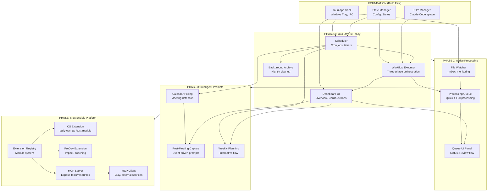

# DailyOS Roadmap

> From proof-of-concept to product in three phases.

---

## Current Status (2026-02-05)

**Phase 1 is functionally complete.** The core promise works:
- Briefing runs automatically at scheduled time
- Dashboard shows the day ready
- Archive runs silently at midnight
- No terminal required for daily workflow

**Remaining:** 7-day crash-free validation period.

---

## Phase Overview

| Phase | Name | Core Delivery | Key Features |
|-------|------|---------------|--------------|
| **Phase 1** | "Your day is ready" | Passive consumption | F1 Briefing, F7 Dashboard, F6 Tray, F3 Archive |
| **Phase 2** | "Active processing" | Inbox automation + post-enrichment | F4 Processing Queue, dashboard enrichment, action sync |
| **Phase 3** | "Intelligent prompts" | Event-driven UX | Calendar awareness, post-meeting intelligence, weekly planning |
| **Phase 4** | "Extensible platform" | Extensions + MCP | CS extension, ProDev extension, MCP server/client |

---

## Dependency Graph

---

## Phase 1: "Your Day Is Ready"

**Goal:** Prove the core value proposition—the system prepares, you consume.

### Milestones

| Milestone | Deliverable | Definition of Done |
|-----------|-------------|-------------------|
| **1.1 App Shell** | Tauri app with system tray | App launches, shows in tray, opens window |
| **1.2 Scheduler** | Time-based job execution | Jobs run at configured times, survive restart |
| **1.3 Executor** | Three-phase workflow orchestration | `/today` runs via DailyOS, produces `_today/` files |
| **1.4 Dashboard** | UI renders briefing content | Overview, meeting cards, action list display correctly |
| **1.5 Integration** | End-to-end happy path | Briefing runs at 8am, notification appears, dashboard shows content |
| **1.6 Archive** | Background cleanup | Nightly archive runs, old files moved |

### Phase 1 Acceptance Criteria

- [x] Briefing runs automatically at scheduled time
- [x] Notification appears when briefing completes
- [x] Clicking tray icon opens dashboard
- [x] Dashboard renders `_today/` content as UI (not markdown)
- [x] Meeting cards show prep content (expandable)
- [x] Action list shows due/overdue items
- [ ] No crashes over 7-day test period
- [x] User doesn't need terminal for daily workflow

### What's NOT in Phase 1

- File watching (no inbox processing)
- Post-meeting prompts
- Weekly planning flow
- Preferences UI
- Onboarding wizard

---

## Phase 2: "Active Processing"

**Goal:** Automate the inbox—files process without commands.

### Prerequisites

- Phase 1 complete and stable
- Executor proven reliable
- Dashboard rendering solid

### Milestones

| Milestone | Deliverable | Definition of Done |
|-----------|-------------|-------------------|
| **2.1 File Watcher** | Monitor `_inbox/` directory | Detects new `.md` files within 30 seconds |
| **2.2 Quick Processing** | Immediate classification | Files classified and routed in < 5 seconds |
| **2.3 Full Processing** | Batched AI enrichment | Queued files processed every 2 hours |
| **2.4 Queue UI** | Processing status panel | Shows pending, processing, completed, review states |
| **2.5 Review Flow** | Handle edge cases | User can resolve ambiguous files |

### Phase 2 Acceptance Criteria

- [ ] New files in `_inbox/` detected automatically
- [ ] Simple files routed immediately (no AI needed)
- [ ] Complex files queued and batch-processed
- [ ] Queue panel shows real-time status
- [ ] "Review needed" items have clear resolution path
- [ ] User doesn't run `/inbox` command manually

---

## Phase 3: "Intelligent Prompts"

**Goal:** Context-aware interactions at natural moments.

### Prerequisites

- Phase 2 complete and stable
- File watcher reliable
- Dashboard interaction patterns established

### Milestones

| Milestone | Deliverable | Definition of Done |
|-----------|-------------|-------------------|
| **3.1 Calendar Polling** | Meeting awareness | Knows when meetings start/end |
| **3.2 Post-Meeting Capture** | Event-driven prompt | Prompt appears 5 min after meeting ends |
| **3.3 Capture UI** | Quick outcome entry | Win/Risk/Action capture in < 10 seconds |
| **3.4 Weekly Prep** | Monday data preparation | Week context ready by Monday 8am |
| **3.5 Weekly Planning UI** | Interactive flow | Priority setting, week overview, focus blocks |

### Phase 3 Acceptance Criteria

- [ ] System knows when meetings end
- [ ] Post-meeting prompt appears at appropriate time
- [ ] Prompt is dismissible without guilt
- [ ] Captured outcomes persist correctly
- [ ] Weekly planning flow completes in < 2 minutes
- [ ] Skipping weekly planning has sensible defaults

---

## Phase 4: "Extensible Platform"

**Goal:** Domain-specific features as extensions. MCP integration for AI-native automation.

### Prerequisites

- Phase 2 post-enrichment engine proven (dashboard updates, action sync working)
- Phase 3 calendar + capture flows stable
- Extension boundaries validated through CS and ProDev internal modules

### Milestones

| Milestone | Deliverable | Definition of Done |
|-----------|-------------|-------------------|
| **4.1 Extension Registry** | Internal module system | Extensions register hooks, schemas, UI contributions |
| **4.2 Customer Success Extension** | daily-csm as Rust module | Dashboard refresh, action tracking, health monitoring, value capture, renewal countdown, portfolio triage — all working as post-enrichment hooks |
| **4.3 Professional Development Extension** | Coaching + impact as opt-in module | Two-sided impact capture, coaching reflections, weekly/monthly roll-ups |
| **4.4 MCP Server** | App exposes tools/resources via MCP | Claude Desktop can query briefing, actions, account data, meeting schedule |
| **4.5 MCP Client** | App consumes external MCP services | Clay integration (contact notes, creation after meetings) |
| **4.6 Dashboard JSON Schemas** | Structured document migration | Account dashboards as JSON with markdown views, mechanical updates working |

### Phase 4 Acceptance Criteria

- [ ] CS extension activates with CSM profile, deactivates with GA
- [ ] Post-enrichment hooks update account dashboards without AI
- [ ] Bidirectional action sync between SQLite and account markdown files
- [ ] Impact capture distinguishes customer outcomes vs. personal impact
- [ ] MCP server responds to resource/tool requests from Claude Desktop
- [ ] Clay MCP client creates notes after customer meetings
- [ ] Extension toggle in Settings (enable/disable per extension)

### What's NOT in Phase 4

- Public SDK / community plugin marketplace (Phase 5+)
- Extension sandboxing / security model for untrusted code
- Extension distribution or versioning
- Non-Automattic MCP integrations (Slack, Linear, Notion)

---

### Future: Phase 5+ (Community Platform)

Items captured for future consideration, not scheduled:

- **Public Extension SDK** — Formalize internal extension contract into documented API
- **Extension Marketplace** — Discovery, installation, updates for community extensions
- **MCP Expansion** — Additional MCP server tools, broader client integrations
- **Extension Sandboxing** — Security model for running untrusted extension code
- **Cross-workspace** — Multiple workspaces, workspace templates, workspace sharing

---

## Technical Milestones (Cross-Phase)

### Foundation (Before Phase 1)

| Task | Description |
|------|-------------|
| Project scaffolding | Tauri + React + TypeScript setup |
| Build pipeline | Dev server, production build |
| IPC bridge | Rust ↔ TypeScript communication |
| Config schema | `~/.daybreak/config.json` structure |

### Infrastructure (During Phase 1)

| Task | Description |
|------|-------------|
| Error handling | Retry logic, user-facing errors |
| Logging | Structured logs for debugging |
| State persistence | Workflow status survives restart |

### Polish (Post-Phase 3)

| Task | Description |
|------|-------------|
| Preferences UI | Visual config editing |
| Onboarding wizard | First-run setup flow |
| Auto-update | In-app update mechanism |
| Telemetry (opt-in) | Usage analytics |

---

## Risk Mitigation by Phase

### Phase 1 Risks

| Risk | Mitigation |
|------|------------|
| PTY spawn failures | Retry logic, queue mechanism, clear error states |
| Claude Code timeout | Configurable timeout, partial result handling |
| Google API token expiry | Detect and prompt for re-auth |
| Scheduler drift on sleep | Re-sync on wake events |

### Phase 2 Risks

| Risk | Mitigation |
|------|------------|
| File watcher misses events | Periodic polling backup |
| Quick processing misclassifies | "Review needed" escape hatch |
| Batch processing too slow | Prioritize by file age |

### Phase 3 Risks

| Risk | Mitigation |
|------|------------|
| Post-meeting prompt fatigue | Easy disable, smart filtering (external meetings only) |
| Calendar API rate limits | Cache calendar data, poll less frequently |
| Weekly planning abandonment | Timeout with sensible defaults |

### Phase 4 Risks

| Risk | Mitigation |
|------|------------|
| Extension boundaries too rigid | Design hooks generically, validate with 2+ real extensions before formalizing |
| MCP server security exposure | Localhost only, explicit consent for write tools, respect privacy levels |
| JSON schema migration breaks existing dashboards | One-time migration script, keep markdown as fallback reader |
| Extension overhead on startup | Lazy-load extensions, only init when profile/settings activate them |

---

## Decision Log

See `RAIDD.md` for the canonical decision log (DEC1-DEC28).

---

## Open Questions

1. ~~**Onboarding:** Should Phase 1 include minimal onboarding, or document manual setup?~~ → Manual setup for MVP, wizard in Phase 2+
2. ~~**Preferences:** Config file editing acceptable for MVP, or need basic UI?~~ → Config file acceptable for MVP
3. **Google API:** Require for MVP, or graceful degradation with manual calendar?
4. **Testing:** What's the testing strategy for Rust backend? (Unit tests exist for archive, scheduler)

---

*Update this roadmap as phases complete and learnings emerge.*
