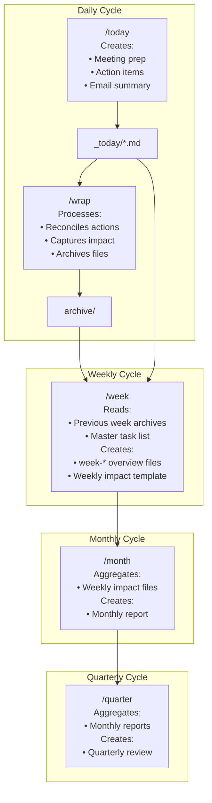

# DailyOS Skills Catalog

## Overview

DailyOS provides a collection of commands and skills that form the core of the "personal chief of staff" system. This document catalogs all available commands and skills, their purposes, and how they integrate with Daybreak automation.

---

## Classification System

### Execution Model

| Category | Description | Daybreak Role |
|----------|-------------|---------------|
| **Automated** | Runs on schedule without user intervention | Daybreak schedules and executes |
| **Semi-Automated** | Schedulable but benefits from user input | Daybreak triggers, may prompt user |
| **On-Demand** | User invokes when needed | Claude Code only |

### Invocation Methods

| Method | Description |
|--------|-------------|
| **Daybreak** | Automatically scheduled by Daybreak app |
| **Claude Code** | User types `/command` in Claude Code terminal |
| **Either** | Can be invoked via Daybreak or Claude Code |

---

## Commands

Commands are slash-invoked workflows that produce output in the workspace.

### `/today` - Daily Operating System

**Purpose**: Populate `_today/` with everything needed for today's work.

| Attribute | Value |
|-----------|-------|
| Execution Model | Automated |
| Invocation | Daybreak (scheduled) or Claude Code |
| Schedule | Morning (default 8:00 AM) |
| Duration | 2-5 minutes |
| Phases | 3 (Prepare, Enrich, Deliver) |

**What It Does**:
- Fetches today's calendar events
- Classifies meetings (customer, internal, project, personal)
- Generates meeting prep files
- Aggregates action items due today
- Scans email inbox for high-priority items
- Identifies agendas needed for upcoming meetings
- Creates daily overview

**Output Files**:
```
_today/
├── 00-overview.md              # Day dashboard
├── 01-HHMM-type-name.md        # Meeting prep files
├── 80-actions-due.md           # Action items
├── 81-suggested-focus.md       # Priorities
├── 83-email-summary.md         # Email triage
└── 90-agenda-needed/           # Draft agendas
```

**Dependencies**:
- Google Calendar API (optional - degrades gracefully)
- Google Gmail API (optional)
- Google Sheets API (optional)
- Account dashboards in `Accounts/*/01-Customer-Information/`

---

### `/wrap` - End of Day Closure

**Purpose**: Close out the day with proper reconciliation and cleanup.

| Attribute | Value |
|-----------|-------|
| Execution Model | Automated |
| Invocation | Daybreak (scheduled) or Claude Code |
| Schedule | End of day (default 5:30 PM) |
| Duration | 2-5 minutes |
| Phases | 3 (Prepare, Enrich, Deliver) |

**What It Does**:
- Verifies meeting transcripts were processed
- Reconciles action items (completed, new, updated)
- Captures daily impact (customer outcomes + personal)
- Updates master task list
- Archives today's files
- Optionally updates Clay relationship notes

**Interactive Elements**:
- Prompts for task status updates
- Prompts for impact capture (two-sided: customer + personal)
- Offers transcript processing if inbox has files

**Output**:
- Updated `_today/tasks/master-task-list.md`
- Updated week overview with completion status
- `archive/YYYY-MM-DD/wrap-summary.md`

---

### `/inbox` - Document Processing

**Purpose**: Process documents from inbox to organized PARA locations.

| Attribute | Value |
|-----------|-------|
| Execution Model | Automated (two-tier) |
| Invocation | Daybreak (file watcher + scheduled) or Claude Code |
| Quick Processing | Immediate on file arrival |
| Full Processing | Batched every 2 hours |
| Phases | 3 (Prepare, Enrich, Deliver) |

**Two-Tier Processing**:

**Quick Processing** (No AI, Immediate):
- Classify file type
- Detect account/project context
- Route simple files immediately
- Queue complex files for full processing

**Full Processing** (With AI, Batched):
- Generate summaries
- Extract action items
- Add frontmatter
- Move to canonical PARA locations

**Document Types Handled**:
| Type | Detection | Enrichment |
|------|-----------|------------|
| Transcripts | `*transcript*.md` | Summary, actions, decisions |
| Meeting Notes | `*notes*.md` | Format, actions |
| Strategy Docs | `*strategy*.md` | Executive summary |
| General | Other `.md` | Classification, tagging |

---

### `/week` - Monday Review

**Purpose**: Start the week with full context and a plan.

| Attribute | Value |
|-----------|-------|
| Execution Model | Semi-Automated |
| Invocation | Daybreak (Monday) or Claude Code |
| Schedule | Monday morning (default 8:00 AM) |
| Duration | 3-7 minutes |
| Phases | 3 (Prepare, Enrich, Deliver) |

**What It Does**:
- Archives previous week's `week-*` files
- Fetches week's calendar, classifies all meetings
- Aggregates action items (overdue + due this week)
- Checks account hygiene (contact gaps, renewal dates)
- Prompts for weekly priorities (interactive)
- Identifies time gaps and suggests scheduling
- Creates weekly impact template

**Interactive Elements**:
- Priority setting prompt
- Time block approval prompt

**Output Files**:
```
_today/
├── week-00-overview.md         # Week at a glance
├── week-01-customer-meetings.md
├── week-02-actions.md
├── week-03-hygiene-alerts.md
└── week-04-focus.md

Leadership/06-Professional-Development/01-Weekly-Impact/
└── YYYY-WNN-impact-capture.md
```

---

### `/month` - Monthly Roll-Up

**Purpose**: Aggregate weekly impacts into a monthly report.

| Attribute | Value |
|-----------|-------|
| Execution Model | On-Demand |
| Invocation | Claude Code only |
| When to Use | Last Friday of month or first Monday |
| Duration | 5-10 minutes |

**What It Does**:
- Aggregates all weekly impact captures
- Identifies patterns across weeks
- Generates monthly report
- Prompts for curation of highlights

**Why Not Automated**:
- Requires curation of highlights
- User should review and polish narrative
- Timing varies (some months end mid-week)

**Output**:
```
Leadership/impact/
└── YYYY-MM-monthly-report.md
```

---

### `/quarter` - Quarterly Pre-Population

**Purpose**: Prepare for quarterly review with aggregated evidence.

| Attribute | Value |
|-----------|-------|
| Execution Model | On-Demand |
| Invocation | Claude Code only |
| When to Use | 1-2 weeks before quarterly review |
| Duration | 10-15 minutes |

**What It Does**:
- Aggregates all monthly reports for quarter
- Calculates key metrics
- Pre-fills quarterly review template
- Generates talking points for review conversations

**Why Not Automated**:
- Requires reflection and goal-setting
- User must curate achievements
- Timing depends on company review cycle

**Output**:
```
Leadership/reviews/
└── YYYY-QN-review.md
```

---

## Skills

Skills are multi-step workflows with specialized processing logic. They are invoked by commands or directly.

### `inbox` Skill

**Purpose**: Three-phase document processing workflow.

| Attribute | Value |
|-----------|-------|
| Type | Processing Skill |
| Used By | `/inbox` command, `/today`, `/wrap` |
| Automation | Daybreak active inbox |

**Capabilities**:
- File type detection
- Account/project context detection
- Summary generation
- Action item extraction
- PARA routing

**Configuration**: `_tools/inbox-config.yaml`

---

### `editorial` Skill

**Purpose**: Multi-stage writing review for quality and authenticity.

| Attribute | Value |
|-----------|-------|
| Type | Review Skill |
| Execution Model | On-Demand |
| Invocation | Claude Code only |

**Why Not Automated**:
- Interactive by nature
- Requires writer's presence
- High-stakes content needs human judgment

**Review Phases**:
1. Mechanical Review (typography, anti-patterns)
2. Structural Review (logic flow, evidence)
3. Voice Review (tone fidelity)
4. Craft Review (soul + mechanics)
5. Authenticity Review (AI tells, formulaic patterns)
6. Red Team (optional - challenges premises)
7. Executive Scrutiny (optional - precision demands)

**Output**: Review report with specific recommendations.

---

### `strategy-consulting` Skill

**Purpose**: Structured problem-solving using consulting frameworks.

| Attribute | Value |
|-----------|-------|
| Type | Analysis Skill |
| Execution Model | On-Demand |
| Invocation | Claude Code only |

**Agents Coordinated**:
- `problem-framer` - Structure the problem
- `framework-strategist` - Apply appropriate frameworks
- `evidence-analyst` - Analyze data and evidence
- `red-team` - Challenge assumptions
- `executive-storyteller` - Synthesize narrative

---

## Agents

Agents are specialized personas that perform specific tasks within skills.

### Command Agents

| Agent | Purpose | Used By |
|-------|---------|---------|
| `agenda-generator` | Creates meeting agendas from account context | `/today`, `/week` |

### Inbox Agents

| Agent | Purpose | Used By |
|-------|---------|---------|
| `file-organizer` | Determines canonical location for files | `inbox` skill |

### Content Agents

| Agent | Purpose | Used By |
|-------|---------|---------|
| `writer-authenticity-review` | Detects AI patterns, ensures genuine voice | `editorial` skill |

### Strategic Agents

| Agent | Purpose | Used By |
|-------|---------|---------|
| `problem-framer` | Structures problems using consulting frameworks | `strategy-consulting` skill |
| `framework-strategist` | Selects and applies analytical frameworks | `strategy-consulting` skill |
| `evidence-analyst` | Analyzes data to support or challenge hypotheses | `strategy-consulting` skill |
| `red-team` | Challenges assumptions and identifies weaknesses | `strategy-consulting` skill |
| `executive-storyteller` | Synthesizes analysis into executive narrative | `strategy-consulting` skill |

---

## Skills Package Concept

### What Is a Skills Package?

A skills package is a distributable bundle of related commands, skills, and agents that extend DailyOS functionality. Think of it like a plugin or extension pack.

### Package Structure

```
skill-package/
├── SKILL.md               # Main skill definition
├── commands/              # Command definitions
│   └── command-name.md
├── agents/                # Agent definitions
│   └── agent-name.md
├── templates/             # Output templates
├── scripts/               # Python scripts for phases 1 & 3
│   ├── prepare_*.py
│   └── deliver_*.py
└── config/                # Default configuration
    └── config.yaml
```

### Installation

Skills packages install to the workspace:
```
.claude/
├── commands/             # Commands from packages
├── skills/               # Skills from packages
│   └── skill-name/
│       └── SKILL.md
└── agents/               # Agents from packages
```

### Core Packages

DailyOS ships with these core packages:

| Package | Contents |
|---------|----------|
| `dailyos-core` | `/today`, `/wrap`, `/week`, `/month`, `/quarter` commands |
| `inbox-processing` | `inbox` skill, `file-organizer` agent |
| `editorial` | `editorial` skill, review agents |
| `strategy-consulting` | Strategy skill, consulting agents |

### Creating Custom Packages

Users can create custom skills packages:

1. Create package structure
2. Define SKILL.md with frontmatter
3. Add commands, agents, templates
4. Install via symlink or copy to workspace

---

## Integration Matrix

### Daybreak Automation Support

| Command/Skill | Daybreak Automated | Quick Processing | Full Processing | Schedule |
|---------------|-------------------|------------------|-----------------|----------|
| `/today` | Yes | N/A | Yes | Morning |
| `/wrap` | Yes | N/A | Yes | Evening |
| `/inbox` | Yes | Yes (file watch) | Yes (batched) | On-demand + periodic |
| `/week` | Semi | N/A | Yes | Monday |
| `/month` | No | N/A | N/A | User-invoked |
| `/quarter` | No | N/A | N/A | User-invoked |
| `editorial` | No | N/A | N/A | User-invoked |
| `strategy` | No | N/A | N/A | User-invoked |

### Data Flow Between Commands



---

## Quick Reference

### Daily Workflow

| Time | Action | Command |
|------|--------|---------|
| Morning | Review briefing | `/today` (auto) |
| During day | Check prep files | Dashboard |
| Files arrive | Auto-process | `/inbox` (auto) |
| End of day | Close out | `/wrap` (auto) |

### Weekly Workflow

| Time | Action | Command |
|------|--------|---------|
| Monday AM | Plan week | `/week` (auto) |
| Throughout week | Capture impact | Manual in template |
| Friday PM | Final wrap | `/wrap` (auto) |

### Monthly Workflow

| Time | Action | Command |
|------|--------|---------|
| Last Friday | Generate report | `/month` (manual) |
| Review | Curate highlights | Manual editing |

### Quarterly Workflow

| Time | Action | Command |
|------|--------|---------|
| 2 weeks before | Pre-populate review | `/quarter` (manual) |
| Before review | Polish narrative | Manual editing |

---

*Document Version: 1.0*
*Last Updated: 2026-02-04*
