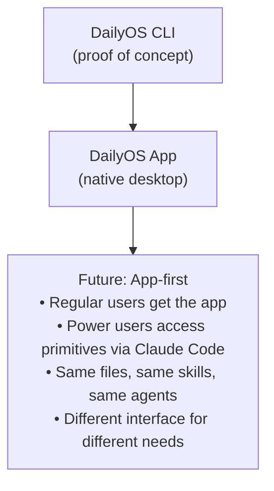

# Product Vision: DailyOS

> Open the app. Your day is ready.

---

## What DailyOS Is

DailyOS is a native desktop application that gives knowledge workers an AI-powered executive assistant—without requiring them to understand AI, write prompts, or touch a terminal.

**The experience:**
1. You open the app
2. Your day is already prepared
3. You read, review, act
4. You close the app and do your work

That's it. No configuration. No commands. No maintenance. The system operated while you weren't looking.

---

## What DailyOS Is Not

**Not a note-taking app.**
We're not competing with Notion or Obsidian on general-purpose note capture. DailyOS is opinionated about productivity workflows, not a blank canvas.

**Not a task manager.**
We're not building a better Todoist. Tasks are a byproduct of work, not the center of it. DailyOS surfaces what's relevant; it doesn't demand you manage a backlog.

**Not a calendar app.**
We integrate with your calendar; we don't replace it. Google Calendar stays. We make what's on it actionable.

**Not a collaboration tool.**
DailyOS is for the alone part of work—individual execution, preparation, synthesis. Collaboration happens in Slack, Docs, meetings. We prepare you for those.

**Not a Claude Code replacement.**
Power users who want full control can still use Claude Code directly. DailyOS is the consumption layer on top of the same primitives.

---

## Who DailyOS Is For

### The Primary User

**Knowledge workers whose only AI experience is ChatGPT or Copilot.**

They know how to ask a question and get output. That's the extent of their AI literacy. They don't know how to build systems, write sophisticated prompts, or structure workflows.

**Their day looks like this:**
- Move from app to app (Salesforce → Glean → Gong → Slack → Docs)
- Collect information from each silo manually
- Synthesize in their head
- Action toward some outcome
- Repeat

**What they wish for:**
- "I wish I could just ask about [topic] and the system would know where to look"
- "I wish I didn't have to spend 20 minutes prepping for every meeting"
- "I wish my action items didn't fall through the cracks"
- "I wish I could remember what happened in that meeting 3 months ago"

**Tools they've tried and abandoned:**
- Todoist (set up perfectly, never used)
- Notion (built a system, didn't maintain it)
- Asana (too much overhead)
- All of them (the guilt loop)

### The Secondary User

**Technical users who want the benefits without the terminal.**

They could use Claude Code directly. They might, for some things. But for daily productivity, they want to open an app like a normal person and have their day ready.

They appreciate:
- The automation that runs while they sleep
- The one-click interactions instead of typing commands
- The ability to drop into power-user mode when needed
- The same file system they could access via terminal

---

## The Core Experience

### Morning

**6:00 AM — The system runs**
- Pulls today's calendar
- Gathers context for each meeting
- Surfaces actions due today and overdue
- Summarizes relevant emails
- Compiles into a daily overview

**8:00 AM — You open DailyOS**
- Today's overview is ready
- Meeting prep cards are populated
- Actions needing attention are surfaced
- You read it with your coffee

**8:15 AM — You're prepared**
- Click "Ready" on the day
- Minimize the app
- Get to work

### During the Day

**Meeting notification (30 min before)**
- "Acme Corp in 30 minutes"
- Click → prep doc appears
- Context, history, talking points ready
- You walk in prepared

**After a meeting**
- Drop transcript in inbox folder
- System processes automatically
- Summary, actions, routing handled
- You don't think about it

**Ad-hoc lookup**
- "What did we discuss with BigCo last quarter?"
- DailyOS finds it
- Context without searching

### Evening

**5:30 PM — Wrap notification**
- "Ready to close out?"
- Click → today's summary appears
- What you accomplished
- What's carrying to tomorrow
- Any loose ends

**5:35 PM — Done**
- Review takes 2 minutes
- Click "Close Day"
- Tomorrow's system runs tonight
- You shut the laptop

---

## What You Never Do

In DailyOS, you never:

- Open a terminal
- Type a command
- Write a prompt
- See markdown syntax (unless you want to)
- Configure folder structures
- Set up integrations manually
- Process things into your system
- Feel guilty about skipped days

The system handles the infrastructure. You handle the decisions.

---

## The Outcomes

### For the User

| Before DailyOS | After DailyOS |
|-----------------|----------------|
| 30 min prepping for meetings | Already prepared |
| Actions fall through cracks | Actions surface when relevant |
| Context requires searching | Context is presented |
| "I know it's somewhere" | "It's right here" |
| Guilty about unused systems | System keeps up with you |

### Measurable Goals

- **Meeting prep time:** 30 min → 5 min
- **Action drop rate:** Reduced 80%
- **Context retrieval:** Instant vs. hunting
- **System maintenance time:** Zero

### The Emotional Outcome

> "I feel like I have an assistant who actually knows what's going on."

That's the feeling we're designing for. Not "productive" in an abstract sense. Actually supported. Actually prepared. Actually on top of things—because the system is on top of things for you.

---

## The Trust Problem

Users have been burned. Every productivity tool promised to change their life. Every one became a maintenance burden or got abandoned.

**How we earn trust:**

**1. Immediate value, no setup**
The first experience is "here's something useful" not "let's configure your workspace." Value before investment.

**2. Demonstrated forgiveness**
Early in the experience, show that skipping a day doesn't break anything. "Welcome back. Here's today." Not "You missed 3 days. Here's your backlog."

**3. Low switching cost**
Your data is markdown files. Don't like DailyOS? Take your files and go. No lock-in. No hostage data. This reduces the risk of trying it.

**4. Visible results**
When you walk into a meeting prepared and someone asks "how did you know that?"—that's the moment DailyOS sells itself. Word of mouth from visible results.

---

## Evolution

DailyOS started as a CLI proof-of-concept built on Claude Code—where we tested approaches to productivity, experimented with skills and agents, and identified gaps.

DailyOS is now becoming a native desktop application. Same primitives underneath (skills, agents, markdown, Python). But wrapped in an interface that doesn't require technical knowledge.

**The evolution:**

Under the hood, it's the same system. The native app is DailyOS that runs itself.

---

## The Boundary

DailyOS is for the alone part of knowledge work. The boundary is where individual preparation meets group collaboration.

**DailyOS's job:**
- Prepare you for meetings (your prep, your context)
- Process your transcripts (your summaries, your actions)
- Track your actions (your commitments, your follow-ups)
- Capture your impact (your wins, your evidence)

**Handoff to other tools:**
- The meeting itself (Zoom, Meet)
- Shared documents (Google Docs, Notion)
- Team communication (Slack, email)
- Project tracking (Jira, Linear, Asana)

**The integration model:**
- Rendered outputs you can copy/paste/share
- Documents ready for wherever they need to go
- Your call on where content ends up

---

## The Ecosystem, Not Just the App

DailyOS doesn't need to do everything. It needs to maintain the best archive and let the rest of your tools consume it.

**The three-layer ecosystem:**

| Layer | What | Examples |
|-------|------|---------|
| Operational intelligence | DailyOS maintains the archive — briefings, preps, outcomes, actions, entities | The app |
| Creative/analytical work | AI tools consume the archive to create reports, strategies, content | Claude Desktop, ChatGPT |
| Bridge | MCP connects DailyOS to other tools and data sources | Integrations (Gong, Salesforce, Linear) |

Strategy consulting? Claude Desktop skill that reads your PARA workspace. Monthly impact report? Any AI tool can synthesize the weekly captures DailyOS archived. GTM plan? Claude reads your account files, your meeting history, your competitive intelligence.

DailyOS's job is to keep the archive excellent. Everything else builds on top.

## Extensibility Vision

Out of the box, DailyOS is opinionated. It makes decisions so you don't have to.

But knowledge work varies. A CS leader needs different intelligence than a VP of Engineering. Account-based work needs different signals than project-based work.

**The customization model (ADR-0046):**

**Entity Mode:** How you organize your work — account-based, project-based, or both. Determines what you track and how meetings associate with entities.

**Kits:** Domain-specific fields, templates, and vocabulary for your role. CS Kit adds account health and renewal tracking. Sales Kit adds pipeline stages. Requires a compatible entity mode.

**Intelligence:** Analytical perspectives that change how the system interprets your data. Executive Intelligence adds decision framing and delegation tracking. ProDev Intelligence captures personal impact and career narrative. Works with any entity mode.

**Integrations:** MCP data source connectors. Gong for transcripts. Salesforce for CRM data. Linear for project tracking. Any combination, any entity mode.

**Configuration:** Timing, working hours, what surfaces and what doesn't. No code required.

**Fork and Own:** It's open source. Your data is markdown. Take it all and go.

The goal: 80% of users pick an entity mode and one or two Kits/Intelligence layers during onboarding. The other 20% compose exactly what they need.

---

## Beyond Individual: Organizational Intelligence

DailyOS is a personal tool. But when every person on a team maintains excellent operational intelligence, something emerges: the raw material for organizational intelligence that's better than anything a top-down system can produce.

Consider the biweekly status update. Today, every IC scrambles to remember what they did. A manager synthesizes six hastily-assembled summaries. A director aggregates four managers. By the time it reaches the division report, it's a lossy summary of lossy summaries — and it took the ELT EA a full day to coordinate.

Now imagine each IC's DailyOS has been capturing wins, customer stories, project milestones, and risk signals in real-time for two weeks. The contribution practically assembles itself. The IC picks 1-3 highlights from what DailyOS already knows. The manager's tool synthesizes the team's contributions into a narrative. At each layer, the human curates — confirming, swapping, elevating. The report cascades from individual to team to group to department to division, with a human touch at every level and clear accountability for every story.

This is contribution, not surveillance. Each person controls what they publish. The organization gets signal quality that's impossible to achieve top-down, because it's grounded in the richest possible individual context — actual meetings, actual outcomes, actual relationship signals.

**This is future state.** The individual product must work beautifully first. But the architecture enables it: the markdown archive is the contribution mechanism, Kits provide domain-appropriate templates, and Intelligence layers identify what's worth elevating. When individual DailyOS users produce excellent signal, organizational intelligence becomes a consumption problem — and consumption is what AI does best.

---

## Success Criteria

DailyOS succeeds when:

1. **Users open it daily** — not because they have to, but because it's useful
2. **Users feel prepared** — walking into meetings with confidence
3. **Nothing falls through cracks** — actions surfaced, not buried
4. **Guilt is gone** — the system adapts to them, not vice versa
5. **They recommend it** — "you need to try this" word of mouth

DailyOS fails if:

1. **It becomes another maintenance burden** — we've recreated the problem
2. **Users feel behind** — guilt loop reappears
3. **Technical knowledge required** — excluded the primary user
4. **Data feels trapped** — violated ownership principle
5. **It's just a pretty CLI** — didn't actually remove the friction

---

## The Name

**DailyOS** — an operating system for your day.

It's the layer that manages your daily work. It prepares, processes, and presents—so you can focus on the work that matters.

You open DailyOS. Your day is ready. You're prepared.

---

*This vision will evolve as we build and learn. But the north star stays fixed: the system operates, you leverage. Open the app, your day is ready.*
