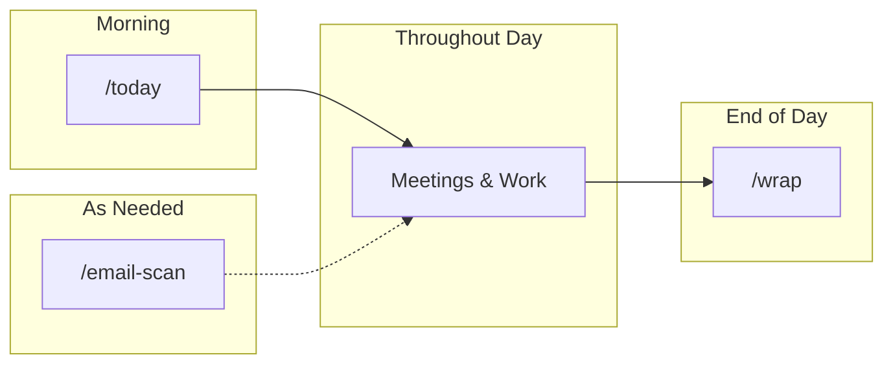
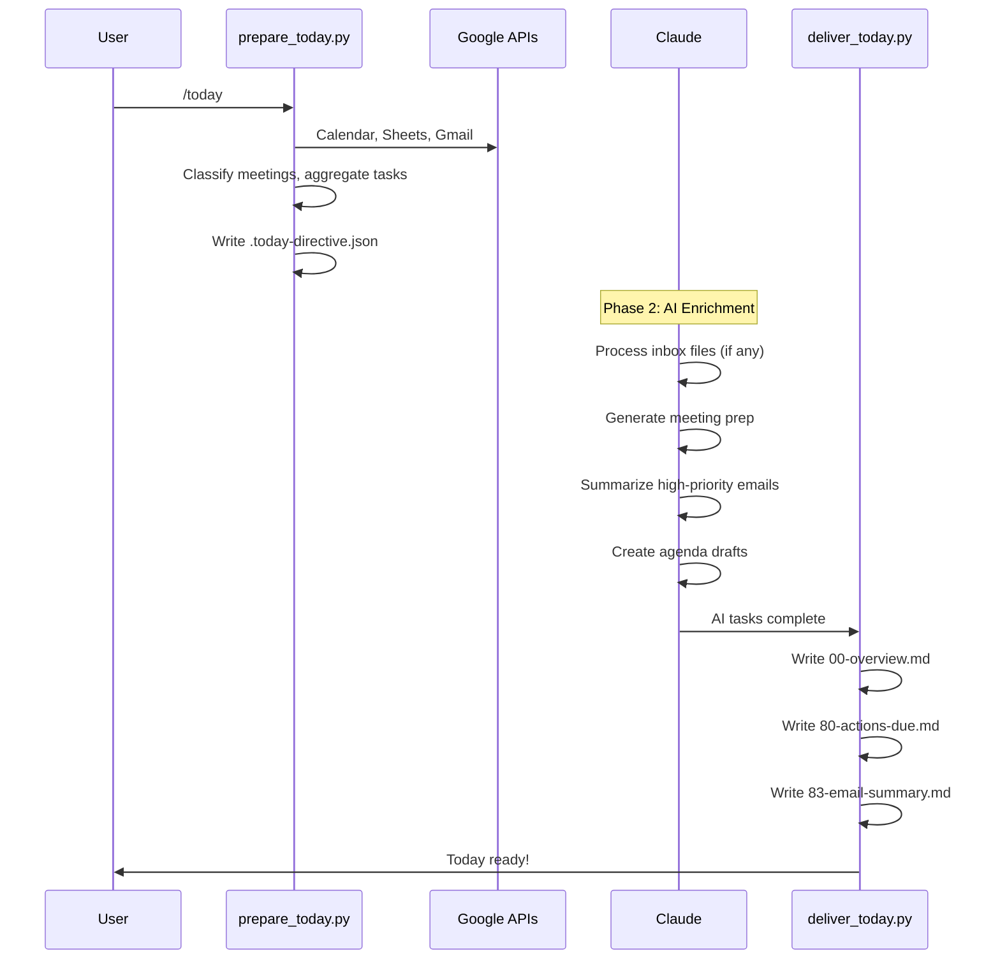
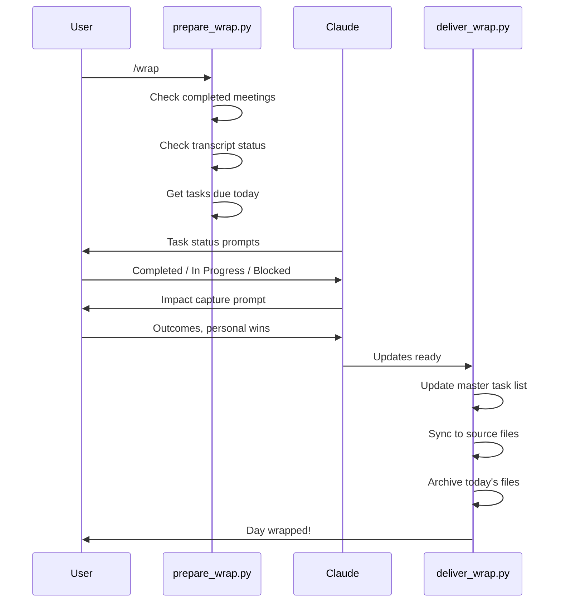
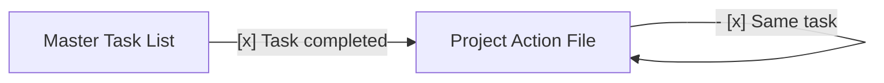
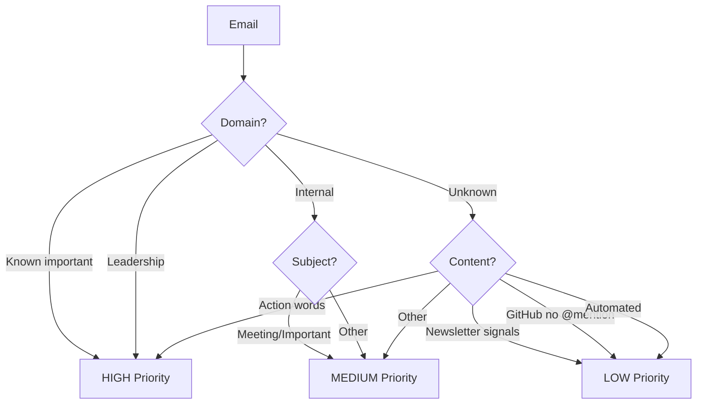

# Daily Workflow

The daily commands that keep you prepared, organized, and on top of your work.

## Quick Reference

| Command | When | What You Get |
|---------|------|--------------|
| `/today` | Every morning | Meeting prep, action items, email triage, agenda drafts |
| `/wrap` | End of day | Task reconciliation, impact capture, archive |
| `/email-scan` | Inbox zero blocks | Email triage, drafts, archived noise |



---

## /today - Morning Operating System

**Purpose**: Start the day fully prepared with everything in `_today/`.

### What It Does

1. **Archives yesterday** (if /wrap missed)
2. **Processes inbox** automatically (transcripts, documents)
3. **Fetches calendar** and classifies meetings
4. **Generates meeting prep** with context
5. **Surfaces action items** due, overdue, meeting-related
6. **Triages email** to HIGH/MEDIUM/LOW
7. **Identifies agendas needed** for next 3-4 business days
8. **Suggests focus areas** for downtime

### Three-Phase Execution



### Step-by-Step Usage

**Step 1: Run preparation**

```bash
python3 _tools/prepare_today.py
```

This fetches all data and outputs `_today/.today-directive.json`.

**Step 2: Read directive and execute AI tasks**

The directive contains a list of AI tasks. Process them in order:

1. **Inbox files** (if any) - Process transcripts first
2. **Meeting prep** - Generate prep for each external meeting
3. **Email summaries** - Summarize HIGH priority emails
4. **Agenda drafts** - Create drafts for upcoming meetings

**Step 3: Run delivery**

```bash
python3 _tools/deliver_today.py
```

This writes final files and updates week overview.

### Output Files

```
_today/
├── 00-overview.md                 # Today's dashboard
├── 01-0900-personal-daily-prep.md # Meetings in chronological order
├── 02-1030-external-project-prep.md
├── 03-1100-internal-1on1.md
├── 80-actions-due.md              # Action items
├── 81-suggested-focus.md          # Focus priorities
├── 83-email-summary.md            # Email triage
├── 90-agenda-needed/              # Draft agendas
│   └── project-sync-2026-02-05.md
└── tasks/
    └── master-task-list.md        # Persistent
```

### Meeting Prep Format

For each external meeting, you get:

```markdown
# [Project] Call Prep
**[Date] | [Meeting Title]**

## Quick Context
| Metric | Value |
|--------|-------|
| Project | Alpha Launch |
| Status | On track |
| Next Milestone | Feb 15 |

## Attendees
| Name | Role | Notes |
|------|------|-------|
| Jane Smith | PM | Project lead |

## Since Last Meeting
[Summary from most recent meeting]

## Open Action Items
- [ ] Send documentation - Due: Feb 5

## Suggested Talking Points
1. Follow up on [topic]
2. Check in on [objective]
```

### Troubleshooting

| Issue | Cause | Solution |
|-------|-------|----------|
| No meetings shown | API issue or no events | Check `python3 .config/google/google_api.py calendar list 1` |
| Empty prep | Context not found | Check project/area directory structure |
| Stale actions | Missed /wrap | Run /wrap to reconcile |
| Inbox not processed | prepare_inbox failed | Check `_inbox/.processing-state.json` |

---

## /wrap - End of Day Closure

**Purpose**: Close the day properly to maintain data quality.

### What It Does

1. **Checks transcript status** for today's meetings
2. **Prompts for task updates** on due items
3. **Captures daily impact** (outcomes + personal wins)
4. **Syncs task completions** back to source files
5. **Archives today's files** to `archive/YYYY-MM-DD/`

### Three-Phase Execution



### Step-by-Step Usage

**Step 1: Run preparation**

```bash
python3 _tools/prepare_wrap.py
```

**Step 2: Answer Claude prompts**

- **Task status**: For each task due today, provide status
- **Outcomes**: What value was delivered today?
- **Personal impact**: What did you accomplish?

**Step 3: Run delivery**

```bash
python3 _tools/deliver_wrap.py
```

### Wrap Summary

After /wrap, find the summary in the archive:

```markdown
# Day Wrap Summary - 2026-02-03

## Meetings Completed
| Project | Time | Transcript | Summary | Actions |
|---------|------|------------|---------|---------|
| Alpha | 10:00 AM | OK | OK | 2 new |

## Action Items Reconciled
### Completed Today
- [x] Send spec document

### New Items Added
- [ ] Review Q1 roadmap - Due: Feb 15

## Impacts Captured
- **Outcome**: Demo successful, stakeholders aligned
- **Personal**: Delivered presentation on new process
```

### Bidirectional Task Sync

When you mark a task complete in /wrap, it automatically syncs back to the source file:



This prevents zombie unchecked items in project files.

---

## /email-scan - Email Inbox Triage

**Purpose**: Triage email inbox during dedicated blocks.

### What It Does

1. **Fetches unread emails** from inbox
2. **Classifies by priority** (HIGH/MEDIUM/LOW)
3. **Summarizes threads** for HIGH priority
4. **Archives noise** (newsletters, GitHub, automated)
5. **Creates drafts** for important emails
6. **Labels** medium priority for later

### Classification Logic



### Priority Actions

| Priority | Action | Destination |
|----------|--------|-------------|
| HIGH | Full summary, draft response | Needs attention |
| MEDIUM | Label for later | Organized |
| LOW | Archive | Out of inbox |

### Email Summary Format

For HIGH priority emails:

```markdown
### Project Discussion (6 messages in thread)

**Conversation Arc:**
Jane initiated timeline discussion. Team sent updates.
Discussion about scope and deadline extension.

**Type:** DECISION NEEDED

**Specific Ask for You:** Yes
- Need to approve timeline by Friday

**For You:**
- **Action**: Respond with decision by EOD Thursday
- **Context**: Project on track, extension reasonable
```

### Standalone vs Integrated

`/email-scan` can run:
- **Standalone**: During dedicated inbox zero blocks
- **Integrated**: As part of `/today` (Step 3.5)

When integrated, email summary appears in `00-overview.md` and `83-email-summary.md`.

---

## Common Patterns

### Full Daily Workflow

```
08:30 - Run /today
08:35 - Review 00-overview.md
08:40 - Read meeting prep files
09:00 - First meeting

12:00 - Check 90-agenda-needed/
12:10 - Review and send agenda drafts

17:00 - Run /wrap
17:05 - Answer task prompts
17:10 - Capture daily impacts
17:15 - Day complete
```

### Recovering from Missed /wrap

If you forget to run /wrap:

1. `/today` detects this (resilience check)
2. Shows warning: "Yesterday's files not archived"
3. Options:
   - Run /wrap now to reconcile
   - Skip and let /today archive automatically

### Monday Coordination

On Mondays, run both:

```
/week    # Weekly overview first
/today   # Then daily prep
```

/week creates the week framework, /today fills in today's details.

---

## File Structure

### _today/ Directory

```
_today/
├── 00-overview.md              # Daily dashboard
├── 01-HHMM-type-name.md        # Meeting files (chronological)
├── ...
├── 80-actions-due.md           # Action items
├── 81-suggested-focus.md       # Focus priorities
├── 83-email-summary.md         # Email triage
├── 90-agenda-needed/           # Agenda drafts
├── tasks/                      # PERSISTENT - never archived
│   └── master-task-list.md
├── archive/                    # Rolling archive
│   ├── 2026-02-02/
│   └── 2026-02-01/
└── week-*.md                   # Week files (archived by /week)
```

### Naming Conventions

**Meeting files**: `[NN]-[HHMM]-[type]-[name].md`
- `NN`: Sequence number (01-79)
- `HHMM`: Start time (24h)
- `type`: external, internal, project, personal
- `name`: Project or meeting name

**Reference files**: `80-89`
- `80-actions-due.md`
- `81-suggested-focus.md`
- `83-email-summary.md`

**Action-needed**: `90-99`
- `90-agenda-needed/` directory

---

## Dependencies

### APIs Required

| API | Used By | Permission |
|-----|---------|------------|
| Google Calendar | /today, /wrap | Read + Write |
| Google Sheets | /today | Read |
| Gmail | /today, /email-scan | Read + Draft + Labels |

### Skills Used

| Skill | Used By | For |
|-------|---------|-----|
| daily-ops | /today | MEETING-PREP workflow |
| inbox | /today | Auto-processing inbox |

### Python Tools

| Tool | Command | Phase |
|------|---------|-------|
| `prepare_today.py` | /today | 1 |
| `deliver_today.py` | /today | 3 |
| `prepare_wrap.py` | /wrap | 1 |
| `deliver_wrap.py` | /wrap | 3 |

---

## Configuration

### Command Options

**/today options:**
```bash
python3 _tools/prepare_today.py [options]
  --skip-archive    Don't archive yesterday's files
  --skip-email      Don't fetch emails
  --skip-inbox      Skip inbox processing
  --skip-dashboard  Skip dashboard auto-start
  --output FILE     Custom output path
```

**/wrap options:**
```bash
python3 _tools/deliver_wrap.py [options]
  --skip-archive    Don't archive files
  --keep-directive  Keep directive file for debugging
  --ai-outputs FILE JSON file with AI-captured outputs
```

---

## Related Documentation

- [Index](index.md) - All systems overview
- [Weekly Workflow](weekly-workflow.md) - /week command
- [Inbox Processing](inbox.md) - Document workflow
- [Three-Phase Pattern](three-phase-pattern.md) - How it all fits together

---

*Daily workflow version: 1.0*
