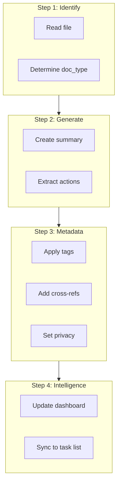
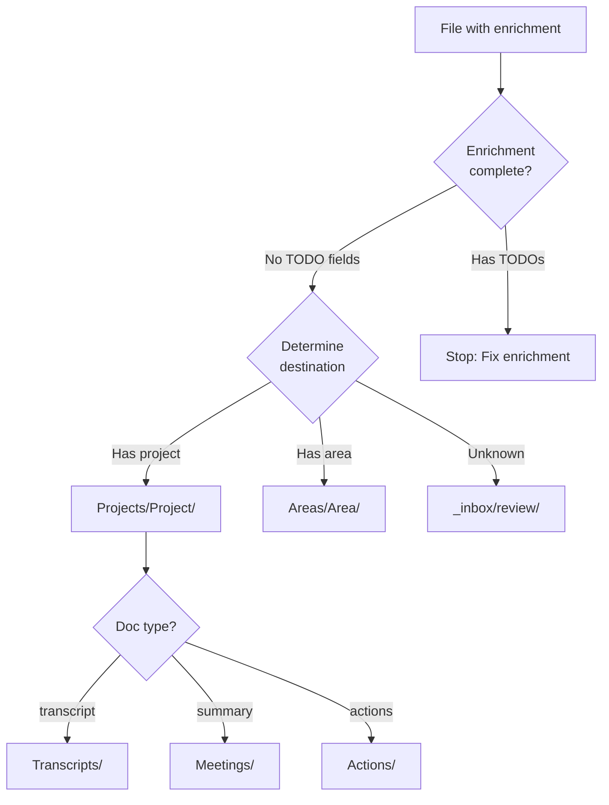
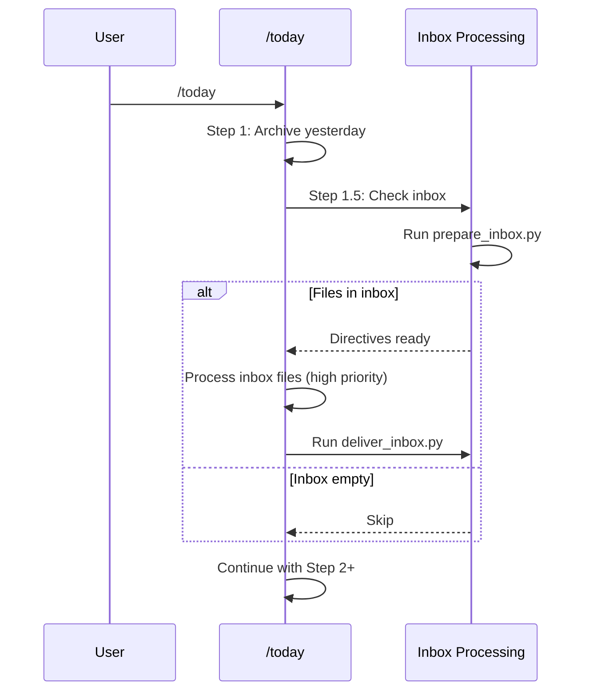

# Inbox Processing System

Transform raw documents from `_inbox/` into organized, enriched files in PARA structure.

## Quick Reference

| Phase | Who | What | Output |
|-------|-----|------|--------|
| Phase 1 | Python | Validate, detect context, analyze needs | `.phase1-directives.json` |
| Phase 2 | Claude | Summarize, extract actions, tag, link | Enriched files |
| Phase 3 | Python | Move to PARA locations, update indexes | Files in Projects/, Areas/, etc. |

```mermaid
flowchart LR
    subgraph Input["_inbox/"]
        T[Transcripts]
        D[Documents]
        N[Notes]
    end

    subgraph Phase1["Phase 1: Preparation"]
        PREP[prepare_inbox.py]
        DIR[.phase1-directives.json]
    end

    subgraph Phase2["Phase 2: Enrichment"]
        SUM[Summarize]
        ACT[Extract Actions]
        TAG[Apply Tags]
        LINK[Create Links]
    end

    subgraph Phase3["Phase 3: Delivery"]
        DELIV[deliver_inbox.py]
    end

    subgraph Output["PARA Locations"]
        PROJ[Projects/]
        AREAS[Areas/]
        RES[Resources/]
    end

    Input --> PREP
    PREP --> DIR
    DIR --> Phase2
    Phase2 --> DELIV
    DELIV --> Output
```



---

## When to Use

**Standalone**: "Process the inbox" or `/inbox-processing`
- When you have documents waiting in `_inbox/`
- After dropping transcripts or files for processing

**Integrated**: Automatic with `/today`
- `/today` runs inbox preparation as Step 1.5
- Transcripts from yesterday are processed automatically
- Zero-guilt design: just run `/today`

---

## Phase 1: Preparation (Python)

**What it does:**
1. Validates file naming conventions
2. Applies frontmatter templates based on doc_type
3. Detects context (project, area)
4. Analyzes what agents are needed
5. Outputs directive for Phase 2

### Running Phase 1

```bash
python3 _tools/prepare_inbox.py _inbox
```

### Output: Directive File

The script creates `_inbox/.phase1-directives.json`:

```json
{
  "total_files": 2,
  "total_agents": 4,
  "files": {
    "2026-02-03-transcript-project-alpha-monthly.md": {
      "doc_type": "transcript",
      "meeting_type": "external",
      "project": "Alpha",
      "agents": [
        {"name": "summary-generator", "priority": "high"},
        {"name": "action-extractor", "priority": "high"}
      ]
    }
  }
}
```

### What Gets Detected

| Detection | Source | Used For |
|-----------|--------|----------|
| Project | Filename, frontmatter, content | PARA destination |
| Area | Filename, title keywords | PARA destination |
| Meeting type | Attendee domains, title | Summary template |
| Doc type | File extension, frontmatter | Enrichment agents |

---

## Phase 2: Enrichment (Claude)

**What you do:**
For each file in the directive, apply enrichment steps.

### Enrichment Steps



### Step 1: Identify File Type

Read frontmatter to determine:
- `doc_type`: transcript, summary, actions, strategy, report
- `meeting_type`: external or internal

### Step 2: Generate Required Content

**For external transcripts:**

1. Create summary following template:

```markdown
# [Project] Meeting Summary
**Date**: 2026-02-03 | **Type**: Monthly Sync

## Attendees
- James (Internal)
- Jane Smith (External)

## Key Discussion Points
1. [Topic 1]
2. [Topic 2]

## Decisions Made
- [Decision]

## Action Items
- [ ] [Action] - Owner: [name] - Due: [date]

## Next Steps
- [Next step]
```

2. Create action file:

```markdown
# [Project] Actions - 2026-02-03

## New Actions
- [ ] **[Action title]**
  - Owner: [Name]
  - Due: [Date]
  - Context: [Why this action]
  - Source: [meeting-summary.md]
```

**For internal transcripts:**
- Use internal summary template (less formal)
- Extract actions if present

### Step 3: Apply Metadata

**Tags** (5-10 per file):

| Category | Examples |
|----------|----------|
| Project/Area | `alpha`, `strategy` |
| Topic | `migration`, `performance`, `planning` |
| Type | `meeting`, `strategy`, `planning` |
| Status | `in-progress`, `blocked`, `completed` |

**Cross-references**:

```yaml
related:
  - "../Meetings/2026-01-15-summary-alpha.md"
  - "../../Projects/Beta/00-Index.md"
```

**Privacy level**:

| Level | Criteria |
|-------|----------|
| `internal` | General business content |
| `restricted` | Names, specific deals |
| `confidential` | Financials, credentials |

### Step 4: Update Intelligence

**For external meetings only:**

1. Update project dashboard:
   - Last Contact date
   - Recent Wins (if applicable)
   - Current Risks (if identified)

2. Sync actions to master task list:
   ```markdown
   - [ ] **[Action]** `2026-02-03-001`
     - Project: Alpha
     - Due: 2026-02-10
     - Source: Projects/Alpha/Meetings/2026-02-03-summary.md
   ```

---

## Phase 3: Delivery (Python)

**What it does:**
1. Verifies enrichments complete (no TODO fields)
2. Groups related files (transcript + summary + actions)
3. Moves file groups to PARA locations
4. Updates project/area index files

### Running Phase 3

```bash
python3 _tools/deliver_inbox.py _inbox
```

### Delivery Logic



### PARA Destinations

| Area | Doc Type | Destination |
|------|----------|-------------|
| Projects | transcript | `Projects/[Project]/Transcripts/` |
| Projects | summary | `Projects/[Project]/Meetings/` |
| Projects | actions | `Projects/[Project]/Actions/` |
| Areas | meetings | `Areas/[Area]/Meetings/` |
| Areas | performance | `Areas/Performance/` |

---

## File Naming Convention

**Pattern**: `YYYY-MM-DD-type-project-topic.md`

| Component | Options | Example |
|-----------|---------|---------|
| Date | ISO format | `2026-02-03` |
| Type | transcript, summary, actions, strategy, report | `summary` |
| Project/Topic | Lowercase, hyphenated | `alpha-monthly` |

**Examples:**
- `2026-02-03-transcript-alpha-monthly.md`
- `2026-02-03-summary-alpha-monthly.md`
- `2026-02-03-actions-alpha-monthly.md`

---

## Integration with /today

When integrated with `/today`, inbox processing is automatic:



**Benefits:**
- Zero-guilt: Just run `/today`
- Transcripts from yesterday processed automatically
- Meeting prep has fresh data

---

## Progress Tracking

Copy this checklist when processing:

```markdown
Inbox Processing:
- [ ] Phase 1: Run preparation script
- [ ] Phase 2: For each file:
  - [ ] Generate summary (transcripts)
  - [ ] Extract actions
  - [ ] Apply tags (5-10)
  - [ ] Add cross-references
  - [ ] Set privacy level
- [ ] Phase 2: Update intelligence (external only)
- [ ] Phase 3: Run delivery script
- [ ] Update project indexes
```

---

## Troubleshooting

| Issue | Cause | Solution |
|-------|-------|----------|
| "TODO fields remaining" | Enrichment incomplete | Complete missing fields in file |
| "Project not found" | Unknown project name | Add to structure or fix filename |
| "Delivery failed" | Missing directory | Create project/area folder |
| File not detected | Bad naming | Rename to `YYYY-MM-DD-type-topic.md` |

### Common Fixes

**Bad filename:**
```bash
# Wrong
notes-from-call.md

# Right
2026-02-03-transcript-alpha-monthly.md
```

**Missing frontmatter:**
```yaml
---
area: Projects
project: Alpha
doc_type: transcript
meeting_type: external
---
```

**Incomplete enrichment:**
```markdown
# Wrong - has TODO
## Summary
TODO: Write summary

# Right - enriched
## Summary
Discussed Q1 roadmap and migration timeline...
```

---

## Supporting Documentation

The full skill has detailed component docs:

| Document | Purpose |
|----------|---------|
| `SKILL.md` | Entry point and overview |
| `SUMMARIZATION-EXTERNAL.md` | External meeting summary format |
| `SUMMARIZATION-INTERNAL.md` | Internal meeting format |
| `ACTION-EXTRACTION.md` | How to extract actions |
| `TAGGING-TAXONOMY.md` | Tag vocabulary |
| `LINKING-PATTERNS.md` | Cross-reference rules |
| `SENSITIVITY-SCANNING.md` | Privacy classification |
| `PARA-MAPPING.md` | Destination logic |

Location: `.claude/skills/inbox-processing/`

---

## Related Documentation

- [Index](index.md) - All systems
- [Daily Workflow](daily-workflow.md) - /today integration
- [Three-Phase Pattern](three-phase-pattern.md) - Architecture

---

*Inbox processing version: 1.0*
