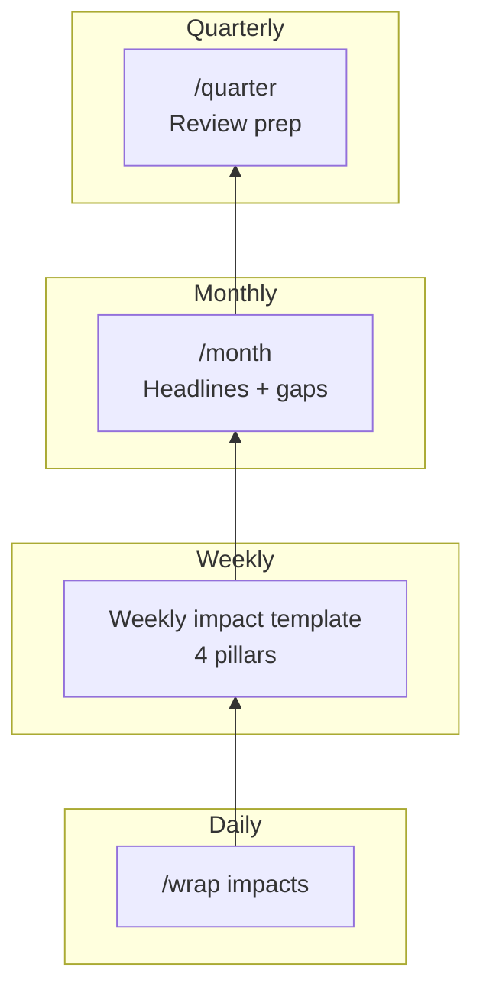
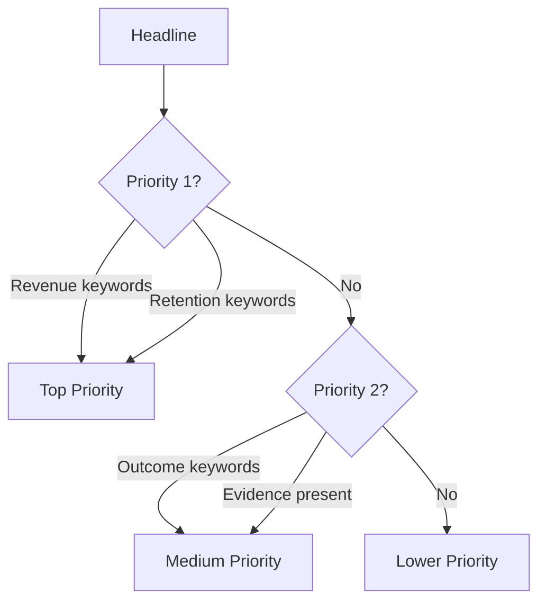
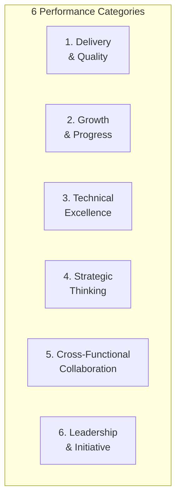
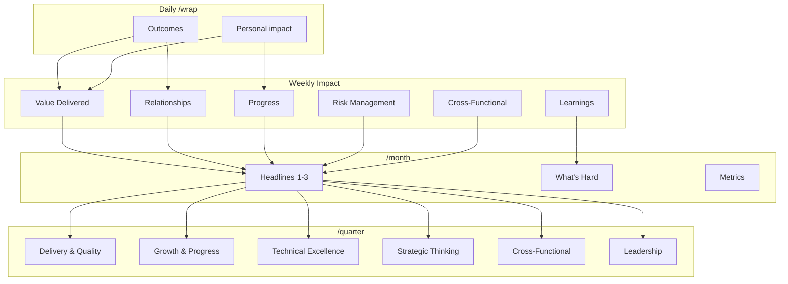

# Monthly and Quarterly Workflow

Roll up weekly impacts into monthly reports and quarterly reviews.

## Quick Reference

| Command | When | Input | Output |
|---------|------|-------|--------|
| `/month` | First Monday of month | Weekly impacts | Monthly report draft |
| `/quarter` | Last week of quarter | Monthly reports | Quarterly review |



---

## /month - Monthly Roll-Up

**Purpose**: Generate monthly impact report draft from weekly captures.

### What It Does

1. **Finds weekly impacts** from the target month
2. **Aggregates by category** (Value, Relationships, Progress, Risk)
3. **Identifies top headlines** (leadership-worthy)
4. **Pulls key metrics** from sources
5. **Generates report draft** with gaps flagged

### When to Run

- **First Monday of month**: Generate previous month's report
- **On demand**: Generate current month so far

### Execution

```bash
# Typically just invoke the command
/month
```

The command determines the target month automatically:
- First week of month = previous month
- Otherwise = current month (on-demand)

### Input: Weekly Impacts

```
Areas/Performance/Weekly-Impact/
├── 2026-W01-impact-capture.md
├── 2026-W02-impact-capture.md
├── 2026-W03-impact-capture.md
├── 2026-W04-impact-capture.md
└── 2026-W05-impact-capture.md
```

### Output: Monthly Report Draft

```
Areas/Performance/Monthly-Reports/
└── 2026-01-draft.md
```

### Report Structure

```markdown
# Monthly Impact Report - January 2026

**Context**: 12 meetings, 8 projects touched, 2 deadlines met

## The Headlines

*Top 2-3 impacts. Each passes the "skip-level test."*

### 1. [Headline]
**What changed**: [Outcome statement]
**The story**: [2-3 sentences synthesized]
**Source**: [Attribution]

### 2. [Headline]
**What changed**: [Outcome]
**The story**: [Context]
**Source**: [Attribution]

## What's Hard Right Now
*[From "Key Learnings" sections]*

## Recognition Received
*[Extracted quotes/kudos - TO BE FILLED]*

## Looking Ahead
*[From last week's learnings or action items]*

---

## Auto-Generated Notes (Remove Before Publishing)

### Weekly Captures Included
- 2026-W01, W02, W03, W04, W05

### Gaps Identified
- Missing: W03
- Empty categories: Progress
```

---

### Headline Prioritization

Headlines are ranked by impact potential:



**Priority 1 keywords** (team's top priority):
- Revenue, completion, retention
- Expansion, growth, pipeline
- Risk prevented, issue resolved

**Priority 2 keywords** (performance expectations):
- Relationship, executive engagement
- Value, adoption, success
- Advocacy, reference

**Headline selection criteria:**
- Passes "skip-level test" (manager's manager would care)
- Shows outcome, not activity
- Has source/evidence

---

### Category Aggregation

Weekly impacts map to monthly categories:

| Weekly Section | Monthly Mapping |
|----------------|-----------------|
| Value Delivered > Wins | Headlines candidate |
| Value Delivered > Technical Outcomes | Headlines candidate |
| Relationship Progress | Headlines candidate |
| Progress | Headlines candidate (top priority) |
| Risk Management | Headlines candidate |
| Cross-Functional | Supporting evidence |
| Key Learnings | "What's Hard" section |

---

## /quarter - Quarterly Pre-Population

**Purpose**: Pre-fill quarterly self-assessment with evidence.

### What It Does

1. **Aggregates monthly reports** from the quarter
2. **Maps headlines to performance categories** (6 categories)
3. **Pulls quarterly metrics** from sources
4. **Assesses evidence coverage** per category
5. **Generates review draft** with gaps flagged
6. **Suggests final-week focus** if gaps exist

### When to Run

- **Last week of quarter**: Generate Q review
- **On demand**: Generate current quarter progress

### Execution

```bash
/quarter
```

### Input: Monthly Reports

```
Areas/Performance/Monthly-Reports/
├── 2026-01-published.md
├── 2026-02-published.md
└── 2026-03-published.md
```

### Output: Quarterly Review Draft

```
Areas/Performance/Quarterly-Reviews/
└── 2026-Q1-draft.md
```

### Performance Categories



### Category Mapping

| Headline Keywords | Performance Category |
|-------------------|----------------------|
| delivery, completed, quality | Delivery & Quality |
| growth, progress, pipeline | Growth & Progress |
| technical, solved, optimization | Technical Excellence |
| strategic, planning, roadmap | Strategic Thinking |
| collaboration, cross-team, alignment | Cross-Functional Collaboration |
| leadership, initiative, speaking | Leadership & Initiative |

### Evidence Coverage Assessment

| Coverage | Evidence Count | Rating Suggestion |
|----------|----------------|-------------------|
| Strong | 3+ headlines + metrics | Exceeds |
| Adequate | 1-2 headlines | Meets |
| Weak | 0 headlines, some mentions | Needs Improvement |
| None | No evidence | FLAG for attention |

### Review Structure

```markdown
# Quarterly Review - Q1 2026

## Performance Against Expectations

### 1. Delivery & Quality
**Expectation**: Drive quality outcomes and timely delivery

**Evidence** (auto-populated):
- Completion rate: 98% (49 of 50 tasks)
- Key deliveries: Project Alpha, Beta Launch
- At-risk items saved: Project Gamma

**Specific Examples**:
- January: Prevented Gamma delay through proactive coordination
- February: Delivered Alpha 30 days early

**Suggested Rating**: Exceeds (based on evidence count)
**Evidence Gaps**: None

---

### 2. Growth & Progress
[Similar structure...]

---

## Quarter Highlights

### Signature Achievements
1. [Top headline from quarter]
2. [Second headline]
3. [Third headline]

### Challenges Overcome
- [From "What's Hard" sections]

---

## Suggested Final-Week Focus

Based on evidence gaps:
1. **Leadership**: Publish post on lessons learned
2. **Cross-Functional**: Document collaboration for Q1 projects
```

---

## Data Flow



---

## Gap Detection

### Monthly Gaps

| Gap Type | Detection | Alert |
|----------|-----------|-------|
| Missing week | Expected W01-W05, missing W03 | "Missing: W03" |
| Empty category | No progress entries | "Progress section empty" |
| No headlines | All entries low-ranked | "No clear headlines" |
| Stale data | Last capture >14 days old | "Most recent capture stale" |

### Quarterly Gaps

| Gap Type | Detection | Alert |
|----------|-----------|-------|
| Missing month | Expected Jan-Mar, missing Feb | "Missing: February report" |
| Weak category | 0 headlines for category | "Leadership: No evidence" |
| No metrics | Source unavailable | "Could not fetch metrics" |

---

## Output Locations

### Monthly Reports

```
Areas/Performance/Monthly-Reports/
├── 2025-12-published.md
├── 2026-01-draft.md       # Current month
└── ...
```

**Lifecycle**: draft -> published (manual)

### Quarterly Reviews

```
Areas/Performance/Quarterly-Reviews/
├── 2025-Q4-review.md      # Previous
├── 2026-Q1-draft.md       # Current quarter
└── ...
```

**Lifecycle**: draft -> reviewed with manager -> final

---

## Troubleshooting

| Issue | Cause | Solution |
|-------|-------|----------|
| No weekly captures found | Impact files missing | Run /week, capture daily |
| Empty headlines | Low-impact entries | Reframe entries as outcomes |
| Wrong month targeted | Run timing | Use on-demand or wait for first Monday |
| Missing metrics | Source unavailable | Run without metrics, add manually |

### Debug Commands

```bash
# Check weekly impacts
ls Areas/Performance/Weekly-Impact/

# Check monthly reports
ls Areas/Performance/Monthly-Reports/

# View specific week
cat "Areas/Performance/Weekly-Impact/2026-W06-impact-capture.md"
```

---

## Best Practices

### Daily Impact Capture

Capture impacts via `/wrap` daily, not Friday afternoon:

```markdown
## Outcomes
- Project now has visibility into timeline
- Team avoided delay through proactive coordination

## Personal Impact
- Delivered presentation
- Facilitated cross-functional alignment
```

### Weekly Finalization

End of week, review and enhance:
- Add context to terse entries
- Cross-reference to source documents
- Tag significant wins for headlines

### Monthly Headlines

Focus on outcomes, not activities:

| Activity (weak) | Outcome (strong) |
|-----------------|------------------|
| "Had 12 meetings" | "Delivered 3 projects on time" |
| "Updated dashboards" | "Identified opportunity for improvement" |
| "Responded to requests" | "Resolved critical blocker preventing launch" |

---

## Related Documentation

- [Index](index.md) - All systems
- [Weekly Workflow](weekly-workflow.md) - Weekly impact capture
- [Daily Workflow](daily-workflow.md) - /wrap for daily capture

---

*Monthly/Quarterly workflow version: 1.0*
