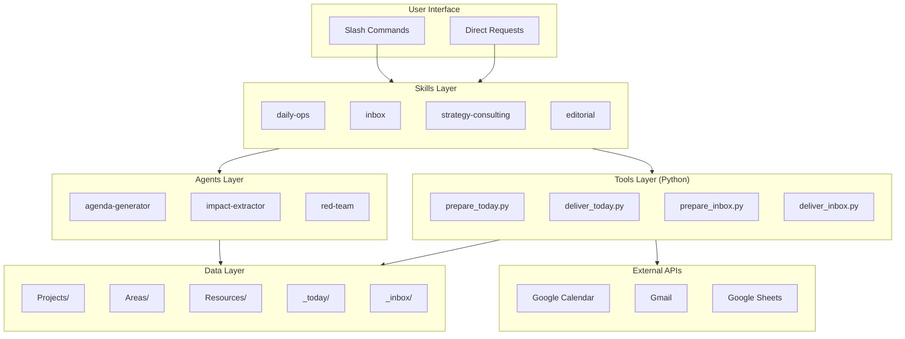
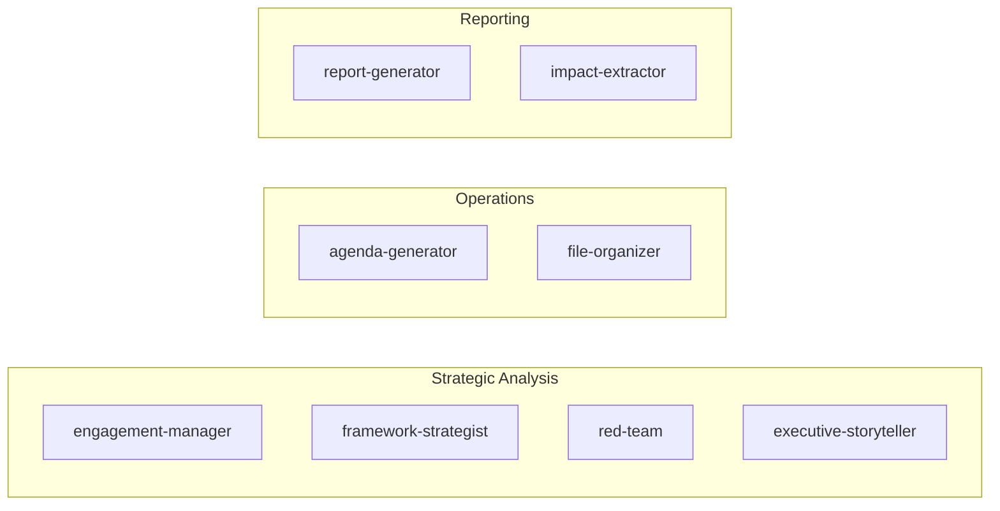
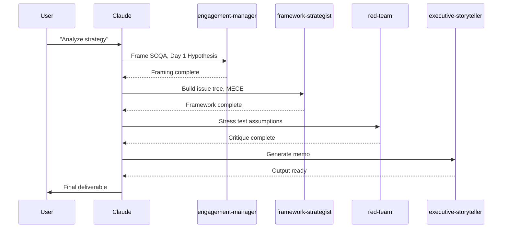
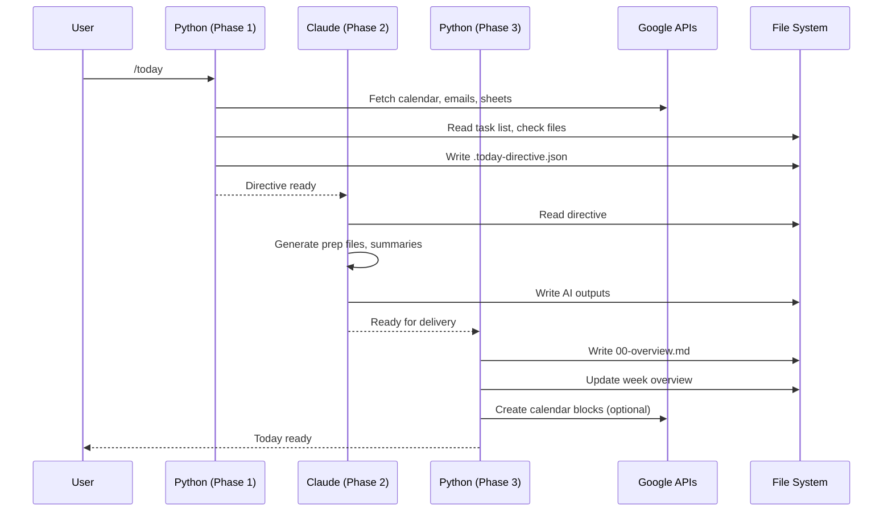
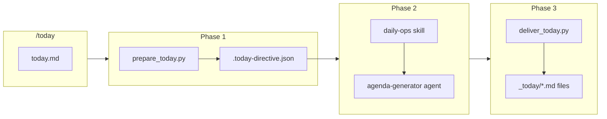
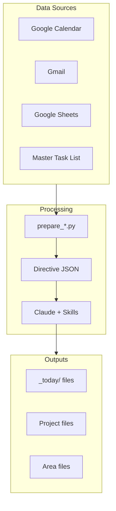

# Skill-Agent-Tool Architecture

How the three layers of automation work together in this personal operating system.

## Quick Reference

| Layer | Location | Invoked By | Purpose |
|-------|----------|------------|---------|
| **Skills** | `.claude/skills/` | Slash commands, user requests | Domain expertise and workflows |
| **Agents** | `.claude/agents/` | Skills, tasks | Specialized subtask execution |
| **Tools** | `_tools/` | Commands (Phase 1/3) | Deterministic data operations |



---

## Architecture Overview

The system uses a **three-phase command pattern** where:

1. **Phase 1 (Python Tool)**: Gathers data, performs deterministic operations
2. **Phase 2 (Claude + Skills/Agents)**: AI enrichment, synthesis, generation
3. **Phase 3 (Python Tool)**: Delivers files, updates state

This separation ensures:
- Fast, reliable data gathering (Python)
- Intelligent content generation (Claude)
- Clean state management (Python)

---

## Layer 1: Skills

**Location**: `.claude/skills/`

Skills are expertise modules that Claude follows directly. Each skill contains:
- `SKILL.md` - Entry point and workflow overview
- Supporting `.md` files for specific operations
- No code execution - pure instructions

### Available Skills

| Skill | Purpose | Key Components |
|-------|---------|----------------|
| **daily-ops** | Day-to-day operations | MEETING-PREP, ACTION-TRACKING, IMPACT-REPORTING |
| **inbox** | Document processing workflow | PHASE1-PREPARATION, PHASE2-ENRICHMENT, PHASE3-DELIVERY |
| **strategy-consulting** | McKinsey-style analysis | FRAMEWORKS (SCQA, MECE), WORKFLOW, QUALITY-GATES |
| **editorial** | Writing standards | VOICE-TONE, GRAMMAR-MECHANICS, TERMINOLOGY |

### Skill Invocation Patterns

```
User: "Prep me for [meeting]"
       |
       v
Claude matches to daily-ops skill
       |
       v
Reads .claude/skills/daily-ops/MEETING-PREP.md
       |
       v
Follows workflow: Load context -> Check activity -> Generate prep
```

Skills are invoked:
- **Automatically**: When user request matches skill triggers
- **Explicitly**: Via slash commands (e.g., `/editorial:full-review`)
- **By other skills**: Cross-referencing (e.g., inbox references daily-ops)

---

## Layer 2: Agents

**Location**: `.claude/agents/`

Agents are specialized sub-agents for specific tasks. They receive focused prompts and return structured outputs.

### Agent Categories



### Agent Usage

Agents are invoked by:
1. **Skills**: `strategy-consulting` uses `engagement-manager`, `red-team`, etc.
2. **Commands**: `/today` invokes `agenda-generator` for look-ahead agendas
3. **Direct task delegation**: For specialized subtasks

**Example - Strategy Consulting Agent Chain**:



---

## Layer 3: Tools (Python)

**Location**: `_tools/`

Python scripts handle deterministic operations that don't require AI judgment:
- API calls (Calendar, Gmail, Sheets)
- File operations (archive, move, validate)
- Data aggregation (tasks, meetings)
- State management (directives, processing state)

### Tool Categories

| Category | Tools | Purpose |
|----------|-------|---------|
| **Daily Operations** | `prepare_today.py`, `deliver_today.py` | Morning prep workflow |
| **Inbox Processing** | `prepare_inbox.py`, `deliver_inbox.py` | Document triage |
| **Validation** | `validate_naming.py`, `validate_cascade.py` | Data integrity |
| **Maintenance** | `standardize_frontmatter.py`, `move_to_canonical.py` | System hygiene |

### Three-Phase Pattern



### Directive Files

Tools communicate with Claude via JSON directive files:

| Directive | Created By | Used By |
|-----------|------------|---------|
| `.today-directive.json` | `prepare_today.py` | Claude, `deliver_today.py` |
| `.week-directive.json` | `prepare_week.py` | Claude, `deliver_week.py` |
| `.wrap-directive.json` | `prepare_wrap.py` | Claude, `deliver_wrap.py` |
| `.phase1-directives.json` | `prepare_inbox.py` | Claude, `deliver_inbox.py` |

---

## Integration Patterns

### Slash Command Flow



### Skill-Agent Relationship

| Skill | Agents Used | When |
|-------|-------------|------|
| daily-ops | agenda-generator | Look-ahead agenda creation |
| strategy-consulting | engagement-manager, framework-strategist, red-team, executive-storyteller | Full analysis workflow |
| inbox | (none directly - uses skill instructions) | Document enrichment |

### Data Flow



---

## Design Principles

### 1. Separation of Concerns

- **Tools**: Data gathering, file operations, API calls
- **Skills**: Domain expertise, workflow instructions
- **Agents**: Focused subtask execution

### 2. Fail Gracefully

Tools check API availability and continue in degraded mode:

```python
api_available, api_reason = check_google_api_available()
if not api_available:
    print(f"Running in DEGRADED MODE: {api_reason}")
    # Continue with local data only
```

### 3. State Tracking

Processing state persists across phases:

```json
{
  "created": "2026-02-03T09:00:00",
  "phases": {
    "phase1": {"status": "completed"},
    "phase2": {"status": "in_progress"}
  }
}
```

### 4. Idempotent Operations

Running a command twice should be safe:
- Archive checks prevent duplicate archiving
- Directive regeneration replaces previous state
- File overwrites are intentional

---

## Troubleshooting

| Issue | Layer | Resolution |
|-------|-------|------------|
| API timeout | Tools | Check Google credentials, retry |
| Missing skill | Skills | Verify `.claude/skills/` path |
| Agent not found | Agents | Check `.claude/agents/` for file |
| Directive empty | Tools | Run prepare script, check errors |
| Stale data | Tools | Regenerate directive, check API |

### Debug Checklist

1. **Check directive exists**: `ls _today/.today-directive.json`
2. **Verify API access**: `python3 .config/google/google_api.py calendar list 1`
3. **Review directive content**: `cat _today/.today-directive.json | jq .`
4. **Check skill path**: `ls .claude/skills/daily-ops/`

---

## Related Documentation

- [Index](index.md) - Overview of all systems
- [Daily Workflow](daily-workflow.md) - /today, /wrap, /email-scan
- [Inbox Processing](inbox.md) - Three-phase document workflow
- [Tools Reference](tools-reference.md) - All Python tools

---

*Architecture version: 1.0*
