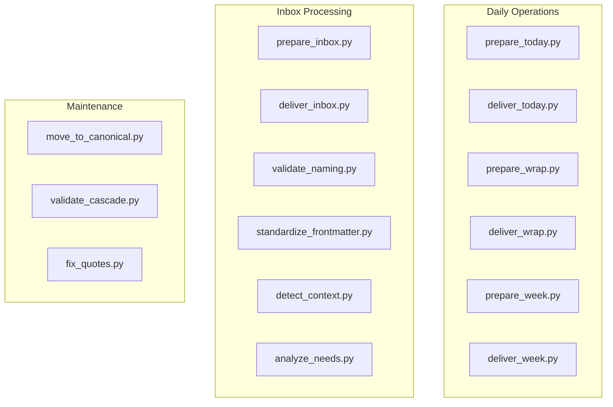

# Python Tools Reference

Quick reference for all automation tools in `_tools/`.

## Quick Reference

### Daily Operations

| Tool | Purpose | Used By |
|------|---------|---------|
| `prepare_today.py` | Phase 1: Gather data for /today | /today |
| `deliver_today.py` | Phase 3: Write daily files | /today |
| `prepare_wrap.py` | Phase 1: Gather wrap data | /wrap |
| `deliver_wrap.py` | Phase 3: Archive and sync | /wrap |
| `prepare_week.py` | Phase 1: Gather week data | /week |
| `deliver_week.py` | Phase 3: Write week files | /week |

### Inbox Processing

| Tool | Purpose | Used By |
|------|---------|---------|
| `prepare_inbox.py` | Orchestrate Phase 1 pipeline | /inbox, /today |
| `deliver_inbox.py` | Phase 3: Move to PARA locations | /inbox |
| `validate_naming.py` | Check file naming conventions | prepare_inbox.py |
| `standardize_frontmatter.py` | Apply frontmatter templates | prepare_inbox.py |
| `detect_context.py` | Detect project/area context | prepare_inbox.py |
| `analyze_needs.py` | Output agent directives | prepare_inbox.py |

### System Maintenance

| Tool | Purpose | Used By |
|------|---------|---------|
| `move_to_canonical.py` | Move files to proper locations | Manual |
| `validate_cascade.py` | Validate document cascade | Manual |
| `fix_quotes.py` | Fix quote character issues | Manual |
| `weekly_changelog.py` | Generate weekly changelog | Manual |

---

## Tool Categories



---

## Daily Operation Tools

### prepare_today.py

Gathers all data needed for the /today command.

```bash
python3 _tools/prepare_today.py [options]
```

**Options:**
- `--skip-archive` - Don't archive yesterday's files
- `--skip-email` - Don't fetch emails
- `--skip-inbox` - Skip inbox processing
- `--skip-dashboard` - Skip dashboard auto-start
- `--output FILE` - Custom output path

**Output:** `_today/.today-directive.json`

**What it does:**
1. Archives yesterday's files (if needed)
2. Runs inbox preparation
3. Fetches calendar events
4. Classifies meetings
5. Fetches data from configured sources
6. Aggregates action items
7. Fetches unread emails
8. Identifies agendas needed

---

### deliver_today.py

Writes final files for /today after Claude enrichment.

```bash
python3 _tools/deliver_today.py [options]
```

**Options:**
- `--skip-calendar` - Don't create calendar blocks
- `--keep-directive` - Keep directive file for debugging

**What it does:**
1. Writes 00-overview.md
2. Writes 80-actions-due.md
3. Writes 83-email-summary.md
4. Writes 81-suggested-focus.md
5. Updates week overview prep status
6. Creates calendar events (optional)

---

### prepare_wrap.py

Gathers data for end-of-day /wrap command.

```bash
python3 _tools/prepare_wrap.py
```

**Output:** `_today/.wrap-directive.json`

**What it does:**
1. Fetches today's calendar (completed meetings)
2. Checks transcript existence
3. Parses week overview for prep status
4. Gets tasks due today

---

### deliver_wrap.py

Processes wrap outputs and archives.

```bash
python3 _tools/deliver_wrap.py [options]
```

**Options:**
- `--skip-archive` - Don't archive files
- `--keep-directive` - Keep directive for debugging
- `--ai-outputs FILE` - JSON file with AI outputs

**What it does:**
1. Updates week overview with Done status
2. Updates master task list
3. Syncs completions to source files
4. Archives today's files

---

### prepare_week.py

Gathers data for /week Monday planning.

```bash
python3 _tools/prepare_week.py [options]
```

**Options:**
- `--skip-archive` - Don't archive previous week
- `--output FILE` - Custom output path

**Output:** `_today/.week-directive.json`

---

### deliver_week.py

Writes week files and creates impact template.

```bash
python3 _tools/deliver_week.py [options]
```

**Options:**
- `--skip-calendar` - Don't create calendar events
- `--skip-inbox` - Don't move archives to inbox
- `--keep-directive` - Keep directive for debugging
- `--ai-outputs FILE` - JSON with priorities, approved blocks

---

## Inbox Processing Tools

### prepare_inbox.py

Orchestrates the Phase 1 inbox pipeline.

```bash
python3 _tools/prepare_inbox.py _inbox
```

**Calls (in order):**
1. `validate_naming.py`
2. `standardize_frontmatter.py --batch`
3. `detect_context.py`
4. `analyze_needs.py`

**Output:** `_inbox/.phase1-directives.json`

---

### deliver_inbox.py

Moves enriched files to PARA locations.

```bash
python3 _tools/deliver_inbox.py _inbox
```

**What it does:**
1. Verifies enrichments complete
2. Groups related files
3. Moves to Projects/, Areas/, etc.
4. Updates index files

---

### validate_naming.py

Checks file naming conventions.

```bash
python3 _tools/validate_naming.py _inbox
```

**Pattern:** `YYYY-MM-DD-type-project-topic.md`

---

### standardize_frontmatter.py

Applies frontmatter templates.

```bash
python3 _tools/standardize_frontmatter.py --batch _inbox
```

---

### detect_context.py

Detects project/area context.

```bash
python3 _tools/detect_context.py _inbox
```

---

### analyze_needs.py

Outputs agent directives.

```bash
python3 _tools/analyze_needs.py _inbox
```

---

## Maintenance Tools

### move_to_canonical.py

Moves files to proper PARA locations.

```bash
python3 _tools/move_to_canonical.py [source] [destination]
```

---

### validate_cascade.py

Validates document cascade and relationships.

```bash
python3 _tools/validate_cascade.py
```

---

### fix_quotes.py

Fixes smart quote characters to standard.

```bash
python3 _tools/fix_quotes.py [path]
```

---

### weekly_changelog.py

Generates weekly changelog from git history.

```bash
python3 _tools/weekly_changelog.py
```

---

## Library Modules

Located in `_tools/lib/`:

| Module | Purpose |
|--------|---------|
| `calendar_utils.py` | Calendar API helpers |
| `task_utils.py` | Task list parsing and formatting |
| `file_utils.py` | File operations and archiving |
| `meeting_utils.py` | Meeting classification |
| `dashboard_utils.py` | Dashboard auto-start |

### calendar_utils.py

```python
from calendar_utils import (
    fetch_calendar_events,
    filter_events_by_status,
    get_week_dates,
    calculate_meeting_gaps,
    check_google_api_available
)
```

### task_utils.py

```python
from task_utils import (
    load_master_task_list,
    get_tasks_due_on,
    get_overdue_tasks,
    filter_tasks_by_owner,
    extract_waiting_on
)
```

### file_utils.py

```python
from file_utils import (
    ensure_today_structure,
    archive_daily_files,
    list_today_files,
    find_project_dashboard
)
```

### meeting_utils.py

```python
from meeting_utils import (
    classify_meeting,
    load_domain_mapping,
    fetch_project_data
)
```

---

## Common Patterns

### Three-Phase Tools

```
prepare_*.py  ->  Claude enrichment  ->  deliver_*.py
```

All daily commands follow this pattern:
- Phase 1 (Python): Data gathering, validation
- Phase 2 (Claude): AI enrichment, synthesis
- Phase 3 (Python): File writing, state updates

### Directive Files

Tools communicate via JSON:

```json
{
  "command": "today",
  "generated_at": "2026-02-03T09:00:00",
  "context": {...},
  "calendar": {...},
  "meetings": {...},
  "ai_tasks": [...]
}
```

### Error Handling

All tools:
- Check API availability early
- Continue in degraded mode if APIs fail
- Log warnings but don't crash
- Exit with meaningful codes (0 = success, 1 = failure)

---

## Troubleshooting

| Issue | Tool | Solution |
|-------|------|----------|
| No calendar data | prepare_today.py | Check Google API credentials |
| Directive empty | prepare_*.py | Check script output for errors |
| Files not delivered | deliver_*.py | Verify enrichments complete |
| Inbox stuck | deliver_inbox.py | Complete Phase 2 manually |

### Debug Mode

Most tools support `--keep-directive` to preserve intermediate files for debugging.

```bash
python3 _tools/deliver_today.py --keep-directive
cat _today/.today-directive.json | jq .
```

---

## Related Documentation

- [Index](index.md) - All systems
- [Three-Phase Pattern](three-phase-pattern.md) - Tool layer in context
- [Daily Workflow](daily-workflow.md) - Uses daily tools
- [Skill-Agent-Tool Layers](skill-agent-tool-layers.md) - Architecture overview

---

*Tools reference version: 1.0*
