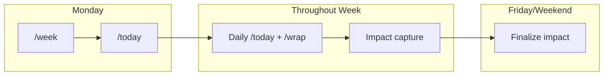
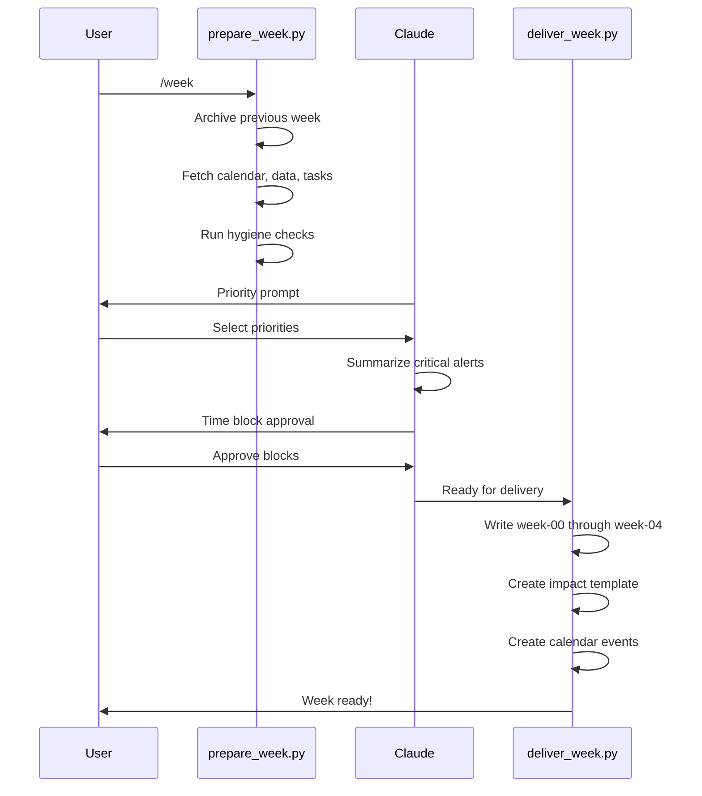
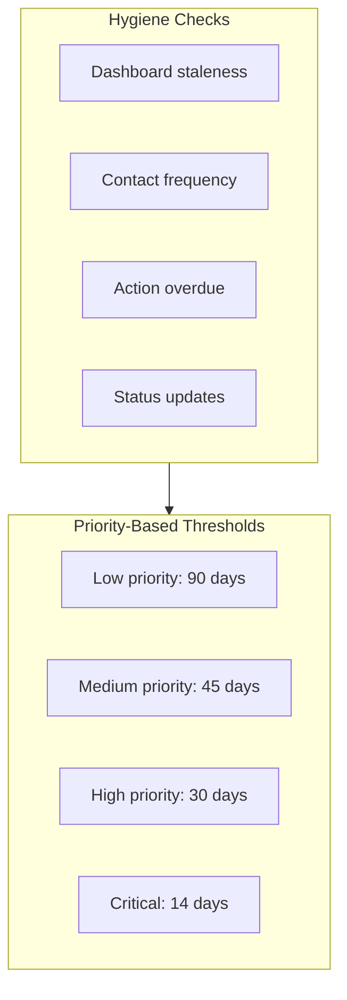
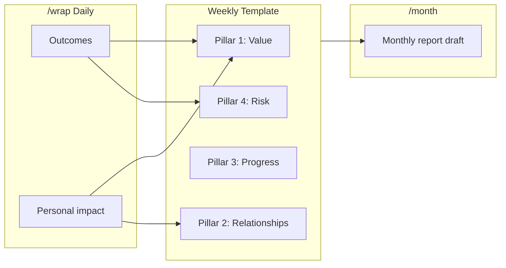

# Weekly Workflow

Strategic planning at the week level with `/week` and impact capture.

## Quick Reference

| What | When | Output |
|------|------|--------|
| `/week` | Monday morning | Week overview, meetings, actions, hygiene alerts |
| Impact capture | Throughout week | `Areas/Performance/Weekly-Impact/` |



---

## /week - Monday Review

**Purpose**: Start the week with full visibility and a plan.

### What It Does

1. **Archives previous week** files
2. **Prompts for priorities** (interactive)
3. **Fetches full week's calendar** (Mon-Fri)
4. **Identifies all meetings** with prep status
5. **Aggregates action items** (overdue + this week)
6. **Runs hygiene checks** (stale files, contact gaps)
7. **Pre-populates impact template** for the week
8. **Suggests time blocks** for task work
9. **Creates calendar events** (with approval)

### Three-Phase Execution



### Step-by-Step Usage

**Step 1: Run preparation**

```bash
python3 _tools/prepare_week.py
```

**Step 2: Answer priority prompts**

```
"What are your top 3 priorities this week?"
Options:
- External meetings / project work
- Strategic project work
- Administrative catch-up (actions, hygiene, emails)
- Other

"Any specific focus areas or constraints?"
Options:
- Deep work blocks needed
- Outreach push
- Deadline-driven
- Light week - catch up mode
```

**Step 3: Review time block suggestions**

```
"I've created a suggested schedule:

| Day | Time | Task | Duration |
|-----|------|------|----------|
| Mon | 9:30-10:30 | Documentation (overdue) | 60m |
| Tue | 2:00-2:30 | Agenda: Project Sync | 30m |

Which blocks would you like me to create?"
Options:
- Create all suggested calendar blocks
- Let me review and select
- Just show suggestions
- Skip scheduling
```

**Step 4: Run delivery**

```bash
python3 _tools/deliver_week.py
```

---

## Output Files

After `/week`, the `_today/` directory contains:

```
_today/
├── week-00-overview.md         # Week at a glance
├── week-01-external-meetings.md # All external meetings with prep status
├── week-02-actions.md          # Overdue + this week's actions
├── week-03-hygiene-alerts.md   # Items needing attention
├── week-04-focus.md            # Suggested priorities
└── archive/
    └── W05/                    # Previous week's files
```

### week-00-overview.md

The main dashboard for the week:

```markdown
# Week Overview: W06 - February 3-7, 2026

## This Week's Meetings

| Day | Time | Meeting | Status | Prep Status | Type |
|-----|------|---------|--------|-------------|------|
| Mon | 10:30 | Project Alpha | Active | Prep needed | Weekly |
| Tue | 2:00 | Stakeholder Sync | Active | Agenda needed | QBR |

## Action Items Summary

### Overdue (3)
- [ ] Send docs to team - 5 days overdue

### Due This Week (7)
- [ ] Review proposal - Due: Tue

## Hygiene Alerts

### Critical
- **Project Beta** - Deadline in 2 weeks, status unclear

### Needs Attention
- **Area X** - Dashboard stale (45 days)
```

### Prep Status Guide

| Icon | Status | Meaning | Action |
|------|--------|---------|--------|
| `Prep needed` | Initial | External meeting requires prep | /today generates |
| `Agenda needed` | Initial | You own agenda, need to create | /today drafts |
| `Bring updates` | Initial | Project meeting | Review status |
| `Context needed` | Initial | Internal meeting | /today adds intel |
| `Prep ready` | Progress | Prep file generated | Review before meeting |
| `Draft ready` | Progress | Agenda draft created | Review and send |
| `Done` | Complete | Meeting completed | /wrap marks |

---

## Hygiene Checks

The `/week` command runs system health checks:



### Check Details

| Check | Source | Threshold | Alert Level |
|-------|--------|-----------|-------------|
| Stale Dashboard | Last Updated field | >60 days | Medium |
| No Recent Contact | Last interaction | Varies by priority | High |
| Overdue Actions | Action files | Any overdue | High |
| Missing Status | Status field | High priority without update | High |

### Priority-Based Contact Thresholds

| Priority | Contact Threshold | Dashboard Refresh |
|----------|-------------------|-------------------|
| Low | 90+ days | Quarterly |
| Medium | 45+ days | Monthly |
| High | 30+ days | Monthly |
| Critical | 14+ days | Bi-weekly |

### Deadline Phase Alerts

| Weeks Out | Alert | Required Action |
|-----------|-------|-----------------|
| 6 | Inform | Assessment needed |
| 4 | Warn | Planning required |
| 3 | Critical | Escalation needed |

---

## Time Blocking

### Task Sizing

| Size | Duration | Examples |
|------|----------|----------|
| **Small** | 15 min | Quick email, Slack, file update |
| **Medium** | 30 min | Draft agenda, update dashboard, review doc |
| **Large** | 60 min | Meeting prep, write proposal, analysis |

### Time Preferences

| Time | Best For | Avoid |
|------|----------|-------|
| Morning (9am-12pm) | Complex thinking, writing, prep | Routine admin |
| Afternoon (1pm-5pm) | Execution, emails, dashboard updates | Deep focus |

### Event Naming

Created calendar events follow this pattern:

| Category | Format | Example |
|----------|--------|---------|
| Focus | `Focus: [Description]` | Focus: Documentation |
| Prep | `Prep: [Project] [Type]` | Prep: Alpha Demo |
| Admin | `Admin: [Description]` | Admin: Dashboard Updates |
| Review | `Review: [Description]` | Review: Weekly Impact |

---

## Weekly Impact Capture

### Template Location

```
Areas/Performance/Weekly-Impact/2026-W06-impact-capture.md
```

### Template Structure

```markdown
---
area: Areas
doc_type: impact
status: draft
date: 2026-02-03
week: W06
---

# Weekly Impact Capture - W06 (February 3-7, 2026)

## Meetings This Week

| Day | Project | Meeting Type | Outcome |
|-----|---------|--------------|---------|
| Mon | Alpha | Monthly | |
| Tue | Beta | QBR | |

## Value Delivered (Pillar 1)

### Wins
-

### Technical Outcomes
-

## Relationship Progress (Pillar 2)

### Stakeholder Engagement
-

### Executive Access
-

## Progress (Pillar 3)

### Opportunities Identified
-

### Pipeline Movement
-

## Risk Management (Pillar 4)

### Issues Resolved
-

### Risks Mitigated
-

## Cross-Functional Contributions
-

## Key Learnings
-

---
*To be completed throughout the week*
```

### Impact Flow



**Best practice**: Capture impacts daily via `/wrap` rather than Friday afternoon scramble.

---

## Monday Coordination

On Mondays, run both commands:

```bash
# 1. Weekly overview first
/week

# 2. Then today's prep
/today
```

The `/week` command creates the framework. The `/today` command fills in today's details. When `/today` runs:
- It sees existing `week-*.md` files
- Updates prep status as files are generated
- Preserves week overview content

If `/week` wasn't run, `/today` creates a minimal week overview automatically.

---

## Archive Lifecycle

### Daily Files

```
_today/00-overview.md, etc.
    |
    v (next day's /today)
_today/archive/2026-02-03/
    |
    v (next /week)
_inbox/daily-archive-2026-02-03/
    |
    v (inbox processing)
Projects/[Project]/Meetings/ (canonical)
```

### Week Files

```
_today/week-*.md
    |
    v (next /week)
_today/archive/W05/
    |
    v (kept for reference)
```

---

## Troubleshooting

| Issue | Cause | Solution |
|-------|-------|----------|
| No calendar events | API issue or weekend | Check API, run on Monday |
| Stale hygiene data | Source not updated | Refresh source data |
| Week files not archived | Previous /week missed | Run `/week --skip-archive` then manually archive |

### Debug Commands

```bash
# Check week directive
cat _today/.week-directive.json | jq .

# View week files
ls _today/week-*.md

# Check archive
ls _today/archive/
```

---

## Configuration

### Command Options

```bash
python3 _tools/prepare_week.py [options]
  --skip-archive    Don't archive previous week
  --output FILE     Custom output path

python3 _tools/deliver_week.py [options]
  --skip-calendar   Don't create calendar events
  --skip-inbox      Don't move archives to inbox
  --keep-directive  Keep directive for debugging
  --ai-outputs FILE JSON with AI outputs
```

---

## Related Documentation

- [Index](index.md) - All systems
- [Daily Workflow](daily-workflow.md) - /today, /wrap
- [Monthly/Quarterly](monthly-quarterly-workflow.md) - Aggregation
- [Three-Phase Pattern](three-phase-pattern.md) - Architecture

---

*Weekly workflow version: 1.0*
